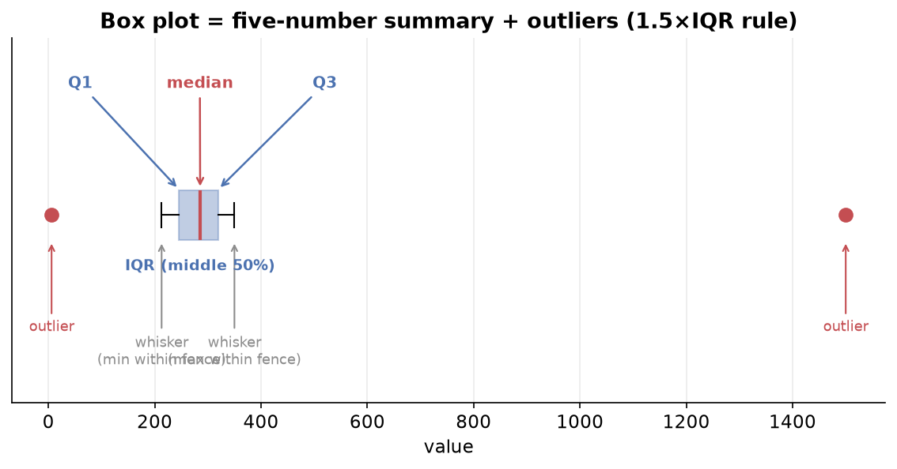

---
tags:
  - statistics
  - descriptive-statistics
  - quantiles
  - percentiles
  - box-plot
  - univariate-analysis
  - data-science
aliases:
  - Quantiles and Box Plots
  - Percentiles and Box Plots
  - Univariate Analysis
difficulty: beginner
prerequisites:
  - Foundations and Central Tendency
created: 2026-06-30
---

## Quantiles, quartiles, and percentiles

Quantiles are statistical measures that divide sorted numerical data into equal-sized groups, where each group holds an equal number of observations.

> [!warning]
> Data must be sorted from low to high before computing any quantile.

| Name | Divides data into | Cut points |
| :--- | :--- | :--- |
| Quartiles | 4 equal parts | 25th, 50th, 75th percentile |
| Quintiles | 5 equal parts | 20th, 40th, 60th, 80th |
| Deciles | 10 equal parts | 10th, 20th, up to 90th |
| Percentiles | 100 equal parts | 1st, 2nd, up to 99th |

Key facts:

1. Sorting is mandatory.
2. You are finding the location of an observation in the data.
3. The quantile value may not exist in the data, because it can fall between two points.
4. Everything can be derived from percentiles. If you know percentiles, you can build any quartile, decile, or quintile.

### Quartiles

- **Q1** is the 25th percentile and cuts off the lowest 25 percent.
- **Q2** is the 50th percentile and equals the median.
- **Q3** is the 75th percentile, with 75 percent of data below it.

### What a percentile means

A percentile tells you what fraction of people you are ahead of.

> [!example]
> Scoring in the 90th percentile means 90 percent of people are behind you and only 10 percent are ahead. This differs from scoring 90 percent, which means 90 marks out of 100.

### Formula 1: find the value at a given percentile

$$PL = \frac{P}{100} \times (n + 1)$$

where $P$ is the desired percentile (for example, 75) and $n$ is the total number of observations.

Example with 10 students' marks, finding the 75th percentile:

$$PL = \frac{75}{100} \times (10 + 1) = 0.75 \times 11 = 8.25$$

The 75th percentile sits at position 8.25, between the 8th and 9th values. The 8th value is 96 and the 9th value is 98.

$$\text{Value} = 96 + 0.25 \times (98 - 96) = 96 + 0.5 = 96.5$$

So the 75th percentile is 96.5.

### Formula 2: find the percentile of a given value

$$\text{Percentile} = \frac{X + 0.5\,Y}{N}$$

where $X$ is the number of values below the given value, $Y$ is the number of values equal to it, and $N$ is the total number of observations.

Example: find the percentile of the value 88 in a 10-point data set, with 3 values below 88 and one value equal to 88:

$$\frac{3 + 0.5 \times 1}{10} = \frac{3.5}{10} = 0.35 \quad\Rightarrow\quad 35\text{th percentile}$$

---

## Five-number summary

The five-number summary describes a numerical column using five values.

| Number | Value | Meaning |
| :--- | :--- | :--- |
| 1 | Minimum | smallest value (0th percentile) |
| 2 | Q1 | 25th percentile |
| 3 | Median (Q2) | 50th percentile |
| 4 | Q3 | 75th percentile |
| 5 | Maximum | largest value (100th percentile) |

It summarizes the center, spread, and distribution of the data. In pandas, the `describe()` function returns this plus count and mean.

### Inter-quartile range (IQR)

$$IQR = Q_3 - Q_1$$

- The IQR represents the middle 50 percent of the data, with 25 percent below Q1 and 25 percent above Q3.
- It is the box in a box plot.

---

## Box plot (box-and-whisker plot)

A box plot is a powerful graph built directly from the five-number summary. It shows the range, median, quartiles, spread, skewness, and outliers all at once.

### How to build a box plot

1. Sort the data.
2. Compute Q1, Q2 (median), and Q3, then draw the box, where the box equals the IQR.
3. The median line inside the box shows whether the middle 50 percent leans left or right.
4. Compute the whisker limits: the lower limit is $Q_1 - 1.5 \times IQR$ and the upper limit is $Q_3 + 1.5 \times IQR$.
5. Whiskers extend to the last actual data point inside these limits.
6. Any point beyond the whisker limits is plotted separately as an outlier.

Worked example with data 6, 213, 241, 260, 281, 290, 314, 321, 350, 1500, where $Q_1 \approx 234$, $Q_2 \approx 285.5$, and $Q_3 \approx 328$:

$$IQR = Q_3 - Q_1 \approx 94$$
$$\text{Lower limit} = 234 - 1.5 \times 94 \approx 93$$
$$\text{Upper limit} = 328 + 1.5 \times 94 \approx 469$$

- The smallest point inside the lower limit is 213, so 6 becomes an outlier.
- The largest point inside the upper limit is 350, so 1500 becomes an outlier.

So 6 and 1500 are outliers, and the whiskers stop at 213 and 350.

A box plot tells you several things:

- **Spread**: the width of the box and whiskers.
- **Skewness**: shown when the median line is off-center or one whisker is longer.
- **Outliers**: points plotted beyond the whiskers.
- **Comparison**: draw two box plots side by side, for example weight by gender, to compare distributions.

---

## Visualizing data: univariate analysis

Univariate analysis means studying one column at a time. The graph you choose depends on the column type.

### Categorical column

First build a frequency distribution table, which counts how many times each category appears.

| Graph | Built from | Shows |
| :--- | :--- | :--- |
| Bar chart | frequency counts | count of each category |
| Pie chart | relative frequency in percent | each category's share of the whole |

- **Relative frequency** is the category count divided by the total, expressed as a percentage. It is used for pie charts.
- **Cumulative frequency** is the running total of frequencies, eventually reaching 100 percent.

### Numerical column

Use a histogram. It divides the number range into buckets, also called bins, and counts how many values fall into each.

Choosing bin size matters:

- Too few or large bins give only a couple of thick bars and no detail.
- Too many or small bins give many thin bars and noise.
- Find a balanced middle ground.

### Common histogram shapes

- **Symmetric**: most values in the middle, tapering equally on both sides.
- **Bimodal or trimodal**: two or three peaks of high density.
- **Left-skewed**: a long tail on the left, with data bunched to the right.
- **Right-skewed**: a long tail on the right, with data bunched to the left.
- **Uniform**: every bin has roughly the same count, often appearing when bins are wide, with no real shape.

---

## Summary

1. Quantiles such as quartiles, deciles, and percentiles locate an observation in sorted data, and sorting is mandatory before you compute any of them.
2. A percentile says what fraction of the data you are ahead of, which is not the same as a percentage score.
3. Two formulas cover both directions: the value at a given percentile, and the percentile of a given value.
4. The five-number summary covers minimum, Q1, median, Q3, and maximum, and the IQR is the middle 50 percent.
5. A box plot visualizes the five-number summary and flags outliers using the 1.5 times IQR rule.
6. Univariate graphs are the bar and pie chart for categorical columns and the histogram for numerical columns, where bin size controls how much detail you see.
7. Histogram shapes reveal symmetry, skew, multiple peaks, or no shape at all.

---

> [!info] Continues to
> One column at a time only goes so far. Next, study how two columns move together in [[Bivariate and Multivariate Analysis|Bivariate and Multivariate Analysis]].
