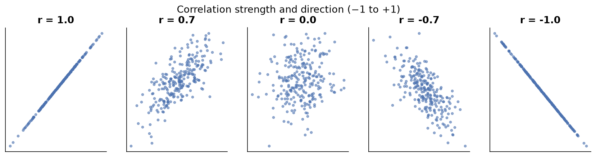

---
tags:
  - statistics
  - descriptive-statistics
  - bivariate-analysis
  - covariance
  - correlation
  - data-science
aliases:
  - Bivariate and Multivariate Analysis
  - Bivariate Analysis
  - Covariance and Correlation
created: 2026-06-30
---

## Visualizing data: bivariate analysis

Bivariate analysis means studying two columns together. There are three cases.

### Case 1: categorical and categorical

Build a contingency table, also called a cross tab. It summarizes the relationship between two categorical variables by counting combinations.

> [!example]
> Titanic `Survived` (0 or 1) versus `Pclass` (1, 2, or 3) forms a 2 by 3 table holding the count for each combination. From it you can draw stacked or side-by-side bar charts.

### Case 2: numerical and numerical

Build a scatter plot. Plot one column on the x-axis and the other on the y-axis, so each row becomes a point.

> [!example]
> Flat area in square feet on the x-axis and price on the y-axis. The pattern of points reveals the relationship between the two variables.

### Case 3: categorical and numerical

Options:

- A bar chart with an aggregation, such as mean age per gender, on the y-axis instead of a count.
- Side-by-side box plots or histograms, one per category.
- Convert the numerical column into buckets and build a contingency table.

---

## Covariance

Covariance measures the direction, or nature, of the linear relationship between two numerical columns.

$$\text{Population: } \; Cov = \frac{\sum (x_i - \bar{x})(y_i - \bar{y})}{N}$$

$$\text{Sample: } \; Cov = \frac{\sum (x_i - \bar{x})(y_i - \bar{y})}{n - 1}$$

### Intuition with four quadrants around the means

For each point, compute $(x_i - \bar{x})$ and $(y_i - \bar{y})$ and multiply them:

- Points in quadrants 1 and 3 give a positive product.
- Points in quadrants 2 and 4 give a negative product.

| Covariance | Meaning |
| :--- | :--- |
| Positive | as x increases, y increases |
| Negative | as x increases, y decreases |
| Near 0 | no linear relationship |

> [!note]
> The covariance of a variable with itself is its variance.

### The big flaw of covariance

Covariance gives only direction, not strength. Its value is not scale-invariant, so if you multiply x and y by 2, the relationship is unchanged but the covariance value changes. It can be any number from negative infinity to positive infinity, so you cannot judge how strong a relationship is. This makes it unreliable for comparison.

---

## Correlation

Correlation fixes the flaw of covariance by measuring both the direction and the strength of a linear relationship, on a fixed scale.

### Pearson correlation coefficient

$$r = \frac{Cov(x, y)}{\sigma_x \, \sigma_y}$$

It is covariance normalized by the standard deviations.

The range is always between -1 and +1.

| Value | Meaning |
| :--- | :--- |
| +1 | perfect positive correlation, where x up gives y up by the same proportion |
| -1 | perfect negative correlation, where x up gives y down by the same proportion |
| 0 | no linear relationship |

- Closer to +1 means a stronger positive relationship; closer to -1 means a stronger negative relationship; closer to 0 means a weaker relationship.
- The more scattered the points are around the trend line, the closer correlation moves toward 0.

Correlation is scale-invariant. Multiply x and y by any constant and the correlation stays the same. This is why correlation is reliable and is preferred over covariance.

> [!note]
> Covariance exists mainly because we need it to calculate correlation. For analysis, always use correlation.

---

## Correlation does not imply causation

Just because two variables move together does not mean one causes the other.

Classic examples:

- **Ice cream sales and homicides** rise together. Ice cream does not cause murder; the hidden factor is hot weather, since more people go out in summer, so both rise.
- **Firefighters at a fire and fire size** are correlated, but more firefighters do not cause bigger fires.
- **Experience and salary** are correlated, but experience is not the only cause, because talent, company budget, and other factors matter too.

To establish causation you need extra evidence:

- Controlled experiments.
- Randomized control trials.
- Well-designed observational studies.

Be careful, because many analysts report a correlation as if it were a cause and reach wrong conclusions.

---

## Multivariate analysis (beyond two columns)

Multivariate analysis means studying three or more columns together.

| Graph | How it adds dimensions |
| :--- | :--- |
| 3D scatter plot | three numerical columns on x, y, and z |
| Hue parameter | adds an extra categorical column through color |
| Facet grid | side-by-side plots split by a category |
| Pair plot | scatter plots between every pair of columns, with histograms on the diagonal |
| Bubble chart | x, y, plus a third numerical value as bubble size |

> [!example]
> A scatter plot of age versus fare, colored by gender through the hue parameter, captures three columns at once. Add a facet split by another category to reach four.

> [!note]
> A joint plot, meaning a scatter plot with side histograms, is still bivariate, because it only uses two columns.

---

## Summary

1. Bivariate analysis has three cases: categorical with categorical uses a cross tab, numerical with numerical uses a scatter plot, and categorical with numerical uses grouped bars or side-by-side box plots.
2. Covariance gives direction only and is unreliable, because it is not scale-invariant and has no fixed range.
3. Correlation gives direction and strength on a scale from -1 to +1, is scale-invariant, and is the measure to use.
4. The Pearson coefficient is simply covariance divided by the two standard deviations.
5. Correlation does not imply causation, always. Establishing cause needs experiments or trials.
6. Multivariate analysis reaches three or more columns through 3D scatter, hue, facet grids, pair plots, and bubble charts.

---

> [!info] Continues to
> These notes lead into [[Probability Distributions|Probability Distributions]], which sits on the boundary between statistics and probability and opens the door to inferential statistics.
