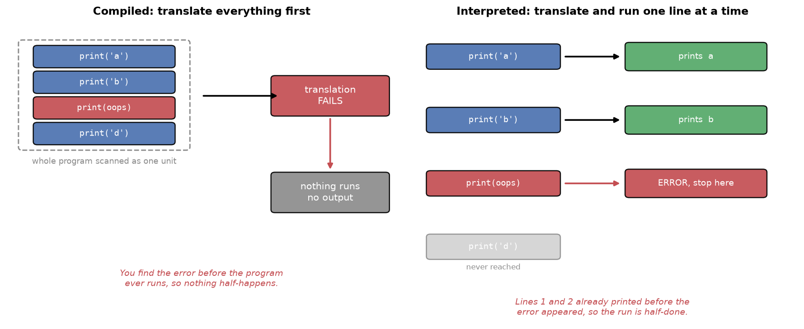
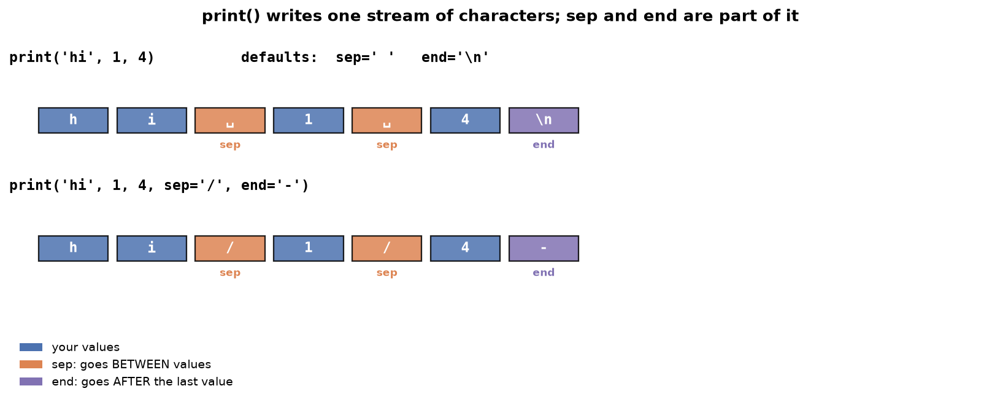
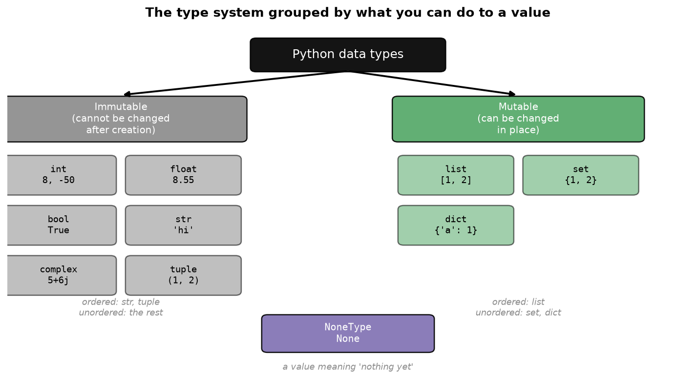
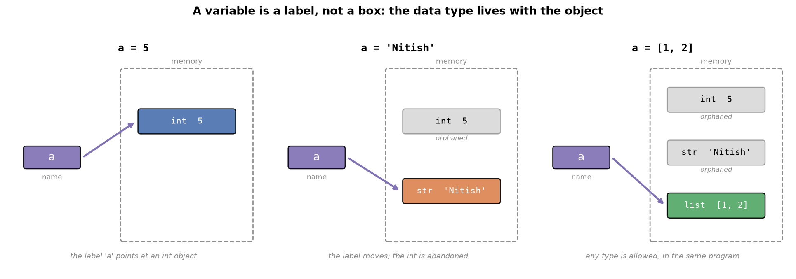
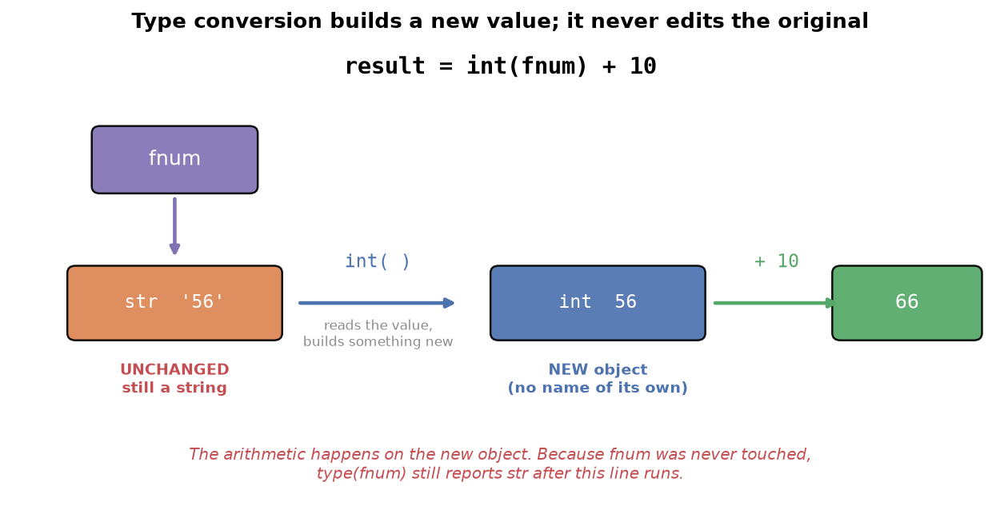

---
tags:
  - python
  - programming
  - fundamentals
  - data-science
aliases:
  - Python Fundamentals
  - Python Basics
difficulty: beginner
created: 2026-09-23
---

> [!info] Where this fits
> This is the first topic in Python and the foundation for everything that follows. Every later topic, from operators and control flow to the data-analysis and machine learning tracks, is written in Python, so the syntax and mental models here are assumed throughout. Start here if you are new to coding.

This note builds Python from the ground up: why the language exists and became popular, how it turns your English-like code into something a machine can run, and the first building blocks you need to write real programs. Those building blocks are printing output, data types, variables, comments, keywords, identifiers, reading user input, converting between types, and literals.

Nothing here assumes prior programming experience. Every term is defined the first time it appears.

---

## Why Python became popular

Python was created in 1989, several years before Java, yet it stayed in the background for decades. Java dominated when the internet era began. Today Python competes with Java in general use and clearly leads in data science. It is worth understanding why, because the reasons explain what the language is good at.

### Reason one: the design philosophy

A language's design philosophy is the set of ideas its creators optimized for. Python optimized for human readability.

- It is likely the easiest mainstream language to learn. A beginner with no background can write working code quickly.
- Python code is forced into clean indentation, so it stays readable. You can look at code someone else wrote and follow what it does.

> [!tip]
> A useful contrast: languages like Java are strict and ceremonious, and they reject your code if the form is not exactly right. Python is forgiving. It lets you make mistakes, learn from the errors, and keep moving. That forgiveness is why beginners get productive fast.

### Reason two: batteries included

**Batteries included** means the language ships with a large amount of useful functionality already built in, so you do not have to write it yourself.

Python's built-in data types arrive with functions and operators already attached. Work that takes many lines in C or C++ often takes one line in Python.

> [!example]
> Reversing a piece of text is a classic beginner exercise in C, where you write a loop and build the logic by hand. In Python there is a single-line way to do it, with no loop to write.

A fair question is whether relying on built-in tools prevents you from becoming a good programmer. It does not. Your job is to build something that works well, not to rewrite from scratch what already exists. Python follows the principle: do not reinvent the wheel. If the wheel exists, use it to build the car.

### Reason three: it is general purpose

A **general purpose** language is one you can use across many kinds of problems, rather than one narrow domain. Python qualifies in two ways.

It supports multiple **programming paradigms**, which are different styles of organizing a program:

- Procedural programming
- Object-oriented programming
- Functional programming

It also supports many kinds of software:

- Desktop applications
- Websites
- Data science and machine learning code

So learning Python pays off beyond data science. The same skill transfers to web development or building tools.

### Reason four: the community and its libraries

A **library** is a bundle of code someone else wrote that you can reuse in your own program.

Python's community is unusually active and generous, and it keeps producing libraries. For data work you have pandas, NumPy, SciPy, PySpark, TensorFlow, Keras, and many more. In practice, whatever you are trying to build, a library probably already exists for a large part of it.

| Reason | What it gives you |
| :--- | :--- |
| Design philosophy | Simple, readable, forgiving code |
| Batteries included | One-line solutions instead of long hand-written logic |
| General purpose | One language for web, desktop, and data science |
| Community and libraries | Reusable code for almost any task |

---

## Why Python leads in data science

Python is the number one language for data science in industry. In academia and research, R is also widely used, and it has excellent plotting libraries. But for a job in industry, Python is the one to learn. Three reasons explain why Python won over Java, JavaScript, PHP, and Ruby.

**It is easy to learn.** Data science was first practiced by mathematicians and statisticians, not programmers. When they needed to turn their algorithms into working software, they wanted a language they could pick up in days, not months. Python fit. Java and C++ are harder to learn, so they lost this group.

**It is close to mathematics.** Python already had strong libraries for scientific computing, such as NumPy and SciPy, before the data science boom. The language was already being used for mathematical work, so it was the natural place to continue.

**The community compounded the advantage.** Once people arrived and started publishing open-source libraries, an ecosystem formed. Now the gap is so wide that other languages would need enormous effort to catch up in this domain.

> [!note]
> A common objection is that Python is slow compared to C or C++, and its native data structures are indeed slower. The community solved this rather than accepting it. NumPy provides a data type called the **ndarray** that is implemented in C, so it runs fast while you still write ordinary Python. Most machine learning work uses these arrays, which means your code is Python but the heavy computation is C speed.

---

## How your code reaches the machine

Before writing code, it helps to know what happens to it. This explains both error messages and the idea of keywords later on.

You write programs in words like `print`, `if`, `else`, and `for`. These are English words, which makes this a **high-level language**: something close to human language and far from hardware.

The machine that runs your code is a processor chip. It does not understand English. It understands only binary: patterns of $1$ and $0$, which physically mean power on and power off.

So something must translate your English-like code into binary. That translation is called **compilation**, and the program that performs it is either a compiler or an interpreter.



| | Compiled | Interpreted |
| :--- | :--- | :--- |
| Translates | The whole program at once | One line at a time |
| Examples | Java, C, C++ | Python, PHP |
| Typical speed | Faster | Slower |

Python is an **interpreted language**, so it converts and runs your code line by line. This is part of why it is slower than compiled languages, and also why it can report an error at the exact line where it occurred.

> [!note]
> **Low-level coding** means writing close to the hardware, in assembly language or raw binary. It is difficult and rarely done today outside specialized areas like microcontrollers and robotics. Almost all modern programming is high level, with a compiler or interpreter handling the translation.

---

## Printing to the screen

The first thing you learn in any language is how to put something on the screen. In Python you do this with `print`.

Before using it, understand what a **function** is. A function is a named box you hand some input to, which then does a job and gives you output. You can recognize a function by the pattern `name( )`: a word followed by parentheses. Whatever you put inside the parentheses is the input.

`print` is a **built-in function**, meaning it already exists inside Python and needs no setup.

```python
print('Hello world')
```

```text
Hello world
```

> [!warning]
> Python is **case sensitive**, so `print` and `Print` are different names. Only the lowercase `print` is the function. This applies to every name in Python, so be consistent.

### Quotes mark text

Text must be wrapped in quotes. The quotes are how you tell Python that something is text rather than a name it should look up.

```python
print('Salman Khan')   # works: quoted, so it is text
print(Salman Khan)     # error: Python does not know what this is
```

You can print other kinds of values too, and they do not need quotes because they are not text.

```python
print(7)        # a whole number
print(7.5)      # a decimal
print(True)     # a boolean
```

### Printing several values at once

`print` is flexible. Separate values with commas and it prints them all, joined by spaces.

```python
print('hello', 1, 4.5, True)
```

```text
hello 1 4.5 True
```

### Controlling the separator and the line ending

Every built-in function comes with documentation, which you can think of as the instruction manual that ships with a product. The manual for `print` reveals two settings you can change.



`sep` is the **separator**: what Python puts between multiple values. Its default is a single space, which is why the example above had spaces.

```python
print('hello', 1, 4.5, sep='/')
```

```text
hello/1/4.5
```

`end` is what Python adds after finishing the line. Its default is `\n`, the newline character, which is why two `print` statements produce two lines.

```python
print('hello')
print('world')
```

```text
hello
world
```

Override `end` to keep them on one line:

```python
print('hello', end='-')
print('world')
```

```text
hello-world
```

> [!tip]
> You can use any separator or ending you like: a hyphen, a slash, a percent sign, or nothing at all. This level of control is a small example of how much flexibility Python gives you by default.

---

## Data types

A **data type** is a kind of value a language can work with. Knowing the available types tells you what Python can represent.

The clearest way to hold the whole set in your head is to group them by what you are allowed to do to a value. An **immutable** value cannot be changed after it is created, while a **mutable** value can be changed in place.



Each type is introduced below.

### Numbers

**Integers** (`int`) are whole numbers, positive or negative. Python handles extremely large integers without special effort, on the order of $10^{308}$. Beyond that it reports infinity.

```python
print(8)
print(1e308)    # 1 multiplied by 10 to the power 308
```

In $1e308$, the `e` notation means $1 \times 10^{308}$.

**Floats** (`float`) are decimals, with a similarly large range.

```python
print(8.55)
```

> [!note]
> Other languages separate `long` and `double` from `int` and `float`. Python does not. Long values map into `int` automatically, which is why Python integers can be so large with no extra type.

**Complex numbers** (`complex`) have a real part and an imaginary part, written with `j`.

```python
print(5 + 6j)
```

They exist for completeness and mathematical work, but you will rarely use them in ordinary projects.

### Booleans

A **boolean** (`bool`) is either `True` or `False`. These power all decision logic.

```python
print(True)
print(False)
```

> [!warning]
> Do not put quotes around `True` and `False`. A boolean is not text. Writing `'True'` gives you a string that happens to spell the word, which behaves differently.

### Text

**Strings** (`str`) hold text.

```python
print('hello world')
```

Python has no separate single-character type. Languages like C have a `char` type; in Python a single character is just a string of length one.

### Collections

These types hold several values together. Each is covered in depth on its own, so here the goal is only to recognize them.

| Type | Written with | Example |
| :--- | :--- | :--- |
| `list` | Square brackets | `[1, 2, 3]` |
| `tuple` | Round brackets | `(1, 2, 3)` |
| `set` | Curly braces | `{1, 2, 3}` |
| `dict` | Curly braces with key-value pairs | `{'name': 'Nitish'}` |

A **list** plays the role that arrays play in C, though it is more capable. A **tuple** looks almost identical to a list but behaves differently in ways that matter later. A **set** is the mathematical set you met in school, holding unique items. A **dictionary** stores **key-value pairs**, where you look up a value by its key.

```python
{'name': 'Nitish', 'gender': 'male', 'weight': 70}
```

Here `name` is a key and `'Nitish'` is its value.

> [!note]
> The choice between square, round, and curly brackets carries no deeper meaning. They are the notation Python uses to tell these types apart.

### None

`None` is a special value meaning nothing. Its use is explained in the literals section below.

### Checking a type with `type()`

`type` is a built-in function that reports the data type of whatever you give it. It is one of the most useful tools for understanding what your program is holding.

```python
print(type(3))        # <class 'int'>
print(type(3.5))      # <class 'float'>
print(type('hello'))  # <class 'str'>
print(type(6 + 6j))   # <class 'complex'>
print(type([1, 2]))   # <class 'list'>
```

> [!tip]
> When a program behaves unexpectedly, checking `type()` on your values is often the fastest way to find the cause. You will see exactly this used to diagnose a bug later in this note.

---

## Variables

A **variable** is a named container that holds a value so you can use it later.

The reason variables exist is that when you write a program, you do not know in advance what values it will handle. A website's home page should greet whoever logs in, but you cannot know today whether that will be Rahul, Rohit, or Ankit. So you put a variable where the name belongs, and fill it in once someone logs in.

### Creating a variable

In C or C++ you declare a variable by stating its type first:

```text
int name = 5;
```

Python needs no type. Write the name, an equals sign, and the value.

```python
name = 'Nitish'
print(name)
```

```text
Nitish
```

The `=` here is the assignment operator. It stores the value on the right into the name on the left.

```python
a = 5
b = 6
print(a + b)
```

```text
11
```

> [!note]
> Python has no separate variable declaration step. You cannot reserve a name at the top of a program for later use. You create a variable at the moment you give it a value.

### Dynamic typing

**Dynamic typing** means you do not state a variable's data type; the interpreter works it out from the value you assign.

Python sees `5` and concludes `int`. It sees `5.5` and concludes `float`. It sees `'Nitish'` and concludes `str`.

**Static typing** is the opposite, used by C, C++, and Java, where you declare the type when creating the variable.

### Dynamic binding

**Dynamic binding** means a variable is not permanently tied to one data type. The same variable can hold different types at different points in the same program.

```python
a = 5
print(a)        # 5

a = 'Nitish'
print(a)        # Nitish
```

No error occurs. The variable holds whatever you last put in it.

Both ideas make sense once you see what a variable is underneath. A variable is not a box that holds a value. It is a **label** pointing at an object stored in memory, and the data type belongs to that object, not to the label.



This single picture explains both concepts. Dynamic typing works because Python reads the object to find the type, so you never have to declare it. Dynamic binding works because assigning again just moves the label to a different object, and the new object can be any type at all.

**Static binding** is the opposite: once a variable's type is fixed, it cannot hold a different type anywhere in the program. C, C++, and Java work this way.

| Concept | Python | C, C++, Java |
| :--- | :--- | :--- |
| Typing | Dynamic (type inferred) | Static (type declared) |
| Binding | Dynamic (type can change) | Static (type fixed) |

> [!warning]
> Programmers from a Java background often dislike dynamic binding, because a variable silently changing type can hide bugs. It is a genuine tradeoff: you gain flexibility and lose a safety check.

### Shorter ways to create variables

You can create several variables on one line.

```python
a, b, c = 1, 2, 3
print(a, b, c)
```

```text
1 2 3
```

You can also give several variables the same value in one statement.

```python
a = b = c = 5
print(a, b, c)
```

```text
5 5 5
```

Both are worth recognizing, because you will meet them in code other people wrote.

---

## Comments

A **comment** is a note you write inside your code for humans to read. The interpreter ignores it completely, so it never runs and never causes an error.

In Python a comment starts with `#`. Everything after the `#` on that line is ignored.

```python
# add two numbers and show the result
a = 5
b = 6
print(a + b)    # this prints 11
```

Comments can sit above the code they describe or at the end of a line. Placing them above is the more common convention in professional codebases.

Python has no true multi-line comment. For several lines of explanation, put `#` at the start of each line.

```python
# this is the first line of explanation
# this is the second line
```

> [!tip]
> Write comments even when the code feels obvious. A programmer who writes no comments is like a batsman who scores freely but keeps getting his partner run out. Excellent individually, difficult for the team. Comments are how your teammates, and your future self, understand the logic you had in mind.

---

## Keywords and identifiers

These two ideas come directly from how the interpreter reads your code.

### Keywords

Recall that the interpreter must translate your English-like code into binary. To do that, it needs certain words to have fixed, guaranteed meaning. When it sees `print`, it knows the programmer wants to display something. When it sees `if`, it knows a decision is being made.

**Keywords** are the words Python reserves for itself for exactly this purpose. Python has roughly 32 of them, including `if`, `else`, `for`, `True`, `False`, and `None`.

You do not need to memorize the list. You need one rule: never use a keyword as a name in your own program.

> [!warning]
> The reason is confusion. If you named a variable `if`, your code could read `if(if > 5)`, which is meaningless. The interpreter cannot tell your name from its own instruction, so it reports an error and the program does not run.

### Identifiers

An **identifier** is any name you create in your program: a variable name, a function name, or a class name. Python has three rules for them.

**Rule one: do not start with a digit.**

```python
1name = 'Nitish'    # error
name1 = 'Nitish'    # works
```

**Rule two: use letters, digits, and underscores only.** Uppercase and lowercase are both fine. Among special characters, only the underscore is allowed.

```python
first_name = 'Nitish'    # works
first-name = 'Nitish'    # error
```

A name can even be a single underscore, `_`, which is valid and has conventional uses you will meet later. Characters such as `-`, `@`, and `%` are not allowed.

**Rule three: an identifier cannot be a keyword.** This follows from the previous section.

> [!note]
> Every variable is an identifier, but identifier is the broader term, since it also covers the names of functions and classes.

---

## Taking input from the user

So far your programs only produce output. To be useful, most programs must also accept input.

Think of software in two categories.

**Static software** does not interact with the user. It presents information and you read it: a calendar, a clock, a blog, a college website.

**Dynamic software** takes input from the user and responds. Nearly all software you use daily is dynamic. On YouTube you type what you want to watch. On Ola you enter your destination. On Zomato you choose your order.

Building dynamic software starts with being able to read input, which in Python uses the built-in `input` function.

```python
input()
```

Running this shows an input box, and whatever the user types comes back as the result.

There is a problem though: an empty box tells the user nothing. They cannot know whether to type a name, an email, or a password. As the programmer it is your responsibility to say what is expected, so pass a message to `input`.

```python
input('Enter your email: ')
```

Now the user sees the prompt alongside the box.

---

## Your first complete program

The goal: take two numbers from the user, add them, and display the result.

A useful habit when starting out is to think before typing. Programming happens in your head first and on the keyboard second. Write the steps as comments, then fill in the code under each one.

```python
# take input from the user and store it in variables
fnum = input('Enter first number: ')
snum = input('Enter second number: ')

# add the two variables
result = fnum + snum

# print the result
print(result)
```

Enter `56` and `67`, and the output is surprising:

```text
5667
```

That is not the sum. The two values were joined end to end instead of added.

### Diagnosing the bug

Use `type()` to inspect what the variables hold.

```python
print(type(fnum), type(snum))
```

```text
<class 'str'> <class 'str'>
```

Both are strings. The user typed digits, but `input` stored them as text.

This explains the output. For numbers, `+` means addition. For strings, `+` means joining, so `'Mumbai' + 'Kolkata'` gives `'MumbaiKolkata'`, and `'56' + '67'` gives `'5667'`.

> [!note]
> Why does `input` always return a string? Because string is a universal format. Any value can be represented as text: a number, a decimal, even a complex number. The reverse is not true, since text like `'Kolkata'` cannot become an integer. Since `input` cannot know what the user will type, returning a string is the only choice that never crashes.

The fix requires converting the text into numbers, which is the next concept.

---

## Type conversion

**Type conversion** is changing a value from one data type to another. Python does this in two ways.

### Implicit type conversion

**Implicit** conversion happens automatically. The interpreter recognizes what you intended and handles it without being asked.

```python
print(5 + 5.6)
```

```text
10.6
```

Here one value is an `int` and the other a `float`. Strictly, that is an operation across two different types. Python understands that this is mathematically sensible and converts for you.

Implicit conversion has limits. When the intent is not clear, Python refuses.

```python
print(4 + '4')    # error: cannot add an integer and a string
```

Adding a number to text has no obvious meaning, so Python raises an error instead of guessing.

### Explicit type conversion

**Explicit** conversion is when you ask for the change yourself, using a built-in function named after the target type.

```python
print(int('4'))        # 4,   now an integer
print(int(4.5))        # 4,   decimal part dropped
print(str(5))          # '5', now a string
print(float(4))        # 4.0, now a float
```

There is one function per data type: `int()`, `float()`, `str()`, `bool()`, `list()`, `set()`, `dict()`, and `tuple()`.

Conversion only works when it makes sense.

```python
print(int(4 + 5j))    # error
```

A complex number has a real and an imaginary part. Keeping $4$ and discarding $5$ would lose information, and Python does not allow silent information loss.

> [!warning]
> Type conversion never modifies the original value. It creates a new one. This is a frequent source of confusion, so it is worth seeing directly.

```python
fnum = input('Enter first number: ')    # user types 56
result = int(fnum) + 10
print(type(fnum))                       # still <class 'str'>
```

`int(fnum)` does not change `fnum`. It produces a new integer with the same numeric value, and the arithmetic uses that new object. `fnum` itself is never touched, so it remains a string.



> [!note]
> This differs from **type casting** in some other languages, where the conversion permanently changes the original value. Python's type conversion always leaves the original alone and returns something new.

### Fixing the program

Convert the input to integers. The cleaner approach is to convert at the moment you read the input, so the variable holds a number from the start.

```python
# take input from the user and store it in variables
fnum = int(input('Enter first number: '))
snum = int(input('Enter second number: '))

# add the two variables
result = fnum + snum

# print the result
print(result)
```

With `56` and `67`:

```text
123
```

Converting during input is preferable whenever you are sure the values should always be numbers, because from then on the variables genuinely hold integers.

---

## Literals

A **literal** is the raw value you assign to a variable. In `a = 2`, the parts are:

- `a` is the variable
- `=` is the operator
- `2` is the literal

Python offers several notations for writing literals, and recognizing them prevents confusion when reading other people's code.

### Integer literals

You can write whole numbers in four number systems. The prefix tells Python which system you mean.

| Notation | Prefix | Example | Value |
| :--- | :--- | :--- | :--- |
| Binary | `0b` | `0b1010` | 10 |
| Decimal | none | `100` | 100 |
| Octal | `0o` | `0o310` | 200 |
| Hexadecimal | `0x` | `0x12c` | 300 |

```python
a = 0b1010
print(a)        # 10
```

Python prints `10` because `0b1010` is binary notation for the decimal value $10$.

> [!tip]
> These alternative notations matter most in hardware work. When programming microcontrollers or configuring ports, binary and hexadecimal notation map directly onto the hardware, so they are the natural way to write values.

### Float literals

Decimals can be written normally or in scientific notation using `e`.

```python
b = 10.5
c = 1.5e2       # 1.5 × 10²  = 150.0
d = 1.5e-3      # 1.5 × 10⁻³ = 0.0015
```

The `e` notation means $1.5 \times 10^{2}$, and a negative exponent gives a tiny number. This is convenient when working with numbers at extreme scales.

### Complex literals

You can write only the imaginary part, and read the two halves separately.

```python
x = 3 + 4j
print(x.real)    # 3.0
print(x.imag)    # 4.0
```

### String literals

Python accepts several ways to write text, all valid.

```python
a = 'single quotes'
b = "double quotes"
c = '''triple quotes'''
```

Triple quotes are used for strings that span multiple lines.

Two special forms are worth knowing now.

A **raw string** is prefixed with `r`. Normally `\n` means a new line and `\t` means a tab; these are escape sequences. A raw string turns that off, so the characters appear literally.

```python
print('hello\nworld')     # prints on two lines
print(r'hello\nworld')    # prints hello\nworld
```

A **Unicode string** is prefixed with `u`. Unicode is the standard that lets text represent far more than letters and digits, including symbols and emoji.

```python
d = u'\U0001f600'    # an emoji
```

### Boolean literals

`True` and `False` are the boolean literals. Internally Python treats `True` as $1$ and `False` as $0$, which means they work inside arithmetic.

```python
a = True + 4     # 1 + 4
b = False + 10   # 0 + 10
print(a)         # 5
print(b)         # 10
```

> [!warning]
> This behavior appears in quiz questions designed to confuse. Remember that in a mathematical expression, Python treats booleans as the numbers $1$ and $0$.

### The None literal

`None` means nothing. Printing it shows `None`, and it carries no value of its own.

Its practical use solves the declaration problem noted earlier. Python has no variable declaration, so you cannot reserve a name for later:

```python
k           # error: Python does not know what k is
a = 5
```

Assigning `None` reserves the name without committing to a value.

```python
k = None    # reserved for later; no error
a = 5
```

> [!example]
> This is genuinely useful when writing an algorithm from scratch and you do not yet know which variables you will need. Declare them as `None` at the top, then fill them in as the logic takes shape. No error occurs and the program's behavior is unaffected.

---

## Summary

1. Python became dominant through readable design, built-in functionality, general purpose reach, and a large library ecosystem. It leads data science because it is easy to learn, already close to mathematics, and backed by an unmatched ecosystem.
2. Python is interpreted, translating your code to machine code line by line, which is why an error stops the run only when execution reaches that line.
3. `print()` displays values, and its `sep` and `end` settings control what goes between values and after the line.
4. Data types define what Python can represent: `int`, `float`, `bool`, `str`, `complex`, `list`, `tuple`, `set`, `dict`, and `None`. Use `type()` to inspect any value.
5. A variable is a label pointing at an object. Python uses dynamic typing, so you never declare a type, and dynamic binding, so the same variable can later point at a different type.
6. Comments start with `#` and are ignored by the interpreter. Write them for the people who read your code later.
7. Keywords are reserved for Python. Identifiers are names you create, and they cannot start with a digit, cannot use special characters other than the underscore, and cannot be keywords.
8. `input()` reads from the user and always returns a string, so convert it before doing arithmetic.
9. Type conversion is implicit when Python can infer intent, and explicit when you call `int()`, `float()`, or `str()`. It always creates a new value and leaves the original unchanged.
10. Literals are the raw values you assign, and Python provides multiple notations for numbers and strings.

---

> [!info] Continues to
> With values, variables, and the type system in hand, the next step is [[Operators & Control Flow]], where operators combine these values and conditional logic with `if` and `else` lets a program make decisions.
