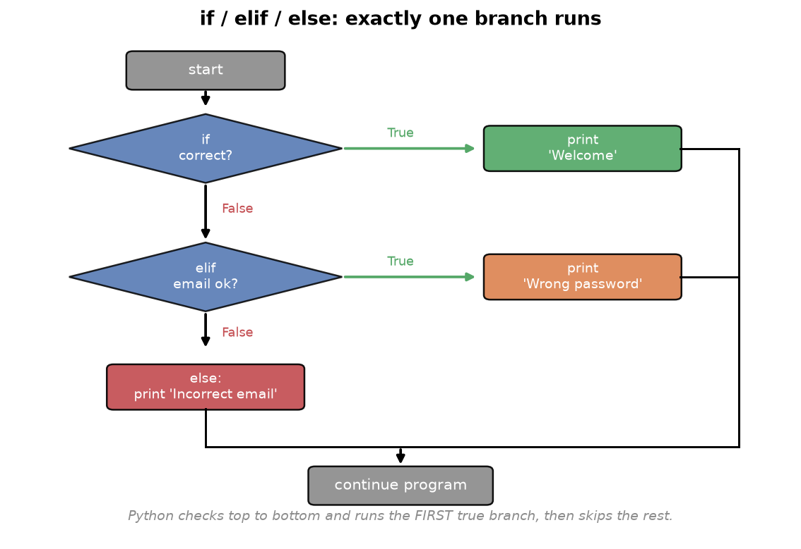
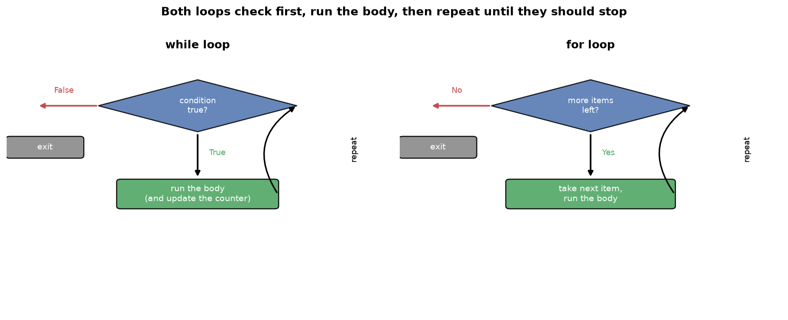
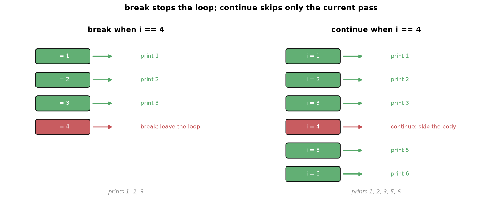

---
tags:
  - python
  - programming
  - operators
  - control-flow
  - loops
aliases:
  - Operators & Control Flow
  - Python Operators and Control Flow
difficulty: beginner
prerequisites:
  - Python Fundamentals
created: 2026-09-25
---

> [!info] Where this fits
> This builds directly on [[Python Fundamentals]]. You already know values, variables, and data types. Now you learn to combine values with operators and to control the order in which code runs, which is what turns a list of statements into a real program.

By default a program runs top to bottom, one line after another. That alone cannot express most real logic, which needs to combine values, make decisions, and repeat work. This note covers the three tools that make that possible: operators that act on values, conditional statements that choose between paths, and loops that repeat a block of code.

---

## Operators

An **operator** is a symbol that performs an operation on one or more values. The values an operator works on are called its **operands**. In `2 + 3`, the `+` is the operator and `2` and `3` are the operands. Python groups its operators into six families.

### Arithmetic operators

These are the mathematical operators you already know, plus three that are worth calling out.

| Operator | Name | `a = 5`, `b = 2` | Result |
| :--- | :--- | :--- | :--- |
| `+` | addition | `a + b` | `7` |
| `-` | subtraction | `a - b` | `3` |
| `*` | multiplication | `a * b` | `10` |
| `/` | division | `a / b` | `2.5` |
| `//` | integer (floor) division | `a // b` | `2` |
| `%` | modulus (remainder) | `a % b` | `1` |
| `**` | power | `a ** b` | `25` |

Three of these are easy to miss:

- **Integer division** `//` divides and then throws away the decimal part, so `5 // 2` is `2`, not `2.5`.
- **Modulus** `%` gives the remainder of a division, so `5 % 2` is `1`. When the left number is smaller than the right, the remainder is the left number itself, so `3 % 10` is `3`.
- **Power** `**` raises to an exponent, so `5 ** 2` is `25`.

> [!example]
> Modulus and integer division together let you pull digits out of a number. Given a three-digit number, `number % 10` gives the last digit, and `number // 10` removes it. Repeat, and you extract every digit.
>
> ```python
> number = 345
> a = number % 10        # 5   (last digit)
> number = number // 10  # 34  (drop the last digit)
> b = number % 10        # 4
> number = number // 10  # 3
> c = number % 10        # 3
> print(a + b + c)       # 12
> ```

### Relational operators

Relational operators, also called comparison operators, compare two values and always return a boolean (`True` or `False`).

| Operator | Meaning |
| :--- | :--- |
| `>` | greater than |
| `<` | less than |
| `>=` | greater than or equal to |
| `<=` | less than or equal to |
| `==` | equal to |
| `!=` | not equal to |

```python
print(4 > 5)    # False
print(4 == 4)   # True
```

> [!warning]
> A single `=` assigns a value; a double `==` compares two values. `x = 5` stores 5 in `x`, while `x == 5` asks whether `x` equals 5. Mixing them up is one of the most common beginner mistakes.

### Logical operators

Logical operators combine boolean values and are the backbone of decision logic. There are three: `and`, `or`, and `not`.

- `and` is `True` only when both sides are `True`.
- `or` is `True` when at least one side is `True`.
- `not` flips a value: `not True` is `False`.

```python
print(True and False)   # False
print(True or False)    # True
print(not True)         # False
```

> [!note]
> Do not confuse the word operators `and`, `or`, `not` with the bitwise symbols `&`, `|`, `~` below. The word versions work on whole boolean values and are what you use for logic. The symbols work on the individual bits of numbers.

### Bitwise operators

Bitwise operators work on the binary representation of integers, bit by bit. They convert each operand to binary, apply the operation to each pair of bits, and convert back.

| Operator | Name |
| :--- | :--- |
| `&` | bitwise and |
| `\|` | bitwise or |
| `^` | bitwise xor |
| `~` | bitwise not |
| `<<` | left shift |
| `>>` | right shift |

```python
print(2 & 3)   # 2
```

To see why `2 & 3` is `2`, line up the bits and apply `and` to each column, where `and` gives `1` only when both bits are `1`:

```text
  1 0   (2)
  1 1   (3)
  -----
  1 0   = 2
```

> [!note]
> Bitwise operators are rarely needed in everyday programming or data science. You might meet `&` and `|` in image processing or computer vision, but you can safely treat the rest as background knowledge for now.

### Assignment operators

The single `=` is the **assignment operator**: it stores the value on its right into the variable on its left. You can combine it with an arithmetic operator as a shorthand.

```python
a = 5
a += 2    # same as: a = a + 2
print(a)  # 7
```

`a += 2` means "take the current value of `a`, add 2, and store the result back in `a`." The same works for `-=`, `*=`, `/=`, `%=`, and the others.

> [!note]
> Python has no `++` or `--` operators. Where C uses `a++`, Python uses `a += 1`. This was a deliberate choice to avoid the confusion those operators can cause.

### Membership operators

Membership operators check whether a value exists inside a sequence. There are two: `in` and `not in`. Both return a boolean.

```python
print('D' in 'Delhi')       # True
print(1 in [2, 3, 4, 5])    # False
```

> [!tip]
> `in` is more than a convenience. Checking membership by hand would need a loop over every element. The `in` operator does it in one readable, optimized expression, and it works on strings, lists, tuples, sets, and dictionaries alike.

---

## Making decisions with if, elif, and else

Sometimes a program reaches a point where it must choose between paths based on a condition. This is called **branching**, and it is handled by `if`, `elif`, and `else`.



Consider a login page. When a user submits an email and password, there are two possibilities: the credentials are correct, or they are not. Each possibility needs different code, so the program branches.

```python
email = input('Enter email: ')
password = input('Enter password: ')

if email == 'nitish@gmail.com' and password == '1234':
    print('Welcome')
else:
    print('Incorrect email or password')
```

Two things are worth noticing.

- The condition uses `and`, because both the email **and** the password must be correct. Using `or` would let anyone in with just a correct email.
- The code inside each branch is indented.

### Indentation defines a block

Where C and Java use curly braces `{ }` to group the code inside an `if`, Python uses **indentation**: the lines belonging to a branch are shifted to the right by one level. There are no braces and no semicolons.

```python
if condition:
    # this indented line runs when the condition is true
    print('inside the if')
print('this always runs, it is outside the if')
```

Indentation is not optional styling in Python; it is the syntax. This is a deliberate design choice that forces every Python program to be cleanly formatted and readable. When you type the colon and press enter, the editor indents the next line for you.

### More than two paths with elif

`if` and `else` handle two possibilities. For three or more, add one or more `elif` (short for "else if") branches between them.

```python
if email == 'nitish@gmail.com' and password == '1234':
    print('Welcome')
elif email == 'nitish@gmail.com' and password != '1234':
    print('Wrong password, try again')
else:
    print('Incorrect email')
```

Python checks each condition from top to bottom and runs the block of the **first** one that is true, then skips the rest. If none are true, the `else` block runs.

> [!tip]
> Chained `if`, `elif`, `else` statements are how you build a menu-driven program: ask the user to pick an option, store their choice, then branch to the matching action. An ATM screen or a command-line menu is built exactly this way.

---

## Modules

As a program grows, you will want to reuse code that someone has already written rather than write everything yourself. A **module** is a file of Python code, holding functions and values, that you can pull into your own program. Python ships with a large collection of them, its **standard library**, which is what "batteries included" means in practice.

You bring a module in with the `import` keyword. Once imported, you reach its contents through the module name and a dot.

```python
import math

print(math.sqrt(25))      # 5.0
print(math.pi)            # 3.141592653589793
```

Here `math` is a module, `sqrt` is a function inside it, and `pi` is a value inside it. The dot says "look inside `math` for this name".

You do not have to import the whole module. When you need one or two names, import them directly, and then you can use them without the module prefix.

```python
from math import sqrt, pi

print(sqrt(25))           # 5.0, no math. prefix needed
```

> [!tip]
> A few standard modules come up constantly: `math` for mathematical functions, `random` for random numbers, and `datetime` for dates and times. Beyond the standard library, the data science tools you will meet later, such as NumPy and pandas, are modules too, imported the same way. Learning `import` now is what unlocks all of them.

> [!note]
> You can rename a module on import with `as`, which is why data science code almost always begins `import numpy as np`. The alias is shorter to type and is a shared convention, so `np` means NumPy to every reader.

---

## Loops

A **loop** repeats a block of code. Without loops you would have to copy the same lines over and over. Python has two loops: `while` and `for`.



### The while loop

A `while` loop repeats its body as long as a condition stays true. You typically set up a counter, check it in the condition, and update it inside the loop.

```python
number = int(input('Enter a number: '))
i = 1
while i < 11:
    print(number * i)
    i += 1
```

This prints the multiplication table of a number. Read it as a cycle:

1. Check the condition `i < 11`. If false, stop and leave the loop.
2. If true, run the body: print `number * i`.
3. Update the counter with `i += 1`.
4. Go back to step 1.

> [!warning]
> If you forget to update the counter (`i += 1`), the condition never becomes false and the loop runs forever. An infinite loop is the most common loop bug. Always make sure something inside the loop moves the condition toward becoming false.

Python also lets you attach an `else` to a loop. The `else` block runs once, after the loop finishes normally.

```python
x = 1
while x < 3:
    print(x)
    x += 1
else:
    print('limit crossed')
```

### The for loop and range

A `for` loop repeats once for each item in a sequence. It is simpler and more powerful than the C-style loop, because you do not manage a counter by hand. The most common way to drive a `for` loop is the built-in `range` function, which generates a sequence of numbers.

```python
for i in range(1, 11):
    print(i)          # prints 1 to 10
```

`range` takes up to three arguments:

- `range(1, 11)` generates `1` to `10`. The first number is included, the second is excluded.
- A third argument sets the **step size**: `range(1, 10, 2)` gives `1, 3, 5, 7, 9`.
- A negative step counts down: `range(10, 0, -1)` gives `10, 9, ..., 1`.

A `for` loop can also walk directly through the items of a string, list, tuple, set, or dictionary, without any `range` at all.

```python
for char in 'DELHI':
    print(char)       # prints D, E, L, H, I
```

> [!note]
> The difference from other languages is that you never specify a start, end, and increment as three separate pieces. You hand the loop a sequence, and it walks through it. This is why Python loops are shorter and harder to get wrong.

---

## Controlling loops: break, continue, and pass

Three statements let you control a loop from the inside. They are called loop control statements.



**`break`** stops the loop immediately and moves on to the code after it.

```python
for i in range(1, 10):
    if i == 5:
        break
    print(i)          # prints 1, 2, 3, 4
```

`break` is what you use in a search: the moment you find what you are looking for, there is no reason to keep looping, so you break out.

**`continue`** skips the rest of the current iteration and jumps straight to the next one.

```python
for i in range(1, 10):
    if i == 5:
        continue
    print(i)          # prints 1 to 9, but not 5
```

**`pass`** does nothing. It is a placeholder for a spot where Python's syntax requires a statement but you have no code to put there yet.

```python
for i in range(1, 10):
    if i == 5:
        pass          # a reminder to add logic here later
    print(i)          # prints 1 to 9, including 5
```

---

## Nested loops

A **nested loop** is a loop inside another loop. The inner loop runs completely for every single pass of the outer loop. Use one whenever you need to pair every item from one set with every item from another.

```python
for i in range(1, 5):
    for j in range(1, 5):
        print(i, j)
```

This prints every pair from `(1, 1)` up to `(4, 4)`. Trace the order: the outer loop fixes `i = 1`, then the inner loop runs fully with `j = 1, 2, 3, 4`. Only then does the outer loop move to `i = 2`, and the inner loop runs fully again.

> [!example]
> To print every student in every class of a school, the outer loop walks through the classes and, for each class, the inner loop walks through that class's students. Any time the task is "for each X, do something with every Y", a nested loop fits.

> [!warning]
> Nested loops multiply their work. An outer loop of 1000 items with an inner loop of 1000 items runs the inner body a million times. This cost matters, and [[Time Complexity]] gives you the tools to reason about it.

---

## Summary

1. An operator acts on operands. Python has arithmetic (`+ - * / // % **`), relational (`> < >= <= == !=`), logical (`and or not`), bitwise (`& | ^ ~ << >>`), assignment (`=` and its shorthands like `+=`), and membership (`in`, `not in`) operators.
2. Integer division `//` drops the decimal part and modulus `%` gives the remainder; together they extract digits from numbers.
3. Use `==` to compare and `=` to assign; confusing them is a common bug.
4. `if`, `elif`, and `else` branch the program. Python runs the first true branch and uses indentation, not braces, to mark which lines belong to each branch.
5. A module is a file of reusable code; `import` brings it in, and you reach its contents with a dot, or import names directly with `from`. The standard library and tools like NumPy and pandas are all modules.
6. A `while` loop repeats while a condition holds; always update something so the condition can eventually become false.
7. A `for` loop walks through a sequence. `range(start, stop, step)` generates numbers, with `stop` excluded, and a `for` loop can also iterate directly over any collection.
8. `break` exits a loop early, `continue` skips to the next iteration, and `pass` is a do-nothing placeholder.
9. A nested loop runs the inner loop fully for each pass of the outer loop, which pairs every item with every other and multiplies the total work.

---

> [!info] Continues to
> With decisions and repetition in hand, the next topic is [[Strings]], where you apply loops, indexing, and membership to work with text.
