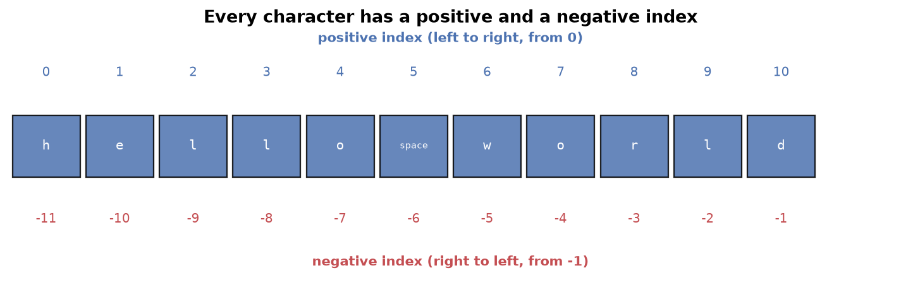

---
tags:
  - python
  - programming
  - strings
  - data-types
aliases:
  - Strings
  - Python Strings
difficulty: beginner
prerequisites:
  - Python Fundamentals
created: 2026-09-25
---

> [!info] Where this fits
> This builds on [[Python Fundamentals]], where you met the string as one of Python's data types, and on [[Operators & Control Flow]], whose loops and membership checks you will now apply to text. Strings are the first data type covered in depth, and the ideas here (indexing, slicing, immutability) return in lists and other sequences.

A **string** is text: a name, a sentence, a whole blog post. Text is everywhere in real software and especially in data science, where a large part of the field, natural language processing, is built entirely on manipulating strings. This note covers what a string is, how to create one, how to reach inside it, and the operations and methods that let you transform it.

---

## What is a string

Logically, a string is a **collection of characters**. The word `Nitish` is the characters `N`, `i`, `t`, `i`, `s`, `h` in order.

More precisely, a Python string is a **sequence of Unicode characters**. That last word matters.

- Early computers used **ASCII**, an 8-bit scheme that could represent only 256 characters, enough for English but not for other languages.
- Python uses **Unicode**, a much larger scheme that can represent characters from every language, along with symbols and emoji.

> [!note]
> This is why a Python string can hold text in any language, or even an emoji, not just English letters. You rarely need to think about it directly, but it explains why Python handles international text so smoothly.

---

## Creating strings

Python gives you a few ways to write a string, and each exists for a reason.

```python
a = 'single quotes'
b = "double quotes"
c = '''triple quotes'''
d = str(5)            # build a string from another value
```

Single and double quotes both work so you can put one kind of quote **inside** a string wrapped in the other kind.

```python
print("it's raining")   # single quote inside double quotes, works
print('it's raining')   # error: Python thinks the string ends at it'
```

Triple quotes are for **multi-line strings**, text that spans several lines, such as a paragraph a user types into a form.

```python
para = '''This is line one.
This is line two.'''
```

---

## Accessing characters: indexing

When you create a string, Python automatically assigns each character a position number called an **index**. **Indexing** is how you pull out a single character by its position.



There are two ways to number the characters:

- **Positive indexing** runs left to right and starts at `0`. The first character is `0`, the second is `1`, and so on.
- **Negative indexing** runs right to left and starts at `-1`. The last character is `-1`, the second-to-last is `-2`, and so on.

```python
s = 'hello world'
print(s[0])     # h   (first character)
print(s[-1])    # d   (last character)
print(s[6])     # w
```

> [!tip]
> Negative indexing is what makes "get the last character" easy. Without it, you would first have to find the length of the string. With it, `s[-1]` always gives the last character, whatever the length.

Asking for an index that does not exist, like `s[41]` on an 11-character string, raises an error.

---

## Slicing

**Slicing** extracts a range of characters at once, rather than a single one. You give a start and a stop index separated by a colon.

![Slicing with s[0:5] takes characters 0 to 4, because the stop index is excluded](./ASSETS/string_slicing.png)

```python
s = 'hello world'
print(s[0:5])    # hello
```

The rule that trips up beginners: the **start index is included, but the stop index is excluded**. `s[0:5]` gives characters at positions 0, 1, 2, 3, and 4, stopping just before 5.

You can leave out either number, and add a third for the step size, exactly like `range`.

```python
print(s[:5])       # hello   (start defaults to 0)
print(s[6:])       # world   (stop defaults to the end)
print(s[:])        # hello world   (the whole string)
print(s[0:6:2])    # hlo     (step size 2, take every other character)
```

A negative step walks backward. The most famous use is reversing a string in one line:

```python
print(s[::-1])     # dlrow olleh
```

> [!warning]
> With a negative step, the start index must be larger than the stop index, because you are moving right to left. `s[6:0:-1]` works; `s[0:6:-1]` produces nothing.

---

## Strings are immutable

Try to change a single character in place, and Python refuses.

```python
s = 'hello world'
s[0] = 'H'    # error: 'str' object does not support item assignment
```

Python strings are **immutable**, which means once a string is created it cannot be changed. Every operation that looks like it edits a string builds a brand new string and leaves the original untouched.

> [!note]
> Immutability is a deep and important property that also governs which data types can be dictionary keys and how memory is shared. For now, remember the practical rule: you cannot edit a string in place.

You can delete a whole string with the `del` keyword, but you cannot delete part of one, because deleting part would be a change.

```python
s = 'hello world'
del s            # deletes the whole variable, works
del s[0:5]       # error: cannot partially delete an immutable string
```

---

## Operating on strings

Several operators work on strings.

**Concatenation with `+`** joins two strings into one.

```python
print('Delhi' + ' ' + 'Mumbai')   # Delhi Mumbai
```

**Repetition with `*`** repeats a string a given number of times. This is handy for building separators.

```python
print('Delhi' * 3)   # DelhiDelhiDelhi
print('*' * 20)      # ********************
```

**Comparison operators** compare strings lexicographically, meaning dictionary order based on character values. A word that comes later in the dictionary is "greater".

```python
print('Mumbai' > 'Pune')   # False, Mumbai comes first alphabetically
```

> [!warning]
> Comparison uses character codes, and capital letters have smaller codes than lowercase ones. So `'Pune' > 'pune'` is `False`, because capital `P` ranks below lowercase `p`. String comparison is case sensitive.

**Membership** with `in` and `not in` checks whether one string appears inside another, and it is case sensitive.

```python
print('b' in 'Delhi')    # False
print('D' in 'Delhi')    # True
```

**Looping** works because a string is iterable: a `for` loop walks through it one character at a time.

```python
for ch in 'DELHI':
    print(ch)    # D, E, L, H, I on separate lines
```

---

## String methods

A **method** is a function attached to a value, called with a dot: `s.upper()`. Python ships with many string methods; these are the ones you will reach for constantly.

### Functions that work on any sequence

These built-in functions work on strings, lists, and other collections alike.

| Function | What it does |
| :--- | :--- |
| `len(s)` | counts the characters, including spaces |
| `max(s)` | the character with the highest code |
| `min(s)` | the character with the lowest code |
| `sorted(s)` | returns a sorted **list** of the characters |

### Changing case

| Method | Result on `'hello world'` |
| :--- | :--- |
| `s.upper()` | `'HELLO WORLD'` |
| `s.lower()` | `'hello world'` |
| `s.capitalize()` | `'Hello world'` (first letter only) |
| `s.title()` | `'Hello World'` (first letter of every word) |
| `s.swapcase()` | swaps the case of every letter |

### Searching

- `s.find(sub)` returns the index where `sub` first appears, or `-1` if it is absent.
- `s.index(sub)` does the same but raises an error if `sub` is absent.
- `s.count(sub)` counts how many times `sub` appears.
- `s.startswith(sub)` and `s.endswith(sub)` return `True` or `False`.

```python
s = 'my name is Nitish'
print(s.count('i'))        # 3
print(s.find('is'))        # 8
print(s.endswith('sh'))    # True
```

### Splitting and joining

`split` breaks a string into a **list** of pieces, and `join` does the reverse. These are among the most used string methods in real work.

```python
sentence = 'hi my name is nitish'
words = sentence.split()          # ['hi', 'my', 'name', 'is', 'nitish']
back = ' '.join(words)            # 'hi my name is nitish'
```

`split` breaks on spaces by default, but you can split on any character.

```python
print('a-b-c'.split('-'))    # ['a', 'b', 'c']
```

### Replacing

`replace` swaps every occurrence of one substring with another, returning a new string.

```python
print('my name is nitish'.replace('nitish', 'campusx'))
# my name is campusx
```

### Checking content

These return `True` or `False`, useful for validating input.

| Method | Checks whether the string is |
| :--- | :--- |
| `s.isalnum()` | only letters and digits |
| `s.isalpha()` | only letters |
| `s.isdigit()` | only digits |
| `s.isidentifier()` | a valid variable name |

> [!warning]
> Every one of these methods returns a **new** string (or a value); none of them changes the original. This follows directly from immutability. After `s.upper()`, `s` itself is unchanged unless you reassign it with `s = s.upper()`.

---

## Formatting strings

Often you need to insert a variable's value into a sentence. The modern, preferred way is an **f-string**: put an `f` before the opening quote and write the variable inside curly braces.

```python
name = 'Nitish'
gender = 'male'
print(f'Hi, my name is {name} and I am a {gender}.')
# Hi, my name is Nitish and I am a male.
```

An older method, `.format()`, does the same by filling numbered placeholders in order.

```python
print('Hi, my name is {} and I am a {}.'.format(name, gender))
```

> [!tip]
> Prefer f-strings. They put the value right where it appears in the sentence, so the code reads the way the output looks. Reach for `.format()` only when you meet it in older code.

---

## Summary

1. A string is text, stored as a sequence of Unicode characters, which lets Python hold any language, symbols, and emoji.
2. Create strings with single, double, or triple quotes; triple quotes allow multiple lines, and `str()` converts other values to text.
3. Indexing pulls out one character: positive indexing counts from `0` on the left, negative indexing counts from `-1` on the right.
4. Slicing `s[start:stop:step]` pulls out a range, with the stop index excluded; `s[::-1]` reverses a string.
5. Strings are immutable: you cannot change a character in place or delete part of one, though you can delete the whole variable.
6. `+` concatenates, `*` repeats, comparison is lexicographic and case sensitive, `in` tests membership, and a `for` loop iterates character by character.
7. Useful methods include `len`, `sorted`, the case methods (`upper`, `lower`, `title`), the search methods (`find`, `count`, `startswith`), and `split`, `join`, and `replace`. All return new values and never change the original.
8. Insert values into text with f-strings, the modern and most readable formatting approach.

---

> [!info] Continues to
> You can now build and manipulate text. Before moving to more data types, [[Time Complexity]] gives you a way to judge whether the code you write, including the loops and slicing here, is efficient.
