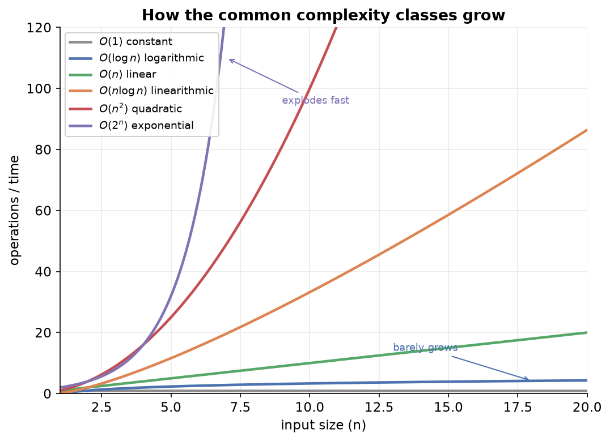

---
tags:
  - python
  - programming
  - time-complexity
  - big-o
  - algorithms
aliases:
  - Time Complexity
  - Big O Notation
difficulty: intermediate
prerequisites:
  - Operators & Control Flow
created: 2026-09-25
---

> [!info] Where this fits
> This follows [[Operators & Control Flow]] and [[Strings]], where you wrote your first loops and saw how nested loops multiply work. Now you learn to measure that cost. Time complexity is the single most reused idea in the rest of the roadmap: it is how every algorithm, from sorting to machine learning, is judged.

Two programs can solve the same problem, yet one may be far better than the other. This note is about how to measure "better" precisely, so you can look at code and say whether it is efficient or wasteful, and by how much.

---

## Why efficiency matters

The **efficiency** of a program is measured on two axes:

- **Time complexity**: how much time the program takes to run.
- **Space complexity**: how much memory it uses while running.

Both matter enormously in real systems.

> [!example]
> Search for a word on Google and it reports something like "about 2 billion results in 0.4 seconds." Google scanned billions of web pages, ranked them, and returned the best ones, all in a fraction of a second. A naive program could never do that. It takes carefully designed, time-efficient algorithms, and that efficiency is worth billions to the business.

> [!example]
> A mobile game that needs 2 GB of memory will not run on a phone with 2 GB of RAM. When the makers of one such game released a light version that fit in 32 MB, it ran smoothly on low-memory phones and reached far more players. That is space complexity turned into business value.

This note focuses on **time complexity**, because it is the trickier of the two to reason about. The goal is a way to compare algorithms that does not depend on which computer you run them on.

---

## Three ways to measure time, and why the first two fail

Before the right approach, it helps to see two tempting but flawed ones. Each teaches a requirement the final method must satisfy.

### Attempt one: measure the clock time

The obvious idea: run the program and time it with a stopwatch.

```python
import time
start = time.time()
for i in range(1, 100):
    print(i)
end = time.time()
print(end - start)     # e.g. 0.002 seconds
```

This is easy, and it does let you compare two algorithms. But it has serious flaws:

- **It changes with the machine.** A fast computer and a slow one give different times for the same code, so the number describes the hardware, not the algorithm.
- **It changes with implementation.** Swapping a `for` loop for an equivalent `while` loop changes the time, even though the algorithm is identical.
- **It breaks for tiny inputs.** Timing a single assignment is meaningless; the number is dominated by noise.
- **It gives no formula.** It tells you the time for one input, but not the relationship between input size and time.

### Attempt two: count the operations

A better idea: count how many basic operations the program performs, treating each arithmetic step, comparison, and assignment as one unit.

```python
def sum_to(x):
    total = 0                 # 1 operation
    for i in range(x + 1):    # runs x times
        total = total + i     # 2 operations, x times
    return total
```

Counting gives roughly `3x + 1` operations for an input of size `x`. This is a real improvement:

- It is **machine independent**: the count is the same on any computer.
- For the first time, it produces a **mathematical relationship** between the input size and the work done.

But two problems remain:

- The count still changes if you change the implementation (`for` versus `while`).
- There is no clear rule for which operations to count, and whether they all cost the same. That ambiguity makes the exact count unreliable.

The lesson from both attempts: we want a measure that is machine independent, implementation independent, and expressed as a relationship to input size, focused on large inputs where efficiency truly matters.

---

## What we want to measure

Three goals shape the right approach:

- **Compare algorithms** for the same problem and pick the most efficient.
- **Judge scalability**: how the program behaves as the input grows large. Small inputs are easy for any algorithm; large inputs are where the differences show.
- **Express the result as a relationship to input size**, so you can predict how the running time grows when the input grows.

### Best, average, and worst case

For a given algorithm, the running time can depend on the specific input, giving three cases. Consider searching a database for one person.

- **Best case**: the person is the first entry. You find them immediately.
- **Average case**: they are somewhere in the middle.
- **Worst case**: they are last, or not present at all, so you must check every entry.

> [!tip]
> Analysis focuses on the **worst case**. When you design an algorithm, you care about the guarantee it can give under the least favorable input, because that is what protects you when things go wrong at scale.

---

## Big O and the order of growth

The method used in practice is the **order of growth**, written with **Big O notation**. It captures how the running time grows as the input size `n` grows, ignoring details that do not matter at large scale.

The recipe has three steps. Start from the operation count as a formula in `n`, then simplify.

1. Count the operations to get an expression, for example $5n + 2$.
2. **Drop the additive constants.** $5n + 2$ becomes $5n$.
3. **Drop the multiplicative constants.** $5n$ becomes $n$.

The result is written $O(n)$, read "order of n".

$$5n + 2 \;\Rightarrow\; 5n \;\Rightarrow\; O(n)$$

When an expression has several terms, keep only the one that grows fastest, since it dominates for large `n`.

> [!example]
> Simplify $n^2 + 2n$. There are no additive constants to drop. Dropping the multiplicative constant on $2n$ leaves $n^2 + n$. For large `n`, $n^2$ grows far faster than $n$, so you keep only the largest term: the result is $O(n^2)$.

> [!example]
> Simplify $\log n + n + 4$. Drop the constant $4$, leaving $\log n + n$. For large `n`, `n` is much larger than $\log n$, so the answer is $O(n)$.

The point is not an exact formula but the **shape** of the growth. $O(n)$ means the relationship is linear: double the input, and the running time roughly doubles.

> [!note]
> Two comparisons worth memorizing for picking the dominant term. For large `n`, a polynomial like $n^{30}$ eventually loses to any exponential like $3^n$, so an exponential term dominates. And $n \log n$ grows faster than $n$, because $\log n$ exceeds 1 for any sizable `n`.

---

## The common complexity classes

Almost every program you write falls into one of a handful of classes. Here they are from fastest-growing (worst) to slowest-growing (best), the way they are usually ranked.



| Class | Big O | Meaning | Typical source |
| :--- | :--- | :--- | :--- |
| Constant | $O(1)$ | time does not change with input size | indexing into a list |
| Logarithmic | $O(\log n)$ | time grows slowly as input grows | binary search |
| Linear | $O(n)$ | double the input, double the time | a single loop, linear search |
| Linearithmic | $O(n \log n)$ | slightly worse than linear | efficient sorting |
| Quadratic | $O(n^2)$ | double the input, four times the time | nested loops |
| Exponential | $O(2^n)$ | time explodes as input grows | trying every combination |

A few of these deserve a closer look.

**Constant, $O(1)$.** The running time is the same no matter how large the input. Fetching item 35 from a list is $O(1)$: the list stores its elements in consecutive memory slots, so Python reaches element 35 by a single calculation from the start address. The list's size never enters that calculation, so a list of 50 and a list of 50 million take the same time to index.

**Linear, $O(n)$.** Double the input and the time doubles. Searching a database one entry at a time is linear: in the worst case, a database twice as large takes twice as long to search.

**Quadratic, $O(n^2)$.** Double the input and the time quadruples. This is the signature of a nested loop, where the inner loop runs fully for every pass of the outer loop.

**Logarithmic, $O(\log n)$.** As the input grows, the time grows only slightly. Achieving logarithmic time on a problem that looks linear is a mark of a strong algorithm.

> [!tip]
> When you see a single loop over the input, suspect $O(n)$. When you see a loop inside a loop, suspect $O(n^2)$. Reaching an element by direct index is $O(1)$. This quick read is usually enough to spot the complexity class of everyday code.

---

## Worked examples

The way to get fluent is to run the recipe on real code: count the operations as a formula in `n`, drop the constants, and keep the fastest-growing term. Work through these four and the quick read above becomes second nature.

**Example 1: a single loop is $O(n)$.** The function sums the numbers from 1 to `n`.

```python
def sum_to(n):
    total = 0                 # 1 operation
    for i in range(1, n + 1): # the body runs n times
        total = total + i     # 1 operation, n times
    return total              # 1 operation
```

The count is $n + 2$. Drop the additive constant to get $n$, so this is $O(n)$. Double `n` and the work roughly doubles.

**Example 2: separate loops still add up to $O(n)$.** One loop after another does not multiply; the counts add.

```python
def two_passes(n):
    for i in range(n):    # n iterations
        print(i)
    for j in range(n):    # another n iterations
        print(j)
```

The count is $n + n = 2n$. Drop the multiplicative constant and it is $O(n)$. Running the input twice in sequence is still linear, because $2n$ and $n$ have the same shape.

**Example 3: a nested loop is $O(n^2)$.** When one loop sits inside another, the inner body runs for every pass of the outer loop, so the counts multiply.

```python
def all_pairs(n):
    for i in range(n):        # runs n times
        for j in range(n):    # runs n times for each i
            print(i, j)       # runs n * n times
```

The inner line runs $n \times n = n^2$ times, so this is $O(n^2)$. Double `n` and the work quadruples, which is why nested loops over large inputs are a warning sign.

**Example 4: keep only the dominant term.** A function can mix a nested loop with a single loop.

```python
def mixed(n):
    for i in range(n):        # n iterations
        for j in range(n):    # n iterations each -> n^2 total
            print(i, j)
    for k in range(n):        # n iterations
        print(k)
```

The count is $n^2 + n$. For large `n`, $n^2$ dwarfs `n`, so you keep only the largest term: $O(n^2)$. The trailing single loop makes no difference to the growth rate.

> [!warning]
> A loop that does not depend on the input size is a constant, not a factor of `n`. A loop that always runs exactly 100 times contributes $O(1)$, however large the input, because the input never enters its count. Only loops driven by the input size add a factor of `n`.

---

## Summary

1. Efficiency has two axes: time complexity (how long a program runs) and space complexity (how much memory it uses). Both carry real business cost at scale.
2. Timing with a stopwatch fails because it depends on the machine and the implementation, breaks for tiny inputs, and gives no formula.
3. Counting operations is machine independent and yields a formula, but still changes with implementation and is ambiguous about which operations to count.
4. The goal is a measure that is machine and implementation independent, focused on large inputs, and expressed as a relationship to input size.
5. Analysis focuses on the worst case, the least favorable input.
6. Big O notation captures the order of growth: count operations, drop additive constants, drop multiplicative constants, and keep only the fastest-growing term.
7. The common classes, from best to worst, are $O(1)$, $O(\log n)$, $O(n)$, $O(n \log n)$, $O(n^2)$, and $O(2^n)$.
8. A quick read: one loop suggests $O(n)$, a nested loop suggests $O(n^2)$, and direct indexing is $O(1)$.
9. Applying the recipe to code: sequential loops add ($2n \Rightarrow O(n)$), nested loops multiply ($n^2$), you keep only the dominant term ($n^2 + n \Rightarrow O(n^2)$), and a fixed-count loop stays $O(1)$.

---

> [!info] Continues to
> With a way to judge efficiency in hand, the next topic is [[Lists]], the most important Python data type, where you will see why indexing is $O(1)$ and why some list operations cost more than others.
