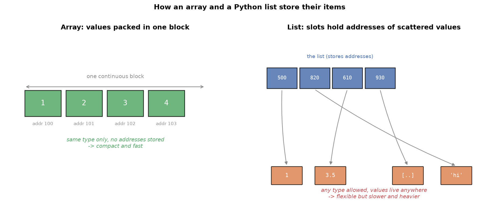

---
tags:
  - python
  - programming
  - lists
  - data-types
aliases:
  - Lists
  - Python Lists
difficulty: beginner
prerequisites:
  - Strings
  - Time Complexity
created: 2026-09-25
---

> [!info] Where this fits
> This follows [[Strings]], whose indexing and slicing carry over directly, and [[Time Complexity]], which explains why indexing a list is fast. The list is the most important Python data type. You will use it constantly, and the data structures in NumPy and pandas are built on the same ideas.

A **list** is a data type that stores many items under one name. When you have a collection of related things, ten thousand movie reviews, a set of scores, a row of features, you keep them in a single list rather than ten thousand separate variables. This note covers what a list is, how it differs from an array, and every way to create, read, change, and process one.

---

## What is a list

A list is written as comma-separated items inside square brackets.

```python
reviews = ['good', 'bad', 'average']
numbers = [1, 2, 3, 4, 5]
```

Storing related items together makes them easy to process as a group. To lowercase ten thousand reviews, you loop over one list; with ten thousand separate variables that would be impossible.

### List versus array

Other languages (C, C++, Java) have a similar type called an **array**. Python's list is more flexible in two ways.

| | Array (C, Java) | Python list |
| :--- | :--- | :--- |
| Size | fixed, declared up front | dynamic, grows on the fly |
| Item types | homogeneous (all same type) | heterogeneous (mixed types allowed) |

- An array has a **fixed size**: you declare how many items it holds, and unused slots are wasted. A list is a **dynamic array**: it grows as you add items, with no size to declare.
- An array is **homogeneous**: every item must be the same type. A list is **heterogeneous**: it can mix integers, strings, floats, even other lists.

```python
mixed = [20, 'nitish', 35.75, [1, 2, 3]]   # all valid in one list
```

These conveniences come at a cost, covered at the end: Python lists are slower and use more memory than arrays.

### How a list is stored in memory

This explains both the flexibility and the cost. An array stores its values in one continuous block of memory. A list instead stores, for each item, the memory **address** of that item, which can live anywhere.



Because a list holds addresses (references) rather than the values themselves, it is called a **referential array**. This is why a list can hold mixed types: every slot is just an address, and an address can point to any kind of object. It is also why lists use more memory: they store both the values and the addresses.

> [!note]
> A Python list can hold any object at all, including functions and objects of your own classes, not just numbers and strings. This is unusual and powerful, and it follows directly from the fact that a list stores references.

---

## Creating lists

```python
empty = []                          # empty list
one_d = [1, 2, 3, 4, 5]             # 1D list
two_d = [1, 2, 3, [4, 5]]           # 2D (nested) list
three_d = [[[1, 2], [3, 4]], [[5, 6], [7, 8]]]   # 3D list
hetero = [1, True, 5.6, 'hello']    # heterogeneous
from_str = list('hello')            # ['h', 'e', 'l', 'l', 'o']
```

A list holding another list is **nested**. Count the opening brackets to read the depth: three opening brackets means a 3D list.

> [!tip]
> To decide if a nested list is homogeneous, look only at the items of the outermost list. `[[1, 2], [3, 4]]` is homogeneous, because its two items are both lists, even though numbers sit inside.

---

## Accessing items: indexing and slicing

This works exactly as it did for strings, which is the payoff of Python's consistent design. Learn it once and it applies to every sequence type.

**Indexing** pulls one item. Positive indexing counts from `0` on the left; negative indexing counts from `-1` on the right.

```python
L = [1, 2, 3, 4, 5]
print(L[0])     # 1
print(L[-1])    # 5
```

**Slicing** pulls a range, with the stop index excluded, and supports a step.

```python
print(L[0:3])    # [1, 2, 3]
print(L[::2])    # [1, 3, 5]
print(L[::-1])   # [5, 4, 3, 2, 1]   reversed
```

For a nested list, use one set of brackets per dimension, working from the outside in.

```python
L = [[1, 2, 3], [4, 5, 6]]
print(L[1][0])   # 4   (second inner list, its first item)
```

---

## Adding items

Lists are **mutable**, meaning they can be changed after creation. This is the key difference from strings, and it is what lets you add, edit, and delete items. There are three ways to add.

| Method | What it does |
| :--- | :--- |
| `append(x)` | adds one item to the end |
| `extend([...])` | adds several items to the end |
| `insert(i, x)` | adds one item at index `i` |

```python
L = [1, 2, 3, 4, 5]
L.append(6)          # [1, 2, 3, 4, 5, 6]
L.extend([7, 8])     # [1, 2, 3, 4, 5, 6, 7, 8]
L.insert(1, 100)     # [1, 100, 2, 3, 4, 5, 6, 7, 8]
```

> [!warning]
> The difference between `append` and `extend` catches people out. `append` always adds its argument as a single item, so `L.append([6, 7, 8])` adds one item that is itself a list. `extend` breaks its argument into pieces, so `L.extend([6, 7, 8])` adds three items. Passing a string to `extend` adds each character separately.

---

## Editing items

Because lists are mutable, you can overwrite items by assigning to an index or a slice.

```python
L = [1, 2, 3, 4, 5]
L[-1] = 500              # [1, 2, 3, 4, 500]
L[1:4] = [200, 300, 400] # [1, 200, 300, 400, 500]
```

This is exactly what strings forbid. Strings are immutable, so `s[0] = 'H'` raises an error; the same operation on a list works.

---

## Deleting items

There are four ways to remove items, each suited to a different situation.

| Tool | What it removes |
| :--- | :--- |
| `del L[i]` | the item (or slice) at a known index |
| `L.remove(x)` | the first item equal to a given value |
| `L.pop(i)` | the item at index `i` (default: the last), and returns it |
| `L.clear()` | every item, leaving an empty list |

```python
L = [1, 2, 3, 4, 5]
del L[-1]        # [1, 2, 3, 4]
L.remove(3)      # [1, 2, 4]
L.pop()          # removes and returns 4 -> [1, 2]
L.clear()        # []
```

> [!tip]
> Use `del` or `pop` when you know the position, and `remove` when you know the value but not the position. `remove` is handy when data is generated dynamically and you cannot predict where an item sits.

---

## Operations, membership, and looping

Two operators work on lists.

- `+` **merges** two lists into one (concatenation).
- `*` **repeats** a list.

```python
print([1, 2] + [3, 4])   # [1, 2, 3, 4]
print([1, 2] * 3)        # [1, 2, 1, 2, 1, 2]
```

Membership with `in` and `not in` tests whether an item is present, and a `for` loop walks through the items.

```python
print(5 in [1, 2, 3, 4, 5])   # True

for item in [1, 2, 3]:
    print(item)               # 1, 2, 3 on separate lines
```

---

## List functions

### Functions that work on any sequence

The same four you met with strings work on lists too.

| Function | Result |
| :--- | :--- |
| `len(L)` | number of items |
| `min(L)` | smallest item (needs comparable types) |
| `max(L)` | largest item |
| `sorted(L)` | a **new** sorted list; add `reverse=True` to descend |

### List-specific methods

| Method | What it does |
| :--- | :--- |
| `L.count(x)` | how many times `x` appears |
| `L.index(x)` | index of the first `x` |
| `L.reverse()` | reverses the list **in place** |
| `L.sort()` | sorts the list **in place** |
| `L.copy()` | returns a separate copy |

> [!warning]
> Note the difference between `sorted(L)` and `L.sort()`. `sorted` is temporary: it returns a new sorted list and leaves the original untouched. `sort` is permanent: it reorders the original list in place. `reverse()` is likewise permanent. When a method changes the list itself, the original ordering is lost.

---

## List comprehension

A **list comprehension** is a concise, one-line way to build a list. It replaces the common pattern of creating an empty list and filling it with a loop.

The shape is:

```text
[ expression for item in iterable if condition ]
```

Compare the long form with the comprehension:

```python
# long form
L = []
for i in range(1, 11):
    L.append(i)

# comprehension: same result, one line
L = [i for i in range(1, 11)]
```

Comprehensions are not just shorter; Python optimizes them, so they are usually faster and more memory efficient than the equivalent loop.

More examples build up the pattern:

```python
# square every number
squares = [i ** 2 for i in [1, 2, 3, 4, 5]]      # [1, 4, 9, 16, 25]

# scalar times a vector
scaled = [s * i for i in [2, 3, 4]]              # depends on s

# with a condition: keep only multiples of 5
fives = [i for i in range(1, 51) if i % 5 == 0]  # [5, 10, ..., 50]

# with a filter on strings
langs = ['python', 'java', 'php']
p_langs = [lang for lang in langs if lang.startswith('p')]  # ['python', 'php']
```

Comprehensions can nest, which lets you build 2D lists (matrices) and beyond in a single expression.

```python
matrix = [[i * j for j in range(1, 4)] for i in range(1, 4)]
```

> [!tip]
> Read a comprehension left to right as "collect this **expression**, for each **item** in the **iterable**, when this **condition** holds." Naming the item meaningfully (`lang` rather than `i`) makes the line read almost like a sentence.

---

## Two ways to loop over a list

There are two styles of loop, and different problems call for each.

**Item-wise**: the loop variable is each item in turn. This is the natural Python way.

```python
for item in L:
    print(item)
```

**Index-wise**: the loop variable is each index position, and you fetch the item with it. This mirrors how other languages loop and is needed when you must know or change positions.

```python
for i in range(len(L)):
    print(L[i])
```

### Pairing lists with zip

`zip` pairs up items from two or more lists by position: the first items together, the second items together, and so on. It is the clean way to process two lists in parallel.

```python
L1 = [1, 2, 3, 4]
L2 = [5, 6, 7, 8]
result = [i + j for i, j in zip(L1, L2)]   # [6, 8, 10, 12]
```

> [!note]
> If the lists have different lengths, `zip` stops at the shorter one. Note that `L1 + L2` merely joins the lists end to end; only `zip` lets you combine them item by item.

---

## The cost of a Python list

The flexibility has real downsides, which trace back to the referential storage described earlier.

- **Slower**: the same operation on a C or Java array runs faster than on a Python list.
- **More memory**: a list stores both values and their addresses, so it uses more space than an array.
- **Risky because it is mutable**: this one causes real bugs.

> [!warning]
> Assigning one list to another does **not** copy it. Both names point at the same list in memory, so changing one changes the other.
>
> ```python
> a = [1, 2, 3]
> b = a            # b points at the SAME list, not a copy
> a.append(4)
> print(b)         # [1, 2, 3, 4]  -- b changed too
> ```
>
> To get an independent copy, use `copy()`:
>
> ```python
> b = a.copy()     # now b is separate; changing a leaves b alone
> ```

This mutability trap is a frequent source of beginner bugs. When you want two lists that can change independently, always copy.

---

## Summary

1. A list stores many items under one name, written as comma-separated values in square brackets.
2. Unlike a fixed-size, homogeneous array, a Python list is a dynamic array that can grow and can hold mixed types, because it stores references (addresses) to its items rather than the items themselves.
3. Create lists directly, nest them for multiple dimensions, or convert with `list()`.
4. Indexing and slicing work exactly as they do for strings; nested lists use one bracket per dimension.
5. Lists are mutable: add with `append`, `extend`, or `insert`; edit by assigning to an index or slice; delete with `del`, `remove`, `pop`, or `clear`.
6. `+` merges lists, `*` repeats them, `in` tests membership, and a `for` loop iterates the items.
7. `sorted` and `reverse`/`sort` differ: `sorted` returns a new list, while `sort` and `reverse` change the list in place.
8. A list comprehension builds a list in one optimized line, optionally with a condition, and can nest to build matrices.
9. Loop item-wise for values or index-wise for positions, and use `zip` to walk two lists in parallel.
10. Lists are slower and heavier than arrays, and because they are mutable, assigning one to another shares it; use `copy()` for an independent copy.

---

> [!info] Continues to
> Lists are mutable and ordered. The next topic, [[Tuples, Sets & Dicts]], covers three more collection types: the immutable tuple, the unordered unique set, and the key-value dictionary, each solving a different problem.
