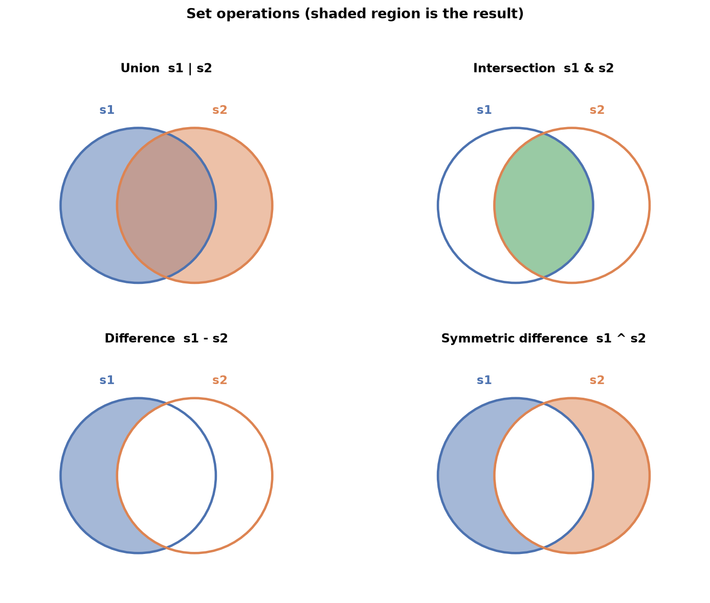

---
tags:
  - python
  - programming
  - tuples
  - sets
  - dictionaries
  - data-types
aliases:
  - Tuples, Sets & Dicts
  - Tuples Sets and Dictionaries
difficulty: beginner
prerequisites:
  - Lists
created: 2026-09-25
---

> [!info] Where this fits
> This follows [[Lists]] and completes Python's built-in collection types. The tuple is an immutable list, the set is an unordered collection of unique items, and the dictionary stores key-value pairs. Each solves a problem the list does not, and dictionaries in particular reappear everywhere, from JSON data to pandas.

The list is one way to hold a collection, but not the only one. Sometimes you want a collection that cannot be changed, sometimes one that automatically removes duplicates, and sometimes one where you look items up by name rather than position. This note covers the three data types that fill those needs.

---

## Tuples

A **tuple** is an ordered collection of items, written with round brackets instead of square ones. In almost every way it behaves like a list, with one crucial difference.

```python
t = (1, 2, 3, 4)
```

> [!note]
> A tuple is an **immutable list**. That is the whole idea. Everything you learned about lists (ordering, indexing, slicing, duplicates allowed) applies, except that a tuple cannot be changed after it is created.

Its three defining properties:

- **Ordered**: position matters, so `(1, 2, 3)` is not equal to `(3, 2, 1)`.
- **Unchangeable**: it is immutable, so you cannot add, edit, or delete items.
- **Allows duplicates**: the same value can appear more than once.

### Creating tuples

Creation mirrors lists, with one trap.

```python
empty = ()
one_item = (2,)              # note the comma
homogeneous = (1, 2, 3, 4)
heterogeneous = (1, 2.5, True, 'hi')
nested = (1, 2, (3, 4))      # a 2D tuple
from_iterable = tuple('hi')  # ('h', 'i')
```

> [!warning]
> A single-item tuple needs a trailing comma. `(2)` is just the number 2 in brackets; `(2,)` is a tuple with one item. Forgetting the comma is a common bug.

### Working with tuples

Reading works exactly like a list: indexing (positive and negative) pulls one item, slicing pulls a range. What does **not** work is anything that changes the tuple: no editing an item, no `append`, no `remove`. All the read operations from lists apply; none of the write operations do.

Two tuple conveniences are worth knowing.

**Unpacking** assigns the items of a tuple to several variables at once, and `*` collects the rest into a list.

```python
a, b = (1, 2)              # a = 1, b = 2
a, b, *others = (1, 2, 3, 4)   # a=1, b=2, others=[3, 4]
```

**`zip`** pairs tuples item by item, just as with lists.

> [!tip]
> Use a tuple when a collection should never change: fixed coordinates, days of the week, a database row. Because they are immutable, tuples are also faster than lists and can be used as dictionary keys, which lists cannot.

---

## Sets

A **set** is an unordered collection of unique items, written with curly braces. It is the mathematical set from school, turned into a data type.

```python
s = {1, 2, 3, 4}
```

Four properties define a set, and remembering them prevents every common mistake:

- **Unordered**: position has no meaning, so `{1, 2, 3}` equals `{3, 2, 1}`, and you cannot rely on any order.
- **Mutable**: you can add and remove items after creation.
- **No duplicates**: adding an item that is already present does nothing.
- **Items must be immutable**: a set can hold numbers, strings, and tuples, but not lists, other sets, or dictionaries.

> [!warning]
> The set itself is mutable, but its items must be immutable. This is why there is no 2D set: a set cannot contain another set. Trying raises an "unhashable type" error.

### Creating sets

```python
s1 = {1, 2, 3}          # a set
empty = set()           # the ONLY way to make an empty set
from_list = set([1, 2, 3, 2])   # {1, 2, 3}, duplicate dropped
```

> [!warning]
> `{}` does **not** make an empty set; it makes an empty dictionary, because both use curly braces and Python gives the default to dictionaries. Use `set()` for an empty set.

Because sets drop duplicates and ignore order, this behavior surprises beginners:

```python
print({1, 'hello', 4.5, True})   # True vanishes: Python treats True as 1
```

### Why you cannot index a set

Since a set is unordered, indexing and slicing have no meaning and are not allowed. You also cannot edit an item in place. Internally a set uses an algorithm called **hashing** to decide where each item lives, and you have no control over that placement, which is exactly why order is not preserved.

### Adding and removing

Sets are mutable, so items can be added and removed.

| Operation | What it does |
| :--- | :--- |
| `s.add(x)` | adds one item |
| `s.remove(x)` | removes `x`, errors if absent |
| `s.discard(x)` | removes `x`, silent if absent |
| `s.pop()` | removes an arbitrary item |
| `s.clear()` | removes all items |

### Set operations

The mathematical set operations are the reason sets exist. Each has an operator form and a method form.



Given `s1 = {1, 2, 3, 4}` and `s2 = {3, 4, 5, 6}`:

| Operation | Operator | Method | Result |
| :--- | :--- | :--- | :--- |
| Union (all items) | `s1 \| s2` | `s1.union(s2)` | `{1, 2, 3, 4, 5, 6}` |
| Intersection (common) | `s1 & s2` | `s1.intersection(s2)` | `{3, 4}` |
| Difference (in s1 only) | `s1 - s2` | `s1.difference(s2)` | `{1, 2}` |
| Symmetric difference (not shared) | `s1 ^ s2` | `s1.symmetric_difference(s2)` | `{1, 2, 5, 6}` |

Each method has an `_update` variant (`union_update`, and so on) that stores the result back into `s1` permanently instead of returning a new set.

Three relationship tests return booleans:

- `s1.isdisjoint(s2)`: true when the sets share no items.
- `s2.issubset(s1)`: true when every item of `s2` is in `s1`.
- `s1.issuperset(s2)`: true when `s1` contains all of `s2`.

### Frozen sets

A **frozen set** is an immutable set: the same relationship a tuple has to a list.

```python
fs = frozenset([1, 2, 3])
```

Because it cannot change, the read operations (union, intersection, subset checks) work, but the write operations (`add`, `remove`, `pop`, `update`) do not. Unlike a normal set, a frozen set can be nested inside another set, because it is immutable.

> [!tip]
> Use a frozen set for a read-only collection, or when you need a set as an item inside another set. Use a normal set when the collection will change as your program runs.

---

## Dictionaries

A **dictionary** stores data as **key-value pairs**. Instead of looking items up by position, you look them up by a key, like a real dictionary where you find a definition by its word. Other languages call this a map or an associative array.

```python
person = {'name': 'Nitish', 'age': 26, 'gender': 'male'}
```

Here `name` is a key and `'Nitish'` is its value. Four properties to remember:

- **Mutable**: you can add, change, and delete pairs.
- **No indexing**: you access values by key, not by position.
- **Keys are unique**: a key cannot repeat; assigning a repeated key overwrites the old value.
- **Keys must be immutable**: a key can be a string, number, or tuple, but not a list, set, or dictionary. Values have no such restriction.

### Creating dictionaries

```python
empty = {}
one_d = {'name': 'Nitish', 'gender': 'male'}
mixed_keys = {(1, 2): 3, 'name': 'Nitish'}   # tuple and string keys
from_pairs = dict([(1, 1), (2, 2)])          # {1: 1, 2: 2}
```

A **nested (2D) dictionary** holds a dictionary as a value, which models tree-like data.

```python
student = {
    'name': 'Nitish',
    'college': 'BIT',
    'sem': 4,
    'subjects': {'DSA': 90, 'maths': 80, 'english': 95}
}
```

> [!note]
> This nested shape is exactly the structure of JSON, the format most web APIs return. When you fetch data from an API later, it arrives as nested dictionaries, which is one reason the dictionary is such an important data type.

### Accessing values

Look up a value by its key, either with square brackets or the `get` method.

```python
print(person['name'])       # Nitish
print(person.get('name'))   # Nitish
```

For a nested dictionary, chain the keys, one bracket per level.

```python
print(student['subjects']['maths'])   # 80
```

### Adding, editing, and deleting

Because dictionaries are mutable, all three work. Adding and editing use the same syntax; if the key exists it is edited, if not it is added.

```python
person['weight'] = 70        # add a new pair
person['age'] = 27           # edit an existing pair
```

Deleting has four tools:

| Tool | What it removes |
| :--- | :--- |
| `d.pop(key)` | the pair with that key |
| `d.popitem()` | the last inserted pair |
| `del d[key]` | the pair with that key |
| `d.clear()` | every pair |

### Operations and functions

Two operations work on dictionaries, and both act on **keys**, not values.

- **Membership**: `'name' in person` checks whether a key exists, not a value.
- **Looping**: `for k in person` iterates over the keys. To get values too, use `person[k]` inside the loop, or loop over `person.items()`.

```python
for key, value in person.items():
    print(key, value)
```

Useful functions and methods:

| Name | What it returns |
| :--- | :--- |
| `len(d)` | number of key-value pairs |
| `sorted(d)` | the keys, sorted, as a list |
| `d.items()` | all pairs as a list of tuples |
| `d.keys()` | all keys |
| `d.values()` | all values |
| `d1.update(d2)` | merges `d2` into `d1`, overwriting shared keys |

---

## Comprehensions

The list comprehension from the previous note extends to sets and dictionaries. The pattern is the same: build a collection in one line from an expression and an iterable.

A **dictionary comprehension** uses `key: value` before the `for`:

```python
squares = {i: i ** 2 for i in range(1, 6)}   # {1: 1, 2: 4, 3: 9, 4: 16, 5: 25}
```

It can transform an existing dictionary, filter with a condition, or combine two lists with `zip`:

```python
# transform values
km = {'a': 100, 'b': 200}
miles = {city: dist * 0.62 for city, dist in km.items()}

# filter: keep only in-stock products
stock = {'phone': 5, 'laptop': 0, 'charger': 3}
in_stock = {k: v for k, v in stock.items() if v > 0}

# build from two lists
days = ['Mon', 'Tue', 'Wed']
temps = [30, 32, 29]
weather = {d: t for d, t in zip(days, temps)}
```

> [!tip]
> A set comprehension works the same way but with curly braces and no `key:` part: `{i ** 2 for i in range(5)}`. The consistent comprehension syntax across lists, sets, and dictionaries is one more example of Python reusing the same idea everywhere.

---

## Choosing a collection

| Type | Ordered | Mutable | Duplicates | Looked up by | Written with |
| :--- | :--- | :--- | :--- | :--- | :--- |
| List | yes | yes | yes | index | `[ ]` |
| Tuple | yes | no | yes | index | `( )` |
| Set | no | yes | no | membership | `{ }` |
| Dictionary | no | yes | keys unique | key | `{key: value}` |

> [!tip]
> Pick a list for an ordered, changeable sequence; a tuple when it must never change; a set when items must be unique and you only test membership; and a dictionary when you look things up by a meaningful key.

---

## Summary

1. A tuple is an ordered, immutable list, written with round brackets; a single-item tuple needs a trailing comma. Read operations work like lists, write operations do not.
2. Tuple unpacking assigns items to variables at once, and tuples can serve as dictionary keys because they are immutable.
3. A set is an unordered collection of unique, immutable items, written with curly braces; `set()` makes an empty one, since `{}` makes a dictionary.
4. Sets cannot be indexed, drop duplicates automatically, and use hashing internally, which is why order is not preserved.
5. Sets support union, intersection, difference, and symmetric difference, plus subset, superset, and disjoint tests.
6. A frozen set is an immutable set: read operations work, write operations do not, and it can be nested inside a set.
7. A dictionary stores key-value pairs, looked up by key; keys are unique and must be immutable, values can be anything, and nesting models JSON-like data.
8. Dictionaries are mutable: add or edit with `d[key] = value`, delete with `pop`, `popitem`, `del`, or `clear`; membership and looping act on keys.
9. Comprehensions extend to sets and dictionaries, building a collection in one line, optionally filtered or combined with `zip`.

---

> [!info] Continues to
> You now know Python's core data types and how to control program flow. The final foundational topic is [[Functions]], which lets you package logic into reusable, named blocks.
