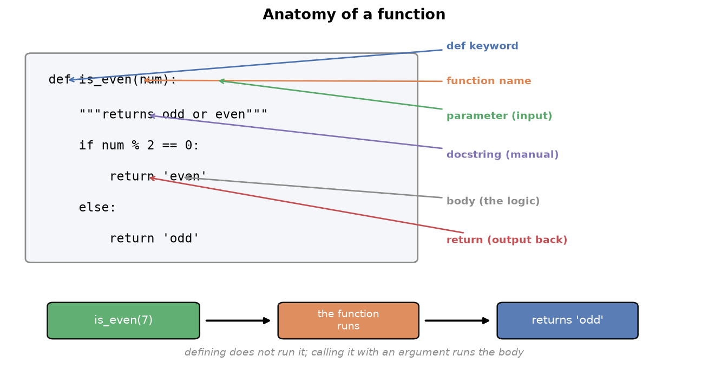
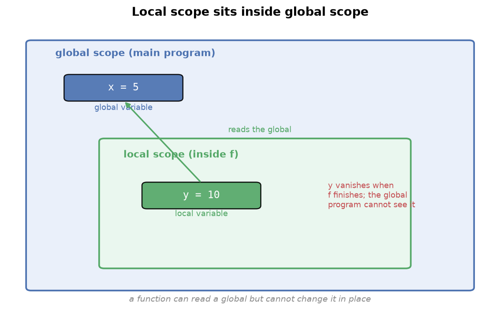
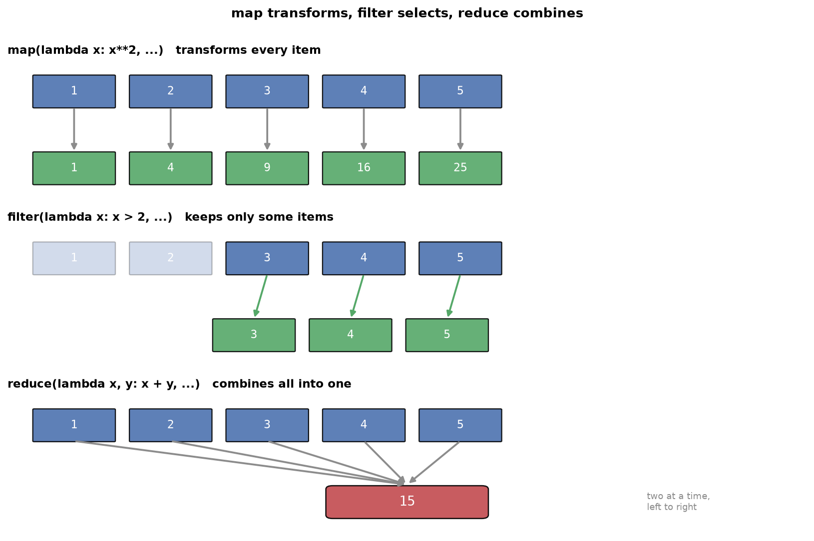

---
tags:
  - python
  - programming
  - functions
  - lambda
aliases:
  - Functions
  - Python Functions
difficulty: beginner
prerequisites:
  - Tuples, Sets & Dicts
created: 2026-09-25
---

> [!info] Where this fits
> This is the final topic in Python foundations, and it draws on everything before it: the loops and conditionals from [[Operators & Control Flow]], and the data types from [[Strings]] through [[Tuples, Sets & Dicts]]. Functions let you package logic into named, reusable blocks, which is how every real program and every library, including NumPy and pandas, is built.

A **function** is a named block of code that takes input, does a job, and returns output. You have already used functions: `print`, `input`, `type`, and `len` are all functions. Those are **built-in**, meaning they ship with Python. This note is about writing your own, called **user-defined functions**, and using them well.

Functions exist for two reasons. **Decomposition** breaks a big problem into smaller, manageable pieces. **Abstraction** hides the details, so a user of `print` does not need to know how it draws text on screen; they just call it. Both make code easier to write, read, and reuse.

---

## Defining a function

You define a function with the `def` keyword.



```python
def is_even(num):
    """Returns whether the given number is odd or even.
    Input: any valid integer.
    Output: the string 'odd' or 'even'.
    """
    if num % 2 == 0:
        return 'even'
    else:
        return 'odd'
```

The parts are:

- `def`: the keyword that marks a function definition.
- `is_even`: the function's name, chosen to describe what it does.
- `num`: the input, listed inside the parentheses.
- The `"""..."""` **docstring**: an optional description of what the function does, its input, and its output. It acts as a built-in reading manual.
- The **body**: the indented code that does the work.
- `return`: sends a result back to whoever called the function.

Defining a function does not run it. To run it, you **call** it by name with input in parentheses.

```python
for i in range(1, 11):
    x = is_even(i)
    print(x)
```

> [!tip]
> You can read any function's docstring with `is_even.__doc__`. This works for built-in functions too, so `print.__doc__` shows how `print` is meant to be used. Always write a docstring for your own functions.

---

## Two points of view

There are always two people involved with a function: the one who **writes** it and the one who **uses** it. In practice these are often different people, since senior programmers write functions that junior programmers call, and the whole language team wrote `print` for everyone else to use.

This split matters because of who is responsible when something breaks.

> [!warning]
> If a function misbehaves, the blame falls on whoever wrote it, not whoever called it. A well-written function must handle bad input gracefully rather than crashing with a cryptic error. If someone passes a string to `is_even`, which expects a number, the function should return a clear message, not blow up.
>
> ```python
> def is_even(num):
>     if type(num) == int:
>         return 'even' if num % 2 == 0 else 'odd'
>     else:
>         return 'this data type is not allowed'
> ```

When you write a function, assume it will be misused, and guard against it.

---

## Parameters and arguments

Two words for the input trip people up. The distinction is simple:

- A **parameter** is the variable in the function definition (`num` above).
- An **argument** is the actual value you pass when calling (`is_even(7)`, where `7` is the argument).

> [!tip]
> A memory aid: on a TV, brightness is a parameter, and the value 60 you set it to is the argument. In a game, difficulty is a parameter, and "hard" is the argument. You define parameters when writing the function and supply arguments when calling it.

### Types of arguments

There are four ways to pass arguments.

**Positional arguments** are matched to parameters by position: the first argument fills the first parameter, and so on. This is the default.

```python
def power(a, b):
    return a ** b

power(2, 3)   # 8: a=2, b=3, matched by position
```

**Default arguments** give a parameter a fallback value, used when the caller omits it. This makes a function forgiving when called with too few arguments.

```python
def power(a=1, b=1):
    return a ** b

power(2)   # 2: a=2, b defaults to 1
power()    # 1: both default
```

**Keyword arguments** are matched by name, not position, so the order does not matter.

```python
power(b=3, a=2)   # 8: matched by name, not order
```

> [!tip]
> Keyword arguments matter for functions with many parameters. A library function like scikit-learn's `DecisionTreeClassifier` has dozens of parameters; no one remembers their positions, so you pass them by name: `DecisionTreeClassifier(max_depth=5)`. Keyword arguments take precedence over positional ones, and any positional arguments must come before keyword arguments in a call.

**`*args` and `**kwargs`** let a function accept a variable number of arguments, when you do not know in advance how many the caller will pass.

`*args` collects extra positional arguments into a **tuple**.

```python
def multiply(*args):
    product = 1
    for i in args:
        product = product * i
    return product

multiply(1, 2, 3)          # 6
multiply(1, 2, 3, 4, 5)    # 120: any number of arguments
```

`**kwargs` collects extra keyword arguments into a **dictionary**, for variable key-value input.

```python
def display(**kwargs):
    for key, value in kwargs.items():
        print(key, '->', value)

display(India='Delhi', Nepal='Kathmandu')
```

> [!note]
> The names `args` and `kwargs` are only convention; the `*` and `**` are what matter. When both appear with normal parameters, the order must be: normal parameters, then `*args`, then `**kwargs`.

---

## Accessing function documentation

When you call a function someone else wrote, you need to know what it expects and what it returns without reading its source. The **docstring** you met earlier is what makes this possible: it is the text in triple quotes on the first line of the body, and Python stores it so it can be read back later.

There are two ways to read it. Every function keeps its docstring in a `__doc__` attribute, and the built-in `help` function prints it in a readable form.

```python
def is_even(num):
    """Return 'even' or 'odd' for a given integer."""
    return 'even' if num % 2 == 0 else 'odd'

print(is_even.__doc__)    # Return 'even' or 'odd' for a given integer.
help(is_even)             # prints the name, signature, and docstring
```

This works for built-in functions too, so `print(print.__doc__)` shows how `print` is meant to be used, and `help(len)` explains `len`. This is the same information that editors show in a tooltip when you hover over a function.

> [!tip]
> This is why the earlier advice to write a docstring matters. A function without one still runs, but anyone who calls it, including you in six months, has to read its body to understand it. The docstring is the reading manual that ships inside the function.

---

## Return versus print

These look similar but differ fundamentally. `print` displays a value on the screen; `return` hands a value back to the caller so the program can use it further.

```python
def add(a, b):
    return a + b          # hands the result back

result = add(2, 3)        # result is now 5, usable in more code
print(add(2, 3) * 10)     # 50: the returned value is used
```

If `add` had used `print` instead of `return`, it would show `5` on screen but hand back nothing, so `add(2, 3) * 10` would fail. A function that computes a value should almost always `return` it. A function with no `return` hands back `None`.

---

## How a function executes in memory

Calling a function is not just a jump to some code. Python sets aside a fresh, private workspace for that call, runs the body there, and then tears it down. Understanding this explains why local variables vanish and why one call cannot see another's variables.

That private workspace is called a **frame**. When you call a function, Python creates a frame for it, puts the parameters and any local variables inside, and stacks it on top of the frame that made the call. When the function returns, its frame is discarded, and control goes back to the frame underneath.

```python
def square(n):
    result = n * n        # result lives in square's frame
    return result

value = square(5)         # value lives in the main frame
```

Trace the call. The main program has a frame holding `value`. Calling `square(5)` pushes a new frame holding `n = 5` and then `result = 25`. The `return` sends `25` back and destroys `square`'s frame, so `n` and `result` no longer exist. Only `value`, back in the main frame, survives.

```text
call square(5)          return 25
main frame                main frame
  value = ?      --->       value = 25
square frame
  n = 5, result = 25   (discarded on return)
```

This stack of frames is why a function's local variables are private and temporary, which is exactly what the next section on scope makes precise.

---

## Scope: local and global variables

**Scope** is the region of a program where a variable exists. When a function is called, it gets its own private scope, separate from the main program.



- A **global variable** lives in the main program's scope.
- A **local variable** lives inside a function's scope and vanishes when the function finishes.

```python
x = 5              # global

def f():
    y = 10         # local to f
    print(y)

f()
print(y)           # error: y does not exist out here
```

Two rules govern how they interact:

- A function **can read** a global variable if it has no local variable of the same name.
- A function **cannot change** a global variable from inside; attempting to reassign it either creates a new local variable or raises an error.

```python
x = 5

def f():
    print(x)       # reads the global x, prints 5

f()
```

> [!warning]
> A function cannot modify a global variable in place. This is deliberate: if any function could change shared globals, several functions using the same global would cause chaos. The rule is "you can use it, but you cannot change it." A local and a global variable can even share a name without interfering, because each scope is independent.

---

## Functions as first-class citizens

In Python, a function is a value like any other. This idea is called **first-class functions**: a function can be stored in a variable, deleted, passed to another function, or returned from one, exactly as you would treat a number or a string. This is the single property that makes the rest of this note possible.

Start with the simplest consequence. The name of a function is just a variable pointing at the function, so you can assign it to another name and delete it.

```python
def greet():
    return 'hello'

say = greet          # say now points at the same function
print(say())         # hello

del greet            # remove the name greet
print(greet())       # error: greet no longer exists
```

A function can be defined inside another function, called a **nested function**. The inner function is local to the outer one: it exists only while the outer function runs, in the same way a local variable does.

```python
def outer():
    def inner():
        return 'from inner'
    return inner()   # the outer function calls its own inner function

print(outer())       # from inner
```

Because a function is a value, it can also be passed as an argument and returned as a result.

```python
def shout(text):
    return text.upper()

def apply(func, value):
    return func(value)          # a function received as an argument

print(apply(shout, 'hello'))    # HELLO
```

Returning a function is what lets one function build and hand back another, so `outer` above could `return inner` instead of calling it, giving the caller a function to use later.

> [!note]
> Four abilities follow from functions being first-class: store a function in a variable, delete it, pass it into another function, and return it from one. The last two, passing and returning functions, are used so often that they have their own name, higher-order functions, which is the next section.

---

## Lambda functions

A **lambda function** is a small, anonymous function written in a single line. "Anonymous" means it has no name.

```python
square = lambda x: x ** 2
print(square(4))          # 16

add = lambda x, y: x + y
print(add(5, 2))          # 7
```

The parts are the `lambda` keyword, the parameters (`x`, or `x, y`), a colon, and a single expression whose value is returned automatically.

Four differences from a normal function:

| | Normal function | Lambda function |
| :--- | :--- | :--- |
| Name | has one | anonymous |
| Return | you write `return` | the expression is returned automatically |
| Length | any number of lines | one line only |
| Reuse | designed to be reused | meant for one-off use |

> [!note]
> If a lambda is one-off and not reusable, what is it for? Its purpose is to be passed to a **higher-order function**, so you can define a small piece of behavior inline without writing a whole named function for it.

---

## Higher-order functions

A **higher-order function** is a function that either takes another function as input, returns a function as output, or both. This is what makes lambdas useful.

```python
def transform(f, L):
    return [f(i) for i in L]

transform(lambda x: x ** 2, [1, 2, 3, 4, 5])   # [1, 4, 9, 16, 25]
transform(lambda x: x ** 3, [1, 2, 3, 4, 5])   # [1, 8, 27, 64, 125]
```

`transform` is higher-order because it accepts a function `f`. By passing a different lambda, you change its behavior without rewriting it.

### map, filter, and reduce

Python provides three built-in higher-order functions that you will use constantly in data work. Each takes a function (usually a lambda) and an iterable.



**`map`** applies a function to every item, producing a transformed collection of the same size.

```python
list(map(lambda x: x ** 2, [1, 2, 3, 4, 5]))    # [1, 4, 9, 16, 25]
```

**`filter`** keeps only the items for which the function returns `True`.

```python
list(filter(lambda x: x > 5, [3, 4, 5, 6, 7]))  # [6, 7]
```

**`reduce`** combines all items into a single value, taking two at a time. It lives in the `functools` module.

```python
from functools import reduce
reduce(lambda x, y: x + y, [1, 2, 3, 4, 5])     # 15
```

To see how `reduce` works, trace the sum: it takes `1` and `2` to get `3`, then `3` and `3` to get `6`, then `6` and `4` to get `10`, then `10` and `5` to get `15`.

> [!tip]
> The three form a natural trio. `map` transforms every item, `filter` selects some items, and `reduce` collapses everything to one value. Together they express most data transformations without writing an explicit loop, which is why they appear everywhere in data analysis.

---

## Summary

1. A function is a named, reusable block that takes input, does a job, and returns output; writing your own gives you decomposition and abstraction.
2. Define a function with `def`, a name, parameters, an optional docstring, a body, and a `return`; calling it by name runs the body.
3. There are two viewpoints, writer and user, and a well-written function must handle bad input rather than crash.
4. A parameter is the variable in the definition; an argument is the value passed in a call.
5. Arguments come in four kinds: positional (by order), default (fallback value), keyword (by name), and `*args`/`**kwargs` (variable numbers, collected into a tuple and a dictionary).
6. A function's docstring is stored in `__doc__` and shown by `help()`, so you can read what any function expects without opening its source.
7. `return` hands a value back for further use, while `print` only displays it; a function with no `return` yields `None`.
8. Each call runs in its own frame holding that call's locals; the frame is discarded on return, which is why local variables are private and temporary.
9. Variables have scope: globals live in the main program, locals live inside a function; a function can read a global but cannot change it in place.
10. Functions are first-class values: you can store one in a variable, delete it, nest one inside another, and pass or return functions.
11. A lambda is a one-line anonymous function whose expression is returned automatically, meant to be passed to higher-order functions.
12. A higher-order function takes or returns a function; `map` transforms every item, `filter` selects items, and `reduce` combines all items into one.

---

> [!info] Continues to
> This completes the Python foundations. With functions in hand, the next stage moves into object-oriented programming and the data science libraries NumPy and pandas, which are built entirely from the functions, data types, and control flow covered in this track.
