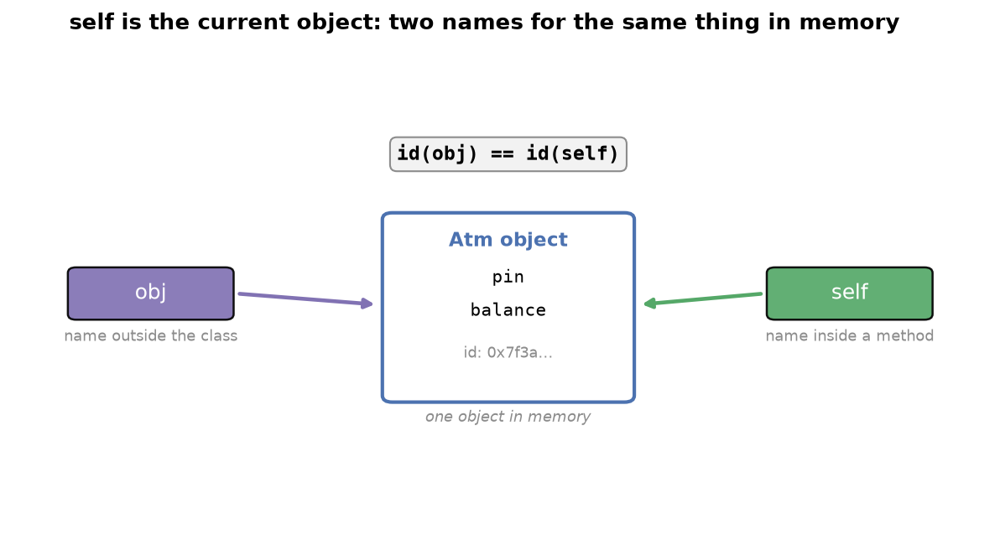
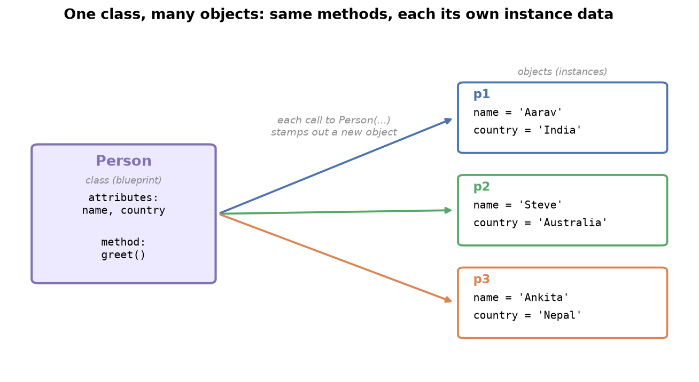

---
tags:
  - python
  - oop
  - classes
  - objects
difficulty: beginner
prerequisites:
  - Functions
created: 2026-09-29
---

> [!info] Where this fits
> This is the first step into object-oriented programming, the style behind almost every real application you use. It builds directly on [[Functions]] and the data types from [[Lists]] through [[Tuples, Sets & Dicts]]. Here you learn what a class and an object are, how a constructor and `self` work, and how magic methods let you design your own data type.

Object-oriented programming (OOP) packages related data and behavior together into your own custom types. Its single biggest idea: **OOP lets a programmer create their own data types**, shaped for the problem instead of forcing everything into built-in types. This note covers classes and objects, methods versus functions, the constructor, `self`, and the magic methods that let you build a working type end to end.

---

## What object-oriented programming solves

So far your code has been **procedural**: it runs top to bottom, line by line, built from Python's built-in types (`int`, `float`, `str`, `list`). That is fine for scripts but strains under large programs, where data and the logic acting on it drift apart and become tangled.

OOP moves from **generality to specificity**: instead of forcing your problem into generic types, you design types that model it directly.

| | Procedural | Object-oriented |
| :--- | :--- | :--- |
| Building blocks | built-in types only | custom types you design |
| Data and logic | kept separate | bundled together |
| Scales to large apps | poorly, code tangles | well, code stays organized |
| Example | loose variables for a trip | a `Trip` type that models a trip |

> [!tip]
> Think of a specialized operating system built for one job, preloaded with exactly the tools that job needs. It does nothing a general machine could not, but the work goes far smoother. OOP gives your code that purpose-built power.

OOP rests on five ideas. This note covers the first; the rest follow in later notes.

- **Classes and objects** (this note)
- **Encapsulation**: protecting an object's data
- **Inheritance**: reusing one class from another
- **Polymorphism**: one operation taking many forms
- **Abstraction**: hiding implementation detail

---

## Classes and objects

In Python, **everything is an object**. Run `type` on any value and Python names its class:

```python
L = [1, 2, 3]
print(type(L))     # <class 'list'>
```

Every built-in type is a class, and every value you make from one is an object. The two terms:

- **Class**: a blueprint, a set of rules describing how its objects behave and what they can do.
- **Object**: a concrete instance built from that blueprint.

Here `list` is the class and `L` is an object of it. Because `L` follows the `list` blueprint, it can use that blueprint's methods (`append`, `insert`), which is why `L.append(4)` works but `L.upper()` fails, `upper` belongs to the `str` blueprint, not `list`.

> [!example]
> Everyday pairings of class to object:
>
> - `Car` (class) to a specific Maruti Suzuki (object)
> - `Smartphone` (class) to a specific Samsung phone (object)
> - A course (class) to each enrolled student (object)

A class holds two kinds of members:

- **Attributes** (data or properties): the values an object carries, such as a car's color, top speed, and mileage.
- **Methods** (behavior): the actions an object can perform, such as calculating average speed.

Classes come in two families:

- **Built-in classes**: ship with Python (`list`, `int`, `tuple`, `set`).
- **User-defined classes**: the ones you write. The rest of this note builds one.

---

## Writing your first class

Define a class with the `class` keyword and a name in **PascalCase** (each word capitalized, no separators: `MyClass`, `Atm`). Take a small ATM machine; its blueprint needs two pieces of data, a PIN and a balance.

```python
class Atm:
    def __init__(self):
        self.pin = ''
        self.balance = 0
```

Two rules appear here, both explained below. For now, take them as given:

- Attributes are created inside a special method called the **constructor** (`__init__`).
- Each attribute name is prefixed with `self.`.

Defining a class produces no output; a blueprint does nothing until you build from it. Create an **object** with the pattern `object = ClassName()`:

```python
obj = Atm()
print(type(obj))   # <class '__main__.Atm'>
```

Once `obj` exists, it reaches the class's members with a dot: `obj.pin`, `obj.balance`. This is the **golden rule of OOP**:

> [!note] The golden rule
> A class's members can only be accessed through an object of that class. A blueprint full of rules comes alive only when an object uses it, just as a course with a full schedule only runs once a student enrolls.

---

## The constructor and its true purpose

The **constructor** is a method named `__init__` with one superpower: **its code runs automatically the moment an object is created**, without you ever calling it.

```python
class Atm:
    def __init__(self):
        print('constructor ran automatically')
        self.pin = ''
        self.balance = 0

obj = Atm()   # prints: constructor ran automatically
```

The definition is easy; the *why* is the interesting part. Most methods sit behind user actions, so the user controls when they fire. The constructor is the opposite:

| | Ordinary method | Constructor |
| :--- | :--- | :--- |
| Runs when | you call it | an object is created |
| Controlled by | the user (behind an action) | the programmer, automatically |
| Typical job | respond to a request | set up state the user must not control |

> [!tip]
> This makes the constructor the home for **configuration** the user must never control: connecting to a database, opening an internet connection, or setting initial state. You cannot rely on a user pressing the right button first; the constructor guarantees this setup runs as the object comes to life.

> [!example]
> If a programmer wrote the world and humans were objects, the constructor holds whatever the programmer will not let objects control, the code that runs the instant a human is born: guaranteed, and outside their choice.

Key facts about the constructor:

- It is always named `__init__` and cannot be renamed.
- A class has exactly one constructor.
- A constructor taking inputs beyond `self` is **parameterized**; one taking only `self` is **non-parameterized**.

---

## Methods versus functions

The terms look interchangeable but differ precisely:

- **Function**: defined independently, outside any class.
- **Method**: a function defined inside a class.

```python
L = [1, 2, 3]
len(L)        # len is a FUNCTION: defined outside the list class
L.append(4)   # append is a METHOD: defined inside the list class
```

`len` exists on its own, so it is a function; `append` lives inside the `list` class, so it is a method, called through an object. Inside a class you write methods, not functions, a distinction worth stating correctly in interviews.

---

## The concept of self

`self` shows up everywhere: the first parameter of every method and the prefix on every attribute. It is the biggest source of confusion in OOP, and one idea clears it up.

Recall the golden rule: a class's members are reachable only through an *object*. This has a strict consequence, and `self` is the workaround:

- One method cannot directly call another method of the same class.
- Yet methods often need to.
- **`self` is the current object**, so a method reaches its sibling methods and attributes through `self`.

You can prove `self` is the object: its memory address inside a method equals the object's address outside.

```python
class Atm:
    def __init__(self):
        print('id of self:', id(self))

obj = Atm()
print('id of obj: ', id(obj))   # same address as self
```

Both print the same id, so `self` and `obj` are one object under two names. That is why every method takes `self` first and why attributes are written `self.pin`.



> [!note]
> The mechanism hides in the call syntax. Writing `obj.method()` makes Python pass `obj` as the first argument, received as `self`. A method defined with no parameters therefore raises "takes 0 positional arguments but 1 was given" when called on an object, the object was silently sent in. The name `self` is only convention; any name works, but everyone uses `self`.

Each object gets its own `self`, always pointing at whichever object the method runs on.

---

## Instance variables

Attributes created with `self.` in the constructor are **instance variables**: variables whose value is different for each object.

```python
class Person:
    def __init__(self, name, country):
        self.name = name
        self.country = country

p1 = Person('Aarav', 'India')
p2 = Person('Steve', 'Australia')
print(p1.name)   # Aarav
print(p2.name)   # Steve
```

`name` is one variable name, yet it holds `Aarav` for `p1` and `Steve` for `p2`. That is the defining trait: **an instance variable's value depends on the object**, which is what lets one blueprint produce many distinct objects.



---

## Magic methods

`__init__` is one example of a family. A **magic method** (or **dunder method**, for the double underscores) is a special method whose name is wrapped in double underscores. Each has a superpower: Python calls it automatically in a particular situation.

| Magic method | Runs automatically when | Job |
| :--- | :--- | :--- |
| `__init__` | an object is created | set up initial attributes |
| `__str__` | the object is printed | return how it should display |
| `__add__` | `+` joins two objects | define what `+` means |
| `__sub__`, `__mul__`, `__truediv__` | `-`, `*`, `/` are used | define those operators |

Build a real type to see them: a `Fraction`. Python has `int`, `float`, and `complex` but no fraction type, so make one.

```python
class Fraction:
    def __init__(self, n, d):
        self.num = n
        self.den = d

fr = Fraction(3, 4)
print(fr)   # <__main__.Fraction object at 0x...>
```

The object exists, but printing shows a memory address, Python does not know how a fraction should look. `__str__` fixes that:

```python
class Fraction:
    def __init__(self, n, d):
        self.num = n
        self.den = d

    def __str__(self):
        return '{}/{}'.format(self.num, self.den)

fr = Fraction(3, 4)
print(fr)   # 3/4
```

Adding two fractions with `+` raises `unsupported operand type(s)`, the same error as adding two sets, because nobody defined what `+` means for the type. `__add__` defines it:

```python
class Fraction:
    def __init__(self, n, d):
        self.num = n
        self.den = d

    def __str__(self):
        return '{}/{}'.format(self.num, self.den)

    def __add__(self, other):
        new_num = self.num * other.den + other.num * self.den
        new_den = self.den * other.den
        return Fraction(new_num, new_den)

fr1 = Fraction(3, 4)
fr2 = Fraction(1, 2)
print(fr1 + fr2)   # 10/8
```

In `fr1 + fr2`, the left object becomes `self` and the right becomes `other`. The other arithmetic operators (`__sub__`, `__mul__`, `__truediv__`) follow the same shape. You can also add ordinary methods, such as a `convert_to_decimal` returning `self.num / self.den`. Combining magic and ordinary methods gives you a genuine, usable data type.

> [!tip]
> This is exactly how libraries like NumPy and pandas are built: programmers using OOP to create rich custom types. Every version that adds a package or feature is someone shipping classes like this one. Building even a small `Fraction` is the same skill at a smaller scale.

---

## Summary

1. OOP's central power is letting a programmer create their own data types, moving from generic built-in types toward types shaped for the application.
2. A class is a blueprint of attributes (data) and methods (behavior); an object is a concrete instance of it.
3. In Python everything is an object, so every built-in type is a class; classes are either built-in or user-defined.
4. Define a class with `class` and a PascalCase name; nothing happens until you create an object with `obj = ClassName()`.
5. A class's members are reachable only through an object of that class, the golden rule of OOP.
6. The constructor `__init__` runs automatically on object creation; its true purpose is configuration the user must not control.
7. A function is defined outside a class; a method is defined inside one.
8. `self` is the current object, passed automatically when you call a method on an object, and it lets a method reach the class's other members.
9. Instance variables, created with `self.` in the constructor, hold a different value for each object.
10. Magic (dunder) methods run automatically in set situations: `__init__` on creation, `__str__` on printing, and `__add__`, `__sub__`, `__mul__`, `__truediv__` on the arithmetic operators.

---

> [!info] Continues to
> With classes, objects, the constructor, and `self` in place, the next step is [[Encapsulation]], which shows how to protect an object's data, control access with getters and setters, and share data across all objects with static variables.
