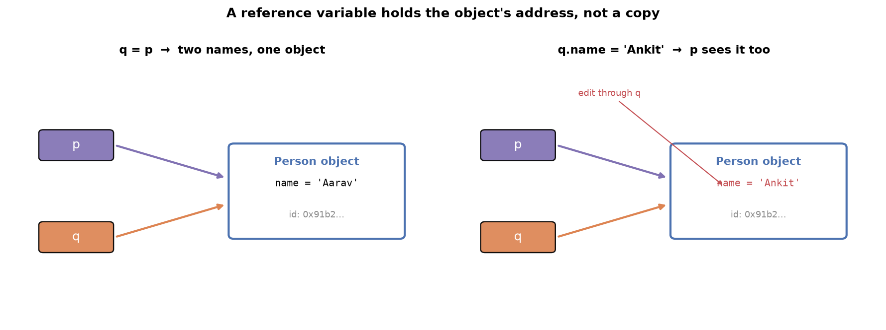
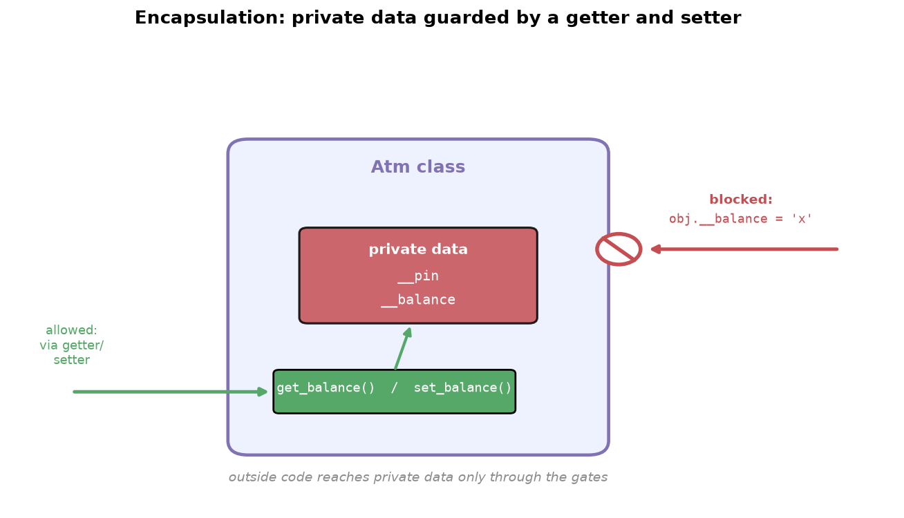

---
tags:
  - python
  - oop
  - encapsulation
  - static
difficulty: intermediate
prerequisites:
  - Classes & Objects
created: 2026-09-29
---

> [!info] Where this fits
> This is the second step in object-oriented programming, building on [[Classes & Objects]]. Having learned classes, objects, and the constructor, you now learn how to protect an object's data, expose it safely through getters and setters, and share a value across every object with static variables. Encapsulation is one of the most misunderstood pillars of OOP, so the focus is on why it exists, not just what it is.

**Encapsulation** bundles an object's data with the methods that guard it, so outside code cannot corrupt that data by accident. Reaching it needs a few supporting ideas first: how objects access attributes, what a reference variable really holds, why passing an object is "pass by reference," and whether your own objects are mutable. The note then covers encapsulation itself and closes with static variables and methods, which belong to the class rather than to any object.

---

## How objects access attributes

An object reaches its class's members with a dot. Reading an attribute that exists returns its value; reading one that does not raises an error.

```python
class Person:
    def __init__(self, name, country):
        self.name = name
        self.country = country

p = Person('Aarav', 'India')
print(p.name)      # Aarav
print(p.gender)    # error: 'Person' object has no attribute 'gender'
```

There is a twist worth remembering: you can create a **new attribute from outside the class** just by assigning to it.

```python
p.gender = 'male'
print(p.gender)    # male
```

Attributes need not be created inside the class. Using the object, you can add them from outside, an ability that causes the trouble the rest of this note guards against.

---

## Reference variables

Writing `p = Person(...)` tempts you to say "`p` is the object." That is wrong, and the correction matters.

- Calling `Person(...)` creates an object in memory.
- `p` does not contain that object; it holds the object's **memory address**.
- A name that stores an object's address is a **reference variable**.

Because `p` holds an address, `q = p` copies the address, not the object, so both names point at the **same** object.



```python
p = Person('Aarav', 'India')
q = p                 # q holds the same address as p
print(id(p) == id(q)) # True: one object, two names

q.name = 'Ankit'
print(p.name)         # Ankit: change through q is seen through p
```

> [!warning]
> Multiple references to one object are risky. If several names point at the same object and one edits it, every name sees the edit, causing bugs that are hard to trace when several people share the code. An object can have any number of reference variables, and pointing a new name at an existing object never creates a new object.

---

## Pass by reference

Handing an object to a function follows the same rule. First, two facts:

- A function **can take an object** as input.
- A function **can return an object** as output.

```python
def greet(person):
    print('Hi, my name is', person.name)
    p1 = Person('Ankit', 'India')
    return p1                       # returns an object

p = Person('Aarav', 'India')
x = greet(p)                        # takes an object
print(x.name)                       # Ankit
```

The key point: passing an object sends its **reference** (address), not a copy. This is **pass by reference**, and it has one consequence.

- The id inside the function equals the id outside, so it is the same object.
- Therefore any edit the function makes is visible outside.

```python
def rename(person):
    person.name = 'Ankit'

p = Person('Aarav', 'India')
rename(p)
print(p.name)     # Ankit: the function changed the original object
```

---

## Mutability of objects

Pass by reference raises a sharper question: are your own objects **mutable** (changed in place) or **immutable** (any "change" makes a new object)? The test is whether an edit keeps the memory address the same.

```python
def rename(person):
    person.name = 'Ankit'
    return person

p = Person('Aarav', 'India')
print('before:', id(p))
p1 = rename(p)
print('after: ', id(p1))    # same address as before
```

The address is unchanged after the edit, so the change happened in place.

> [!note]
> **User-defined objects in Python are mutable by default**, like lists, sets, and dictionaries. Were they immutable, the address would change after an edit. This is the definitive answer to a common interview question, and it follows directly from pass-by-reference behavior.

---

## Encapsulation

Encapsulation is easy to define and hard to motivate, so start from the problem.

With public attributes, any code can reach in and overwrite them:

```python
class Atm:
    def __init__(self):
        self.pin = ''
        self.balance = 0

obj = Atm()
obj.balance = 'hehe'    # balance is now a string, not a number
```

Nothing stops this, and later a withdraw method doing `self.balance - amount` crashes. **Data set from outside can silently break the logic inside.** Encapsulation fixes it in two moves.

**Move 1: make attributes private** by prefixing the name with two underscores. Python has no `private` keyword; the double underscore is the mechanism.

```python
class Atm:
    def __init__(self):
        self.__pin = ''
        self.__balance = 0
```

- A private member does not appear in autocomplete from outside the class and is meant to be off-limits.
- Python renames it internally, so `__balance` becomes `_Atm__balance`.
- A naive overwrite from outside now creates a different, harmless attribute instead of touching the real one.

> [!warning]
> Nothing in Python is truly private. Someone determined can still reach a private attribute by its mangled name, `obj._Atm__balance`. Python treats the double underscore as a gentleman's agreement, "this is private, do not use it", and a language "made for adults" trusts you to respect it. If a teammate breaks it deliberately, that is a team-culture problem, not a language flaw. Python keeps the door reachable for the rare case that genuinely needs it.

**Move 2: expose the data through two guarding methods** when outside code has a legitimate need.

- A **getter** returns the private value.
- A **setter** changes it, and can validate the new value first.

```python
class Atm:
    def __init__(self):
        self.__pin = ''
        self.__balance = 0

    def get_balance(self):
        return self.__balance

    def set_balance(self, new_value):
        if type(new_value) == int:
            self.__balance = new_value
        else:
            print('not allowed')
```

The setter is where protection lives: it rejects anything that is not an integer, so no one can turn the balance into a string and crash the logic.

**Encapsulation** is a private data attribute bundled with the getter and setter that guard it. The name comes from *capsule*: data and its access methods wrapped into one protected unit. Its purpose is to keep an object's data safe, exposing it only through controlled methods that validate what comes in.



---

## Collection of objects

Objects are ordinary values, so you can store them in a list (or tuple or dictionary) and work with them like any collection.

```python
p1 = Person('Aarav', 'male')
p2 = Person('Ankit', 'male')
p3 = Person('Ankita', 'female')

L = [p1, p2, p3]
for person in L:
    print(person.name, person.gender)
```

Because the items are objects, you loop over them and reach each one's attributes with a dot. A list of objects behaves like any other list; nothing new is required.

---

## Static variables and methods

Every instance variable holds a different value per object. Sometimes you need the opposite: a value shared by **all** objects. Consider giving each customer an increasing ID (100, 101, 102). An instance variable cannot do this, since each object gets its own copy that resets, so every customer would get the same ID.

A **static variable** (or class variable) belongs to the class, not to any object, so **its value is the same for every object**, exactly what a counter needs.

```python
class Atm:
    counter = 1              # static variable: shared by all objects

    def __init__(self):
        self.cid = Atm.counter   # this object's id
        Atm.counter += 1         # bump the shared counter

c1 = Atm()
c2 = Atm()
c3 = Atm()
print(c1.cid, c2.cid, c3.cid)   # 1 2 3
```

Choosing which kind a value should be is common sense: a customer's name and balance differ per customer (instance), a bank's IFSC code is the same for everyone (static).

| | Instance variable | Static variable |
| :--- | :--- | :--- |
| Belongs to | the object | the class |
| Value | different per object | same for every object |
| Declared in | the constructor | the class body, outside all methods |
| Accessed as | `self.name` | `ClassName.name` |

A static variable can be private too, exposed through a getter. But that getter never uses `self`, since it deals only with class-level data, and a method that does not use `self` need not receive it. Such a method is a **static method**.

```python
class Atm:
    __counter = 1

    @staticmethod
    def get_counter():
        return Atm.__counter

Atm.get_counter()   # called on the class, no object needed
```

- A **static method** is a utility method that belongs to the class, not an object.
- Mark it with the `@staticmethod` decorator.
- Call it directly through the class name, without creating any object.

> [!tip]
> The test for a static method: if a method never touches `self`, it does not need an object, so make it static and call it as `ClassName.method()`.

---

## Summary

1. An object accesses members with a dot, and you can even add new attributes to it from outside the class.
2. A reference variable holds an object's memory address, not the object, so `q = p` makes two names for one object and editing through either affects both.
3. Passing an object to a function is pass by reference: the function gets the same object, and any edit is visible outside.
4. User-defined objects are mutable by default, proven by an in-place edit leaving the memory address unchanged.
5. Encapsulation solves outside code corrupting an object's data: make attributes private with a double-underscore prefix, then expose them only through a getter and a validating setter.
6. Nothing in Python is truly private; the double underscore is an agreement, backed by name mangling that turns `__balance` into `_Class__balance`.
7. Objects can be stored in collections and looped over like any values.
8. A static (class) variable is shared by all objects, declared in the class body and accessed through the class name, which is what a shared counter needs.
9. A static method, marked `@staticmethod`, is a utility method that does not use `self` and is called through the class without an object.

---

> [!info] Continues to
> With data protected and shared state handled, the next step is [[Inheritance]], which shows how one class can reuse another's data and behavior.
