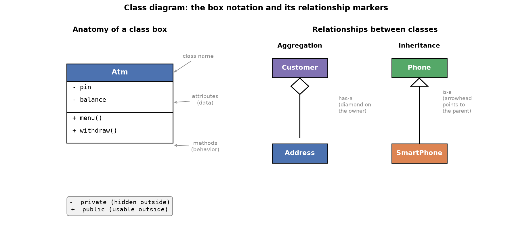
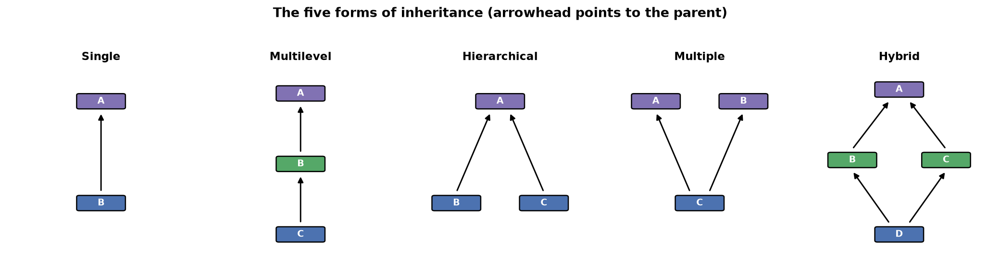

---
tags:
  - python
  - oop
  - inheritance
  - aggregation
difficulty: intermediate
prerequisites:
  - Encapsulation
created: 2026-09-29
---

> [!info] Where this fits
> This is the third step in object-oriented programming, following [[Classes & Objects]] and [[Encapsulation]]. Real applications are built from many classes that relate to one another. This note covers the two main relationships between classes, aggregation and inheritance, what inheritance actually passes down, how `super` reaches a parent, and the five forms inheritance can take.

Large applications rarely have one class. A food-delivery site might have separate classes for users, restaurants, payments, and delivery, and those classes relate to each other. Two relationships matter most: **aggregation**, where one class owns another, and **inheritance**, where one class reuses another. This note builds both, then covers what inheritance passes down, the `super` keyword, and the five kinds of inheritance.

---

## Aggregation

**Aggregation** is a "has-a" relationship: one class owns another as one of its parts.

- A `Customer` **has an** `Address`.
- A `Restaurant` **has a** `Menu`.

The owner stores an object of the owned class as one of its attributes.

```python
class Address:
    def __init__(self, city, pincode, state):
        self.__city = city
        self.pincode = pincode
        self.state = state

    def get_city(self):
        return self.__city

class Customer:
    def __init__(self, name, gender, address):
        self.name = name
        self.gender = gender
        self.address = address       # an Address object lives here
```

To build a `Customer`, first build an `Address` and pass it in:

```python
addr = Address('Gurgaon', 122011, 'Haryana')
cust = Customer('Aarav', 'male', addr)
```

The technical heart of aggregation: **you create the main object with another class's object passed in as input.**

> [!warning]
> Aggregation does not grant access to the owned class's private data. If `Address` makes `city` private (`__city`), the `Customer` cannot read it directly; it must go through the owned object's getter, `self.address.get_city()`. Owning a class is not the same as bypassing its encapsulation.

A method on the owner can **delegate** work to the owned object rather than doing it all. If a customer edits their profile, the name changes on `Customer`, but the address-editing logic belongs on `Address` and is called through the address object. Each class keeps the code that is properly its own.

---

## Inheritance

**Inheritance** is an "is-a" relationship, and the most important idea in this note. It is borrowed from the real world, where whatever belongs to a parent belongs to the child, and traits pass from parents to offspring through DNA.

In code, inheritance creates a **parent class** and a **child class** so a child object can use the parent's data and methods as its own. Declare it by naming the parent in parentheses after the child.

```python
class User:
    def __init__(self):
        self.name = 'Aarav'

    def login(self):
        print('login')

class Student(User):     # Student is a child of User
    def enroll(self):
        print('enroll into the course')

s = Student()
s.login()    # inherited from User
s.enroll()   # its own method
```

The arrow of inheritance always points from child to parent.

The biggest benefit is **code reusability**. Suppose a platform has students and instructors, both able to log in and register. Writing that code in both classes repeats it, violating **DRY** (don't repeat yourself): write once, reuse everywhere. Put the shared code in a parent `User` class and let both children inherit it.

```text
                     User
             (login, register)
              /              \
         Student           Instructor
        (enroll,           (create course,
         review)            reply)
```

Now shared behavior lives in one place, and no code is duplicated. Recognizing what can be a parent and what can be a child is a large part of writing clean, short code.

---

## Class diagrams

Once several classes relate to each other, a **class diagram** is a compact way to picture them. It is a standard notation, sometimes shown in interviews, so it is worth being able to read one.



A single class is drawn as a box with three stacked parts:

- **Top**: the class name.
- **Middle**: the attributes (data).
- **Bottom**: the methods (behavior).

A `+` or `-` before each member marks its **visibility**:

- `-` means **private** (hidden from outside the class).
- `+` means **public** (usable from outside the class).

Relationships between classes are drawn as a line with a symbol at the owning or parent end, and the symbol tells you which relationship it is:

| Relationship | Symbol at the connecting end | Meaning |
| :--- | :--- | :--- |
| **Aggregation** | a diamond (rhombus) | "has-a"; the diamond sits on the owner |
| **Inheritance** | a triangle (arrowhead) | "is-a"; the arrowhead points to the parent |

Reading a diagram is then quick: a diamond means one class owns another (aggregation), and a triangle means one class is a kind of another (inheritance), with the arrowhead always pointing at the parent.

---

## What gets inherited

A child inherits three things from its parent:

- the **constructor**
- the **non-private attributes**
- the **non-private methods**

Private members (double-underscore names) are never inherited, though a public getter can still expose them. The subtle part is the constructor, and it comes down to one rule: **which constructor runs.**

**Case 1: the child has no constructor.** The parent's constructor runs on child creation.

```python
class Phone:
    def __init__(self, price, brand, camera):
        print('inside Phone constructor')
        self.price = price
        self.brand = brand
        self.camera = camera

class SmartPhone(Phone):    # no constructor of its own
    pass

s = SmartPhone(20000, 'Apple', 13)   # prints: inside Phone constructor
print(s.brand)                       # Apple
```

**Case 2: the child has its own constructor.** The parent's constructor does not run automatically, so the parent's attributes are never created.

```python
class SmartPhone(Phone):
    def __init__(self):
        print('inside SmartPhone constructor')

s = SmartPhone()      # prints only: inside SmartPhone constructor
print(s.brand)        # error: brand was never created
```

| Child constructor | What runs on creation | Parent's attributes |
| :--- | :--- | :--- |
| absent | the parent's constructor | created |
| present | only the child's constructor | not created (unless `super` is used) |

Case 2 is the trap that surprises people; the fix is `super`, below. A child also cannot reach the parent's **private** members directly, but if the parent provides a getter, the child can use it, since the getter is a public method.

---

## Method overriding

When parent and child both define a method with the **same name**, calling it on a child object runs the **child's** version. This is **method overriding**.

```python
class Phone:
    def buy(self):
        print('buying a phone')

class SmartPhone(Phone):
    def buy(self):
        print('buying a smartphone')

s = SmartPhone()
s.buy()      # buying a smartphone: the child's version wins
```

The constructor is itself a method, so the "which constructor runs" rule above is method overriding applied to `__init__`. (Method overriding is one form of polymorphism, covered fully in [[Polymorphism]].)

---

## The super keyword

**`super` gives a child access to its parent's methods and constructor.** It solves Case 2, where a child's own constructor blocks the parent's and leaves the parent's attributes uncreated.

The clean pattern: the child's constructor calls the parent's through `super`, passing the values the parent needs, then sets up its own extra attributes.

```python
class Phone:
    def __init__(self, price, brand, camera):
        print('inside Phone constructor')
        self.price = price
        self.brand = brand
        self.camera = camera

class SmartPhone(Phone):
    def __init__(self, price, brand, camera, os, ram):
        print('inside SmartPhone constructor')
        super().__init__(price, brand, camera)   # run the parent's constructor
        self.os = os
        self.ram = ram

s = SmartPhone(20000, 'Apple', 13, 'Android', 8)
print(s.brand, s.os)     # Apple Android
```

Now both constructors run: the parent handles the common attributes, the child adds its own. This is how you split responsibility, common attributes in the parent, specialized ones in the child, while still initializing everything.

> [!warning]
> Two rules about `super`:
>
> - It is used **inside** the class (typically the child), never outside it, so `obj.super()` from outside is invalid.
> - It reaches the parent's **methods and constructor**, not its attributes, so `super().brand` does not work.

---

## Types of inheritance

There are five forms.

| Form | Shape |
| :--- | :--- |
| **Single** | one parent, one child |
| **Multilevel** | a chain: grandparent to parent to child, any length |
| **Hierarchical** | one parent, multiple children |
| **Multiple** | one child, multiple parents (Python allows; Java forbids) |
| **Hybrid** | a combination of the above |



**Multiple inheritance** raises a problem: if a child inherits from two parents that both define the same method, which runs?

```python
class Phone:
    def buy(self):
        print('buying a phone')

class Product:
    def buy(self):
        print('buying a product')

class SmartPhone(Product, Phone):
    pass

s = SmartPhone()
s.buy()      # buying a product
```

Python resolves this with the **method resolution order (MRO)**: among the parents in parentheses, the one written **first** wins. Here `Product` precedes `Phone`, so `Product.buy` runs; swap the order and `Phone.buy` runs. Java cannot resolve this ambiguity and so bans multiple inheritance; Python's MRO gives a clear, first-listed-wins rule.

> [!warning]
> Method overriding can create an infinite loop. If a method calls `self.some_method()` and `some_method` is overridden to call back into the first, they invoke each other forever. Python detects this and raises "maximum recursion depth exceeded" rather than hanging.

---

## Summary

1. Aggregation is a "has-a" relationship where one class owns another, created by passing an object of the owned class into the owner's constructor; it does not grant access to the owned class's private data.
2. Inheritance is an "is-a" relationship declared with `class Child(Parent)`, letting a child use the parent's data and methods; its biggest benefit is code reusability (DRY).
3. A class diagram draws a class as a box of name, attributes, and methods, with `-` for private and `+` for public members; a diamond marks aggregation and a triangle marks inheritance, its arrowhead pointing to the parent.
4. A child inherits the parent's constructor, non-private attributes, and non-private methods, never its private members.
5. If a child has no constructor, the parent's runs; if the child has its own, the parent's does not run automatically, so the parent's attributes are not created.
6. Method overriding: when parent and child share a method name, the child's version runs on a child object; the constructor rule is this applied to `__init__`.
7. `super` lets a child call the parent's methods and constructor from inside the class; it reaches methods and the constructor, not attributes, and is never used outside a class.
8. Inheritance comes in five forms: single, multilevel, hierarchical, multiple, and hybrid.
9. Multiple inheritance is resolved by the method resolution order, where the first-listed parent wins; Java bans it for this ambiguity, Python allows it.

---

> [!info] Continues to
> Method overriding hinted at a bigger idea: the same operation taking different forms. The next note, [[Polymorphism]], makes that precise across method overriding, method overloading, and operator overloading.
