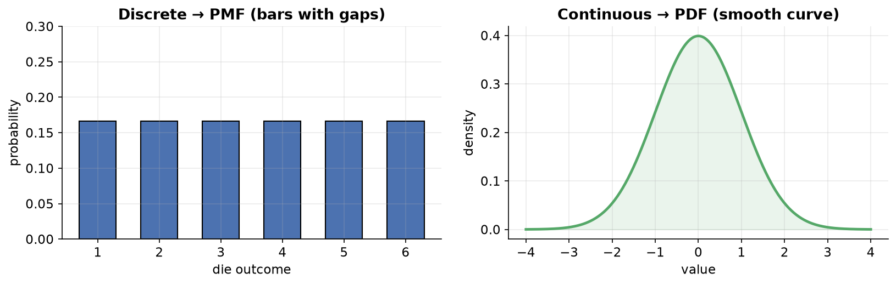
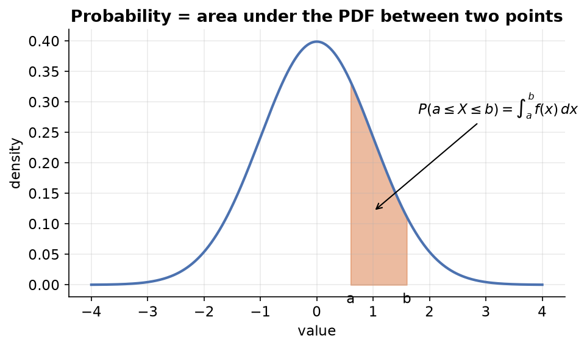
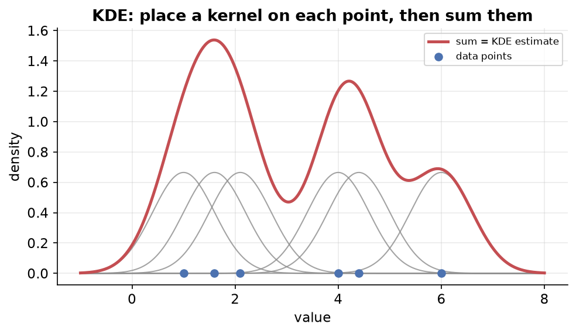
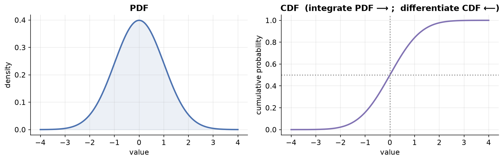

---
tags:
  - statistics
  - probability
  - probability-distributions
  - data-science
aliases:
  - Probability Distributions Notes
  - Probability Distributions
created: 2026-07-08
---


> [!info] Where this fits
> These notes continue from the descriptive statistics track, which ends at [[Bivariate and Multivariate Analysis|Bivariate and Multivariate Analysis]]. Descriptive statistics summarized the data we already have. Probability distributions sit on the boundary between statistics and probability, and they are the doorway into inferential statistics, where we predict things about a population from a sample. This note covers the **core machinery** (random variables, PMF, PDF, CDF, density estimation); the specific distributions come in the notes that follow.

---

## Random variables

Before distributions, we need one small building block: the random variable.

In algebra, a variable holds a single unknown value.

$$x + 5 = 10 \quad\Rightarrow\quad x = 5$$

Here `x` is one fixed number we solve for. A **random variable** is different. It holds a *set* of possible values coming out of a random experiment, and which value appears is decided randomly.

- A **random experiment** is any experiment whose outcome is random, such as a coin toss or a die roll (assuming they are fair).

> [!example]
> Coin toss: let head = 1 and tail = 0. The random variable is $X = \{0, 1\}$, and the result comes randomly.
> Die roll: $Y = \{1, 2, 3, 4, 5, 6\}$, again random.

| | Algebra variable | Random variable |
| :--- | :--- | :--- |
| Value | one unknown, fixed | many possible values |
| How value appears | you solve for it | comes out randomly |
| Notation | small letter, `x` | capital letter, `X` |

### Two types of random variables

| Type | Values it can take | Example |
| :--- | :--- | :--- |
| Discrete | only separate, countable values | die roll gives 1–6, never 1.5 |
| Continuous | any value in a range, including decimals | a student's CGPA can be 8.53271 |

This split matters, because it decides which kind of distribution function we use later.

---

## What is a probability distribution?

A probability distribution links every possible outcome of a random variable to the probability of that outcome.

The simplest form is a table, just like a frequency distribution table.

**Coin toss:**

| Outcome | Probability |
| :--- | :--- |
| 1 (head) | 1/2 |
| 0 (tail) | 1/2 |

**Rolling two dice and summing:** the sample space has 36 equally likely combinations, and the sums are not equally likely.

| Sum | 2 | 3 | 4 | 5 | 6 | 7 | 8 | 9 | 10 | 11 | 12 |
| :-- | :- | :- | :- | :- | :- | :- | :- | :- | :- | :- | :- |
| Probability | 1/36 | 2/36 | 3/36 | 4/36 | 5/36 | 6/36 | 5/36 | 4/36 | 3/36 | 2/36 | 1/36 |

Here 7 is the most likely sum, and 2 and 12 are the least likely.

### The problem with tables

A table works only when outcomes are few. If you roll 10 dice at once, sums run from 10 to 60. If the variable is continuous (like marks from 0 to 10), there are infinite possible values and a table becomes impossible.

**The fix:** find a mathematical function instead of a table.

Let the outcome be `x` and its probability be `y`. Build a function $f(x)$ that models the relationship between `x` and `y`. Once you have this equation, plug in any `x` and read off its probability.

$$y = f(x)$$

> [!note]
> Going forward, "probability distribution" and "probability distribution function (PDF)" are used to mean the same thing.

---

## The PDF graph and famous distributions

Plot outcomes on the x-axis and probabilities on the y-axis and you get the shape of the distribution.

- A **discrete** random variable gives a graph with gaps (bars only at whole numbers).
- A **continuous** random variable gives a smooth curve with a y-value at every point.



When you plot real data, the shape often matches one of a handful of famous distributions, such as **normal, uniform, log-normal, Pareto, exponential, and Poisson**.

### Why distributions matter so much

1. **Shape gives insight.** The graph shows you where data concentrates. If marks cluster near 5 out of 10, the class is weak; if near 8, the class is strong.
2. **A match unlocks known knowledge.** If your data matches a well-studied distribution like the normal, you instantly inherit everything mathematicians already proved about it.

### Parameters

Every distribution has **parameters**, which are like tuning knobs that change the shape, location, and scale of the curve. For the normal distribution they are $\mu$ (mean) and $\sigma$ (standard deviation).

> [!tip]
> When learning any new distribution, always focus on two things: its graph (shape) and its parameters.

---

## Types of distribution functions

"Probability distribution function" is the umbrella term. Under it sit two functions.

```text
              Probability Distribution Function
                    /                    \
        Probability Mass              Probability Density
        Function (PMF)                Function (PDF)
        for DISCRETE                  for CONTINUOUS
        random variables             random variables
```

From either of these you can also build the **cumulative distribution function (CDF)**.

> [!warning] Naming clarity
> Some people call the umbrella term "PDF" too. In these notes, **PDF means density function** (continuous) only, and **PMF means mass function** (discrete).

---

## Probability mass function (PMF)

The PMF describes the probability distribution of a **discrete** random variable, assigning a probability to each possible value.

Two rules any PMF must satisfy:

1. Every probability is $\geq 0$ (never negative).
2. All probabilities add up to 1.

**Die roll PMF** as an equation:

$$
f(x) =
\begin{cases}
\dfrac{1}{6} & \text{if } x \in \{1,2,3,4,5,6\} \\[6pt]
0 & \text{otherwise}
\end{cases}
$$

> [!example] Simulating a die 10,000 times
> Roll a die 10,000 times, store results, and count values. Each of 1–6 appears with probability close to $1/6 \approx 0.167$. Plotting the counts (divided by 10,000) gives a roughly flat bar chart, the PMF.

For the two-dice experiment the probabilities are unequal, so the PMF equation is written piecewise (1/36 for a sum of 2, 2/36 for a sum of 3, and so on).

---

## Cumulative distribution function (CDF)

The CDF answers a different question. Instead of "what is the probability of exactly `x`?", it asks "what is the probability of `x` **or less**?".

$$F(x) = P(X \leq x)$$

To get it from a PMF, add up all probabilities up to and including that point.

> [!example] Die roll
> $F(4) = P(X \le 4) = f(1) + f(2) + f(3) + f(4) = \tfrac{4}{6}$

| | PMF | CDF |
| :--- | :--- | :--- |
| Question | probability of exactly `x` | probability of `x` or less |
| At x = 4 | 1/6 | 4/6 ≈ 0.66 |
| How to build | direct probabilities | running (cumulative) sum |

In code, a CDF is the cumulative sum of the PMF. Its graph rises step by step and ends at 1.

---

## Probability density function (PDF)

For a **continuous** random variable the PDF looks like a smooth curve. But it behaves in a surprising way, so three questions must be answered.

### Q1: Why is the y-axis "probability density" and not "probability"?

Because a continuous variable has **infinite** possible values. Ask for the probability that marks are *exactly* 7.912 and the answer is essentially 0, because that exact value almost never lands. So a single point cannot carry a real probability; the y-axis instead carries **probability density**.

### Q2: What does the area under the curve represent?

The **total area under a PDF is always 1**, because it covers every possible outcome, and the total probability of all outcomes is 1.

### Q3: How do we get an actual probability?

Probability lives in the **area between two points**, not at a single point.

> [!example]
> To find the probability that marks fall between 8 and 9, compute the area under the curve between 8 and 9 (mathematically, integrate the PDF from 8 to 9).
> $$P(8 \le X \le 9) = \int_{8}^{9} f(x)\,dx$$



By shrinking the interval (8 to 8.001) you can approximate a "point" probability for practical purposes. So the y-axis is *technically* density, but the area gives you probability.

---

## Density estimation: building a PDF from data

We know how to compute probabilities (PMF) for discrete data easily. But for continuous data, we do not directly know the y-axis (probability density) values. Getting them from data is called **density estimation**.

```text
                    Density Estimation
                   /                  \
          Parametric              Non-parametric
      (assume a distribution)   (assume nothing, e.g. KDE)
```

| Approach | Core idea |
| :--- | :--- |
| Parametric | Assume the data follows a known distribution (normal, uniform, log-normal), then estimate that distribution's parameters. |
| Non-parametric | Make no assumption about the distribution; estimate the density directly from the data points. |

### Parametric density estimation

Steps:

1. Plot a histogram of your data.
2. Guess which known distribution it resembles (say, normal).
3. Estimate that distribution's parameters from the data (for normal: sample mean and sample standard deviation, used to approximate the population parameters).
4. Plug those parameters into the distribution's PDF equation.
5. Feed each `x` into the equation to get its probability density, then plot.

> [!example] Normal data
> Generate 1000 points from a normal distribution (population mean 50, sd 5). The **sample** mean/sd will be close but not exactly 50 and 5 (say 49.88 and ~5), because a sample is not the whole population. Fit a normal PDF with these sample estimates, generate points across the min–max range with `linspace`, compute density for each, and plot. In seaborn this is simply `sns.distplot(sample)`.

Why "parametric"? Because the whole result depends on estimating the parameters ($\mu$, $\sigma$). The closer your estimate is to the true population values, the better the fitted curve. Feed wrong parameters (mean 60, sd 12 on data centered at 50) and the curve collapses or misfits. More data means better parameter estimates and a better fit.

### Non-parametric density estimation (KDE)

Use this when the data matches **no** known distribution. Its main technique is **Kernel Density Estimation (KDE)**.

| | Advantage | Disadvantage |
| :--- | :--- | :--- |
| Non-parametric | works for any shape, no assumption needed | computationally heavy, needs more data for accuracy |

**How KDE works, step by step:**



1. Take each data point and place a **kernel** (usually a Gaussian / normal curve) centered on it. So every point becomes the mean of its own little normal curve.
2. Do this for all points, giving you as many kernels as data points.
3. For any x, move straight up and **add together the y-values (densities)** of every kernel passing through that x.
4. The summed curve is your estimated PDF.

**Bandwidth** is the key hyperparameter. It is the standard deviation of each kernel (how thick or thin each little curve is).

| Bandwidth | Effect on kernels | Effect on final curve |
| :--- | :--- | :--- |
| Small | thin, peaked kernels | spiky, jagged, over-sensitive |
| Large | wide, flat kernels | very smooth, may lose detail |

You must experiment to find the right bandwidth.

> [!example] KDE in code
> In scikit-learn use `KernelDensity(bandwidth=..., kernel='gaussian')`. Reshape 1D data to 2D (ML algorithms expect 2D), call `model.fit`, then `model.score_samples` on new points. Note: `score_samples` returns the **log** density, so wrap it in `np.exp` to get real densities. Available kernels include gaussian, tophat, exponential, linear, and cosine, but gaussian is used most. In seaborn, `sns.kdeplot(sample)` does it in one line, with `bw_adjust` controlling bandwidth.

---

## Relationship between PDF and CDF

The same CDF idea applies to continuous variables. A normal PDF gives a smooth S-shaped CDF.

**How to read a continuous CDF:**

> [!example] Heights
> On a CDF, pick x = 165. If y = 0.5, then 50% of people are 165 or shorter, i.e. $P(X \le 165) = 0.5$. Pick x = 150 with y = 0.2 and 20% are 150 or shorter.

The beautiful link between the two functions:

$$\text{CDF} = \int \text{PDF} \qquad\qquad \text{PDF} = \frac{d}{dx}\,\text{CDF}$$

- **Integrate** the PDF (accumulate area up to a point) and you get the CDF.
- **Differentiate** the CDF (take its slope at a point) and you get the PDF.



### Why use a PDF at all when we have a histogram?

Because you may not have enough data, or your sample may not represent the population well. A histogram of limited data can mislead you about the true shape. A correctly estimated PDF gets you closer to the population's real distribution, giving better, more reliable estimates. (Bin size changes a histogram's look but has no role once you compute a PDF.)

---

## Summary

1. A **random variable** holds many possible outcomes that appear randomly; it is discrete (countable) or continuous (any value in a range).
2. A **probability distribution** maps each outcome to its probability; tables work for few outcomes, but a **function** $y = f(x)$ is needed in general.
3. The umbrella "distribution function" splits into the **PMF** (discrete) and **PDF** (continuous); both yield a **CDF** ($P(X \le x)$).
4. For a continuous PDF, a single point has ~0 probability, the total area is 1, and probability equals the **area between two points** (integration).
5. **Density estimation** builds a PDF from data: **parametric** (assume a distribution, estimate its parameters) or **non-parametric / KDE** (sum a kernel placed on every point, tuned by bandwidth).
6. PDF and CDF are linked: **integrate PDF → CDF**, **differentiate CDF → PDF**.

---

> [!info] Continues to
> With the machinery in place, the next note studies the single most important distribution in detail: [[The Normal Distribution|The Normal Distribution]].
