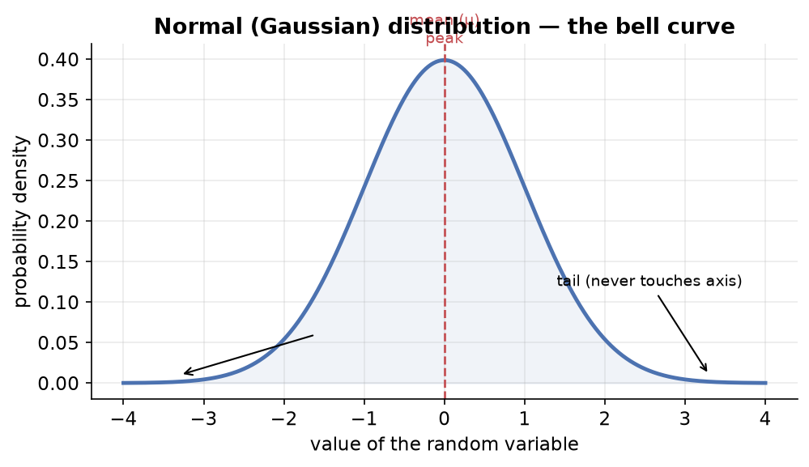
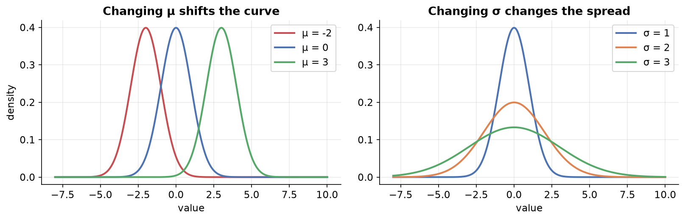
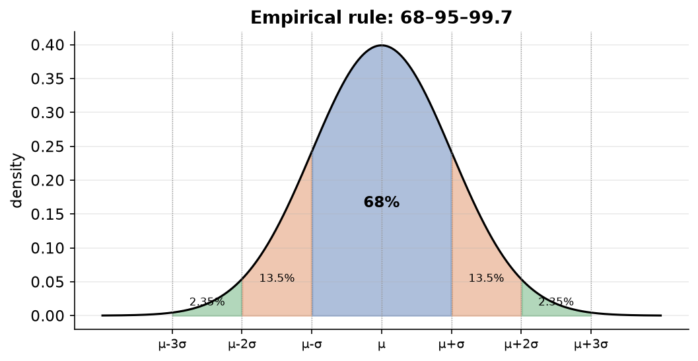

---
tags:
  - statistics
  - probability
  - probability-distributions
  - normal-distribution
  - data-science
aliases:
  - The Normal Distribution
  - Normal Distribution
  - Gaussian Distribution
difficulty: beginner
prerequisites:
  - Probability Distributions
created: 2026-07-09
---

> [!info] Where this fits
> Continues from [[Probability Distributions|Probability Distributions]], which built the PMF/PDF/CDF machinery. This note zooms in on the **normal (Gaussian) distribution**, the single most important continuous distribution, and everything that follows from it: the standard normal variate, Z-tables, the empirical rule, and where it shows up in data science.

---

## Normal distribution (Gaussian distribution)

The normal distribution, also called the **Gaussian distribution** or the **bell curve**, is the single most important continuous probability distribution.

### The shape and its parts

- The x-axis holds the values of the random variable.
- The y-axis holds probability density.
- The peak sits at the **mean**.
- The two ends are called **tails**. A tail never touches the x-axis; it only reaches it at infinity.

**Core summary:** most points sit near the center, and fewer points sit far from the center on either side.

### Parameters

A normal distribution is fully identified by two parameters:

| Parameter | Symbol | Controls |
| :--- | :--- | :--- |
| Mean | $\mu$ | the center / location of the curve |
| Standard deviation | $\sigma$ | the spread / width of the curve |

If you know $\mu$ and $\sigma$ and the data is normal, you can draw the whole graph.

### Why is it so important?

Because it is genuinely **common in nature** (that is why it is called "normal"). Heights of people, weights of objects, IQ scores, and many man-made phenomena follow it. Over decades statisticians kept drawing PDFs from different domains and kept getting this same curve, so they studied it deeply. Now, discovering that your data is normal makes you comfortable, because everything about it is already known.

### The PDF equation

$$f(x) = \frac{1}{\sigma\sqrt{2\pi}}\; e^{-\frac{(x-\mu)^2}{2\sigma^2}}$$

In the whole equation, only $\mu$ and $\sigma$ are parameters. $\pi$ is a constant (3.14), and `x` is the input.

**Intuition for where the equation comes from:**

- Start with $e^{x}$ (exponential growth). Add a minus sign, $e^{-x}$, for decay. Square it, $e^{-x^2}$, and you already get a bell-shaped curve, because pushing `x` far in either direction makes `y` shrink fast.
- The $(x - \mu)$ term shifts the curve so it can sit anywhere (handles location).
- Dividing by $2\sigma^2$ lets the variance scale the width (handles spread).
- The front factor $\frac{1}{\sigma\sqrt{2\pi}}$ exists only to force the total area under the curve to equal 1, as every PDF must.

### Effect of the parameters

- Changing $\mu$ **shifts** the curve left or right along the x-axis; height and shape stay the same.
- Increasing $\sigma$ makes the curve shorter and wider (more spread); decreasing it makes the curve taller and narrower.

---

## Standard normal variate (standard normal distribution)

A **standard normal variate** is a special case of the normal distribution where:

$$\mu = 0 \qquad \sigma = 1$$

It is denoted by **Z**, and its center sits at 0.

Its equation is just the normal PDF with $\mu = 0$ and $\sigma = 1$ plugged in:

$$f(z) = \frac{1}{\sqrt{2\pi}}\; e^{-\frac{z^2}{2}}$$

### Standardization (Z-score)

Any normal distribution can be converted into the standard normal variate. Take every point and apply:

$$Z = \frac{x - \mu}{\sigma}$$

This is **mean-centering** (subtract the mean) followed by **scaling** (divide by the standard deviation). The result has mean 0 and standard deviation 1.

> [!example] Titanic age column
> The age column is roughly normal with mean ≈ 29 and sd ≈ 14. Apply $Z = (x - 29)/14$ to every value. Plot the KDE of the new values: the peak now sits at 0, and the spread runs in units of 1, 2, 3. The new mean is ≈ 0 and the new sd is exactly 1.

### Why standardize? Two big benefits

1. **You can compare two different normal distributions** side by side, even if they originally had different means and scales.
2. **You can look up any in-between probability** instantly, because all probability values for the standard normal are pre-computed in **Z-tables**.

---

## Using Z-tables to find probabilities

A Z-table stores, for every z value, the **area under the curve to the left** of that z, i.e. $P(Z \le z)$. That area *is* the probability (or percentage).

### Worked example 1: taller than 72 inches

Male heights are normal with $\mu = 68$, $\sigma = 3$. Find $P(\text{height} > 72)$.

1. Compute the Z-score:
$$Z = \frac{72 - 68}{3} = \frac{4}{3} = 1.33$$
2. Look up 1.33 in the positive Z-table: row 1.3, column 0.03 gives **0.9082**.
3. That is $P(Z \le 1.33) = 90.82\%$, the area to the *left*.
4. We want the right side: $100\% - 90.82\% = 9.18\%$.

So about **9%** of males are taller than 72 inches.

### Worked example 2: deriving the empirical rule

For any normal distribution, what percent of data lies between the mean and one standard deviation above it ($\mu$ to $\mu + \sigma$)?

- Z-score of $\mu$: $\frac{\mu - \mu}{\sigma} = 0$. Table value at 0.00 is **0.50** (50%).
- Z-score of $\mu + \sigma$: $\frac{(\mu + \sigma) - \mu}{\sigma} = 1$. Table value at 1.00 is **0.8413** (84.13%).
- Difference: $84.13\% - 50\% = 34.13\%$.

By symmetry, the range $\mu - \sigma$ to $\mu$ also holds 34.13%. Together, one standard deviation on each side holds about **68%**.

---

## The empirical rule (68–95–99.7 rule)

For any normal distribution:

| Range | Percentage of data |
| :--- | :--- |
| $\mu \pm 1\sigma$ | ≈ 68% |
| $\mu \pm 2\sigma$ | ≈ 95% |
| $\mu \pm 3\sigma$ | ≈ 99.73% |

This is extremely powerful. If you know only that a data set is normal, you can guarantee that ~99.73% of it lies within 3 standard deviations of the mean, just by looking. Everything beyond that is a candidate outlier.

---

## Properties of the normal distribution

1. **Symmetric** around the mean; the two halves are mirror images, so a probability on one side gives you the other side.
2. **Mean = Median = Mode**, all three are exactly equal for a proper normal distribution.
3. **Empirical rule** holds (68–95–99.7).
4. **Total area under the curve = 1** (true of every PDF, but worth remembering here).

> [!example] Outliers and standard deviations
> Analysts studying batting scores found that most batsmen cluster near the center of a normal distribution, while an all-time great like Don Bradman sat around **5 standard deviations** away from the population, the very definition of an outlier.

---

## CDF of the normal distribution

Since the normal distribution has a PDF, it also has a CDF. It looks like a smooth **S-curve (sigmoid)** rising from 0 to 1.

- For curves with the same mean but different standard deviations, a **smaller sd** keeps the CDF steep near the center; a **larger sd** spreads it out.
- Reading it: at x = 0 (the mean of a standard normal), the CDF gives 0.5, meaning 50% of data is at or below the mean.

The equation is the PDF integrated from $-\infty$ up to the point `x`:

$$F(x) = \int_{-\infty}^{x} \frac{1}{\sigma\sqrt{2\pi}}\; e^{-\frac{(t-\mu)^2}{2\sigma^2}}\, dt$$

The integral just accumulates the area under the PDF up to that point.

---

## Where the normal distribution is used in data science

1. **Outlier detection.** Using the empirical rule, any point outside $\mu \pm 3\sigma$ is in the extreme ~0.03% region, so it can be treated as an outlier.
   > [!example]
   > On the Titanic age column (roughly normal), compute $\mu + 3\sigma \approx 73$ and $\mu - 3\sigma \approx -13$. Passengers older than 73 can be flagged as outliers.
2. **ML algorithm assumptions.** Algorithms like linear regression and Gaussian mixture models assume normally distributed input (for linear regression, the *residuals*/errors are assumed normal). Feeding normal data improves their performance.
3. **Hypothesis testing.** Many statistical tests assume the data is normally distributed.
4. **Central Limit Theorem (preview).** If you take any non-Gaussian distribution and repeatedly sample from it, the distribution of the sample means turns out to be normal. This is the backbone of inferential statistics.

---

## Summary

1. The **normal distribution** is defined by $\mu$ (center) and $\sigma$ (spread), is symmetric with mean = median = mode, and is common in nature.
2. Its PDF is $f(x) = \frac{1}{\sigma\sqrt{2\pi}} e^{-(x-\mu)^2 / 2\sigma^2}$; changing $\mu$ shifts it, changing $\sigma$ widens or narrows it.
3. The **standard normal variate** (Z, with $\mu=0$, $\sigma=1$) is obtained by standardizing ($Z = (x-\mu)/\sigma$); it enables comparison and **Z-table** lookups.
4. A **Z-table** gives the area to the left of a z value ($P(Z \le z)$), which is the probability.
5. The **empirical rule** (68–95–99.7) holds for any normal distribution and powers outlier detection.
6. The normal **CDF** is a smooth S-curve; the distribution underpins outlier detection, ML assumptions, hypothesis testing, and the CLT.

---

> [!info] Continues to
> Real data is rarely perfectly normal. The next note measures *how far* a distribution departs from normal with [[Skewness, Kurtosis and Normality Checks|skewness, kurtosis, and normality checks]].
