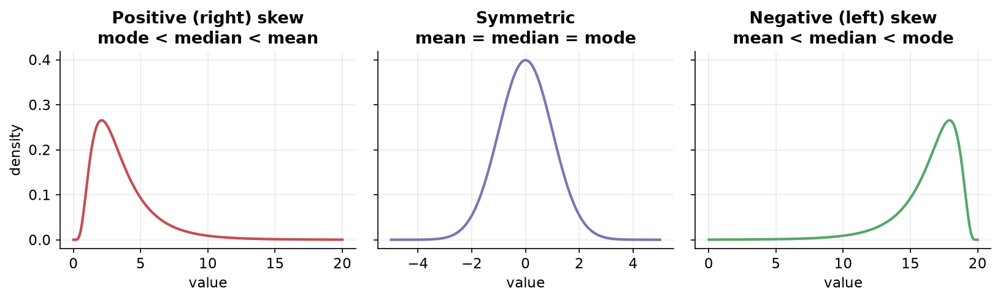
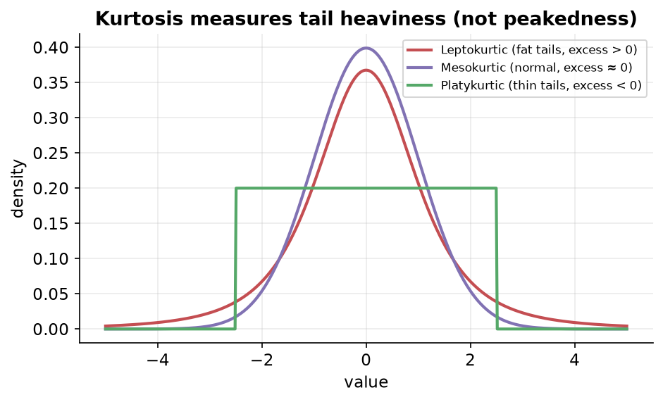
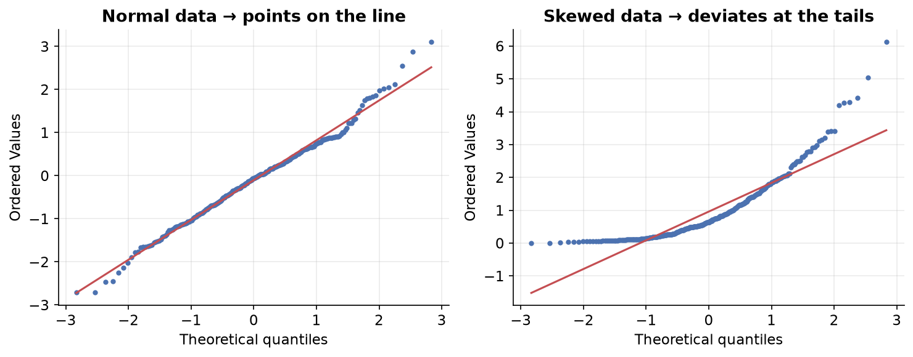

---
tags:
  - statistics
  - probability
  - probability-distributions
  - skewness
  - kurtosis
  - data-science
aliases:
  - Skewness, Kurtosis and Normality Checks
  - Skewness and Kurtosis
  - Normality Checks
  - QQ Plot
difficulty: intermediate
prerequisites:
  - The Normal Distribution
created: 2026-07-09
---


> [!info] Where this fits
> Continues from [[The Normal Distribution|The Normal Distribution]]. Real data is rarely perfectly normal. This note covers the two shape measures that quantify the departure from normal, **skewness** (asymmetry) and **kurtosis** (tail heaviness), and then the practical tools for **checking whether data is normal**, culminating in the QQ plot.

---

## Skewness

Skewness measures the **asymmetry** of a distribution, i.e. how far it deviates from being symmetric (normal). High skewness means the data is **not** normally distributed.

- A skewed distribution has one **tail longer** than the other. Since a tail represents outliers, you always name the skew after the side the tail is on.

| Type | Tail is longer on the | Order of measures |
| :--- | :--- | :--- |
| Positive (right) skew | right | mode < median < mean |
| Symmetric | both equal | mean = median = mode |
| Negative (left) skew | left | mean < median < mode |



The mean gets pulled toward the tail (the outliers). The greater the skew, the greater the distance between the mean and the mode/median. With no skew they sit on top of each other.

### Formula (statistical moments)

Statistics has a sequence of "moments": the **1st moment is the mean**, the **2nd is variance**, the **3rd is skewness**, and the **4th is kurtosis**. Sample skewness:

$$\text{Skew} = \frac{n}{(n-1)(n-2)} \sum \left(\frac{x_i - \bar{x}}{s}\right)^3$$

You rarely compute this by hand; `df.skew()` in pandas or Excel's SKEW does it. What matters is **interpreting the number**.

### Interpreting the skew value

```text
   highly     moderately   almost      moderately    highly
   skewed     skewed     symmetric      skewed       skewed
  <----|----------|----------|----------|----------|---->
      -1        -0.5         0          0.5         1
```

| Skew value | Interpretation |
| :--- | :--- |
| between −0.5 and 0.5 | almost symmetric; treat as normal for practical purposes |
| between −1 and −0.5, or 0.5 and 1 | moderately skewed; do not assume normal |
| below −1 or above 1 | highly skewed; definitely not normal |

> [!note]
> Skewness applies to **all** distributions, not just the normal. A symmetric non-normal curve still has skew near 0. Getting exactly 0 in real data is nearly impossible.

---

## Kurtosis

Kurtosis is the **4th statistical moment**. It measures the **tailedness** of a distribution: how heavy or "fat" the tails are, which reflects how many extreme outliers are likely.

> [!warning] Common myth
> Kurtosis is **not** about "peakedness". Many sources say it measures peakedness or both peak and tail; that is incorrect. Kurtosis measures **tail heaviness** (the presence of outliers). A fatter tail means more extreme values.

### Intuition through cricket scores

Imagine two seasons where a batsman had the **same mean, spread, and skew**, but one season had heavier tails (more very-low and very-high scores). Kurtosis is what distinguishes them, telling you the intensity of tail events.

### Excess kurtosis and three families

Sample kurtosis for a normal distribution is treated as a baseline. **Excess kurtosis = sample kurtosis − 3**, comparing any distribution against the normal.

| Family | Excess kurtosis | Tails |
| :--- | :--- | :--- |
| Leptokurtic | > 0 | fatter tails, more extreme outcomes |
| Mesokurtic | ≈ 0 | like the normal distribution |
| Platykurtic | < 0 | thinner tails, fewer extreme outcomes |



Distributions in these families can share the same mean, standard deviation, and skewness; the only difference is tail fatness.

### Where kurtosis is used: finance

In finance there is a term **"kurtosis risk"**, the risk of extreme outcomes (fat tails) in the returns of an asset or portfolio. A highly volatile mutual fund with a leptokurtic return distribution can produce sudden large gains or losses. This is closely tied to the idea of **tail events**: rare events with low probability that, when they occur, hit hard and fast.

---

## Checking if data is normally distributed

Before applying transformations, you need to know whether a column is already normal. Three common methods:

| Method | How |
| :--- | :--- |
| Visual inspection | plot a histogram or a KDE/density plot and eyeball the shape |
| Skewness value | run `df['col'].skew()`; near 0 is symmetric, far from 0 is skewed |
| QQ plot | compare your data against a theoretical normal distribution graphically |

The QQ plot is the most reliable and most-used of these, so it deserves its own section.

---

## QQ plot (Quantile-Quantile plot)

A QQ plot is a graphical tool that compares two distributions by plotting their quantiles against each other. Most often it checks whether your data follows a normal distribution.



### How it is built

1. Generate a **theoretical** distribution (for a normal check, a standard normal with mean 0, sd 1, e.g. 1000 points).
2. Sort your **actual** data.
3. Compute matching percentiles/quantiles of both, and plot theoretical quantiles on the x-axis against your data's quantiles on the y-axis.
4. Draw a reference line (usually 45°).

### How to read it

- If the points lie **along the straight line**, the two distributions match, so your data is (approximately) normal.
- **Tails** are where deviations show up most. Points drifting off the line at the ends signal skew.
- Right-skewed data pulls away from the line at the top; the more it deviates, the less normal it is.

> [!example] In code
> `statsmodels`' `qqplot(data, line='45')` builds it automatically: it generates the theoretical normal, does the sorting and percentile work, and fits the 45° line. Options for the reference line include 45-degree, standardized, regression, and quartile fits.

### QQ plots are not just for the normal

By definition, a QQ plot compares *any* two distributions. Pass a theoretical **uniform** (or Pareto, log-normal, etc.) as the comparison distribution, and the QQ plot will tell you whether your data matches *that* shape. Points on the line means a match.

---

## Summary

1. **Skewness** (3rd moment) measures **asymmetry**; positive skew has a long right tail (mode < median < mean), negative skew a long left tail. |value| < 0.5 is roughly symmetric, > 1 is highly skewed.
2. **Kurtosis** (4th moment) measures **tail heaviness**, not peakedness; excess kurtosis compares against the normal (leptokurtic > 0, mesokurtic ≈ 0, platykurtic < 0).
3. Check normality via **visual inspection**, the **skewness value**, and most reliably the **QQ plot**.
4. A **QQ plot** plots theoretical vs sample quantiles; points on the 45° line mean a match, and it works against any reference distribution, not just the normal.

---

> [!info] Continues to
> When data isn't normal, we either model it with another distribution or reshape it. That's the subject of [[Non-Gaussian Distributions and Transformations|non-Gaussian distributions and transformations]].
