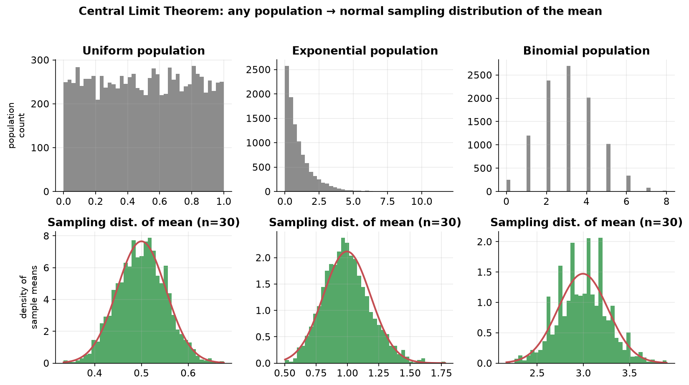

---
tags:
  - statistics
  - inferential-statistics
  - central-limit-theorem
  - sampling
  - data-science
aliases:
  - Central Limit Theorem
  - CLT
  - Sampling Distribution
difficulty: intermediate
prerequisites:
  - Bernoulli and Binomial Distributions
created: 2026-07-09
---


> [!info] Where this fits
> Continues from [[Bernoulli and Binomial Distributions|Bernoulli and Binomial Distributions]]. This is the point where we cross fully into **inferential statistics**, using a sample to say something about a population. The central limit theorem (CLT) is one of the most powerful and surprising results in all of statistics, and it is the foundation for [[Confidence Intervals|Confidence Intervals]] and [[Hypothesis Testing|Hypothesis Testing]].

---

## Prerequisite: sampling distribution

Recall from [[Foundations and Central Tendency|Foundations and Central Tendency]] the idea of **population vs sample**. Because a population is usually too large to measure, we draw a sample and infer from it.

A **sampling distribution** is the probability distribution of a **sample statistic** (like the mean or variance), computed from **many independent samples of the same size** drawn from a population.

### Sampling distribution of the sample mean

> [!example] Average salary in India
> The population is every Indian's salary (say 140 crore numbers), which follows some unknown distribution.
> 1. Randomly draw a sample of **50 people** and record their salaries.
> 2. Compute the **mean** of those 50 salaries. Call it $\bar{x}_1$.
> 3. Repeat this, say, **100 times**, giving $\bar{x}_1, \bar{x}_2, \dots, \bar{x}_{100}$.
>
> These 100 sample means themselves form a distribution. That is the **sampling distribution of the sample mean**.

You could instead collect sample **variances**, sample **standard deviations**, or any other statistic, and get the sampling distribution of *that* statistic.

```text
   Population  ──draw sample of size n──►  compute statistic (e.g. mean)
        │              (repeat many times)          │
        └──────────────────────────────────────────┘
                          ▼
              Sampling distribution of that statistic
```

---

## The central limit theorem

> [!important] Statement
> The distribution of **sample means** of a large number of independent, identically distributed random variables approaches a **normal distribution**, **regardless of the shape of the underlying population distribution**.

This is the magical part: the population can be uniform, exponential, Poisson, gamma, binomial, or anything at all, and the sampling distribution of its sample means will still come out **normal**.

### The two key results

If the population has mean $\mu$ and variance $\sigma^2$, then the sampling distribution of the sample mean is normal with:

| Quantity | Value |
| :--- | :--- |
| Mean of sampling distribution | $\mu$ (same as the population mean) |
| Variance of sampling distribution | $\dfrac{\sigma^2}{n}$ |
| Standard deviation (**standard error**) | $\dfrac{\sigma}{\sqrt{n}}$ |

Here $n$ is the **sample size**, not the number of samples.

> [!note] Rule of thumb
> A sample size of $n \ge 30$ is usually "large enough" for the CLT to kick in.

### Why this is a big deal

You do **not** need to measure the entire population. To estimate the average salary of 140 crore people, you can draw (say) 50 people, 100 times, work with 5,000 numbers total, and still recover the population mean $\mu$ through the CLT.

The CLT also provides the theoretical justification for many standard tools: the **t-test, ANOVA, and even linear regression** all rest on it.

---

## Demonstration

> [!example] It works for any starting distribution
> Take a **uniform** population, draw many samples of size 30, compute each sample's mean, and plot. The histogram of means looks **normal**. Repeat with an **exponential**, **Poisson**, **gamma**, or **binomial** population, and every time the sampling distribution of the mean comes out normal. Increasing the sample size makes it look even more perfectly normal.



The top row shows three very different population shapes; the bottom row shows the sampling distribution of their sample means, and all three are normal (red curve).

> [!example] Verifying the formulas (Titanic fare)
> Treat the full Titanic passenger list as the population (combine train + test files → ~1309 passengers). We pretend we don't know the population mean of `Fare`.
> 1. Draw 50 random fares, 100 times → 100 sample means. This is the sampling distribution.
> 2. Its KDE plot is **normal** (confirms the CLT).
> 3. Its mean ≈ the true population mean of `Fare` (confirms result 1).
> 4. Its variance ≈ population variance / 50 (confirms result 2).

---

## Preview: from CLT to a confidence interval

Rather than reporting a single point estimate ("the mean is exactly 32.5"), we usually give a **range**. Because the sampling distribution is normal, the **empirical rule** (68–95–99.7) applies.

> [!example] A quick 95% interval
> The sampling distribution is normal with mean $\bar{x}$ and standard error $\sigma/\sqrt{n}$. By the empirical rule, ~95% of the area lies within **2 standard errors** of the center. So:
> $$\text{population mean lies within } \bar{x} \pm 2\cdot\frac{\sigma}{\sqrt{n}} \text{ with ~95\% confidence}$$
> For the Titanic fare sample this gave a range like 30.36 to 34.80, and the true population mean (≈ 33.29) fell inside it.

This is exactly the idea developed fully in [[Confidence Intervals|Confidence Intervals]].

---

## Conditions and cautions

For the CLT to give trustworthy results, the samples must be:

1. **Random**, so every individual has a fair chance of selection.
2. **Representative**, covering all the variation in the population (all states, ages, genders, etc.).

> [!warning]
> If you build a biased sample (e.g. only surveying people in big cities for an all-India salary estimate), the CLT machinery still runs but the answer is wrong. Good sampling is a very big "if".

> [!note] There is no "why", only "what"
> The CLT is an observed property of nature, like the value of $\pi$ or $e$. Statisticians ran the experiments and found it holds. We use it because it works, not because there is a deeper derivable reason at this level.

---

## Summary

1. A **sampling distribution** is the distribution of a statistic (usually the mean) computed from many equal-sized samples of a population.
2. The **CLT** says the sampling distribution of the sample mean is **normal**, no matter the population's shape, given a large enough sample ($n \ge 30$).
3. The sampling distribution's **mean equals the population mean** $\mu$, and its **standard deviation is the standard error** $\sigma/\sqrt{n}$.
4. This lets us estimate population parameters from small samples, and it underpins confidence intervals, t-tests, ANOVA, and regression.
5. Samples must be **random and representative** for the results to be valid.
