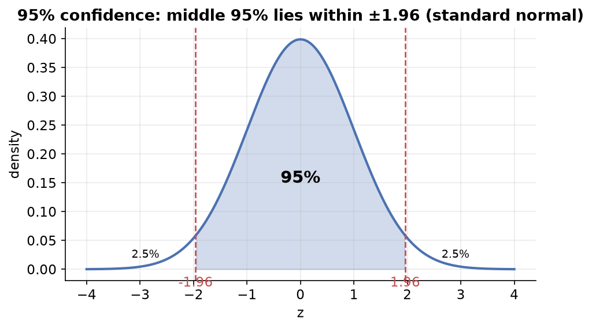
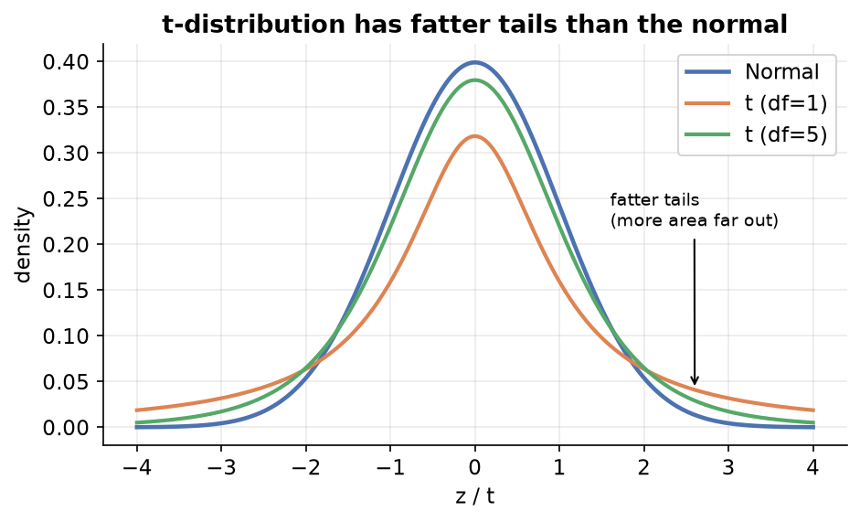

---
tags:
  - statistics
  - inferential-statistics
  - confidence-intervals
  - data-science
aliases:
  - Confidence Intervals
difficulty: intermediate
prerequisites:
  - Central Limit Theorem
created: 2026-07-09
---

> [!info] Where this fits
> Continues from [[Central Limit Theorem|Central Limit Theorem]]. The CLT told us the sampling distribution of the mean is normal. Here we use that fact to put a **range** around a population parameter, instead of guessing a single number. This is a core inferential-statistics tool and a common interview topic.

---

## Revision: the vocabulary we need

| Term | Meaning | Symbol |
| :--- | :--- | :--- |
| Population | the entire group of interest | — |
| Sample | a random, representative subset we actually measure | — |
| Parameter | a numeric summary of the **population** (unknown) | $\mu$, $\sigma$ |
| Statistic | a numeric summary of the **sample** (known) | $\bar{x}$, $s$ |

We use a **statistic** (from the sample) to estimate a **parameter** (of the population). Parameters are usually unknown, which is the whole reason inferential statistics exists.

---

## Point estimate

A **point estimate** is a single value, calculated from a sample, used as the best guess for an unknown population parameter.

> [!example]
> To estimate the average age of a YouTube channel's subscribers, hold a live class, ask 100 attendees their age, and compute the sample mean (say 28). That 28 is the point estimate for the whole subscriber base.

You can make a point estimate stronger by taking **many samples** and averaging their means (an application of the [[Central Limit Theorem|Central Limit Theorem]]), but it is still a single number.

### The problem with point estimates

A single number is **not reliable**. How can the average of 100 people exactly equal the average of 77,000?

> [!example] The betting intuition
> Predict Dhoni's score today. Guess the **exact** run and win big, but you'll almost never be right. Guess a **range** (±10 or ±20) and you're far more likely to be correct. A range is more useful than a point.

So statisticians report a **range**, called a confidence interval.

---

## Confidence interval and confidence level

- **Confidence interval (CI):** a range of values within which we expect a population parameter to lie.
- **Confidence level:** how sure we are that the true value lies in that interval, expressed as a percentage (commonly **95%**).

> [!example]
> "The subscribers' average age is between **25 and 32**, and I am **95% confident**." Here 25–32 is the confidence interval and 95% is the confidence level.

### The master formula

$$\text{CI} = \text{point estimate} \pm \text{margin of error}$$

If the point estimate is 25 and the margin of error is 4, the CI is $25 \pm 4 = [21, 29]$.

> [!important] Confidence intervals are for **parameters**, not statistics
> We always build the interval around a population quantity (like $\mu$), using sample information.

---

## Interpreting the confidence level (very important)

A 95% confidence level does **not** mean "there is a 95% probability the mean is in this range". The population mean is a fixed number, it does not have a probability.

> [!important] Correct interpretation
> If you repeat the whole experiment many times, each time drawing a fresh sample and building a fresh 95% confidence interval, then about **95% of those intervals will contain the true population parameter**. Roughly 5% will miss it.

### Width vs confidence trade-off

The **higher** the confidence level, the **wider** the interval.

> [!example]
> "Dhoni scores between 0 and 200, I'm 100% confident" is useless because the range is too wide. "Between 25 and 35, I'm 95% confident" is informative. A 100% confidence interval stretches from $-\infty$ to $+\infty$.

---

## Procedure 1: Z-procedure (population $\sigma$ known)

Use the Z-procedure when the **population standard deviation $\sigma$ is known**.

### Assumptions

1. The sample was drawn **randomly**.
2. The **population standard deviation $\sigma$ is known**.
3. The population is **normally distributed** (or the sample size is $\ge 30$, so the CLT provides normality).

### The formula

$$\text{CI} = \bar{x} \pm z_{\alpha/2}\cdot\frac{\sigma}{\sqrt{n}}$$

| Symbol | Meaning |
| :--- | :--- |
| $\bar{x}$ | sample mean (the point estimate) |
| $\sigma$ | population standard deviation |
| $n$ | sample size |
| $z_{\alpha/2}$ | the **critical value** from the Z-table |

Here $\alpha$ is $1 - \text{confidence level}$. For a 95% interval, $\alpha = 0.05$, and $z_{\alpha/2} = 1.96$ (the z-value leaving 2.5% in each tail).

### Where the formula comes from (intuition)

1. By the CLT, the sampling distribution of $\bar{x}$ is normal.
2. Standardize it into the standard normal variate $Z = \frac{\bar{x} - \mu}{\sigma/\sqrt{n}}$.
3. We want a range of $z$ values that captures 95% of the area, which is $[-1.96, 1.96]$.
4. Rearranging that inequality to solve for $\mu$ gives the formula above.

> [!example] Common critical values
> | Confidence level | $z_{\alpha/2}$ |
> | :--- | :--- |
> | 90% | 1.645 |
> | 95% | 1.96 |
> | 99% | 2.576 |

---

## Procedure 2: T-procedure (population $\sigma$ unknown)

In real life you almost never know the population standard deviation. When $\sigma$ is **unknown**, replace it with the **sample standard deviation $s$**, and use the **t-distribution** instead of the normal.

### Why not just use the normal?

Replacing $\sigma$ with $s$ adds extra uncertainty, because $s$ itself varies from sample to sample. That extra uncertainty means the standardized quantity no longer follows the normal distribution; it follows the **Student's t-distribution**.

### The t-distribution

- A theoretical distribution (it does not occur in nature; it was designed to handle this uncertainty). It was published under the pen name "Student".
- Looks like the normal distribution but with **fatter tails** (more area far from the center).
- Has a **single parameter: degrees of freedom** $= n - 1$.
- As the sample size grows, the t-distribution **converges to the normal distribution**.

### The formula

$$\text{CI} = \bar{x} \pm t_{\alpha/2}\cdot\frac{s}{\sqrt{n}}$$

The critical value $t_{\alpha/2}$ comes from a **t-table** using the degrees of freedom $n-1$.

> [!note]
> For the same confidence level and small sample, $t_{\alpha/2} > z_{\alpha/2}$ (e.g. ~2.04 vs 1.96), so the t-interval is a bit **wider**, correctly reflecting the extra uncertainty. As $n$ grows, $t_{\alpha/2} \to z_{\alpha/2}$.

> [!warning] Using the wrong procedure
> If you mistakenly use the Z-procedure with the sample $s$, simulations show your intervals capture the true mean only ~92% of the time even though you claimed 95%. Switching to the T-procedure restores the correct ~95% coverage.

---

## Factors that affect the interval width

$$\text{CI} = \underbrace{\bar{x}}_{\text{sample mean}} \pm \underbrace{z_{\alpha/2}}_{\text{critical value}}\cdot\frac{\sigma}{\sqrt{n}}$$

| Factor | Effect on width |
| :--- | :--- |
| Higher confidence level | wider interval (bigger critical value) |
| Larger population standard deviation | wider interval |
| Larger sample size $n$ | narrower interval |

> [!note]
> Increasing sample size helps a lot at first (going from 0 to ~30), but the benefit shrinks as $n$ grows further, because the width falls with $\sqrt{n}$, not $n$.

---

## Worked example (Titanic age, T-procedure)

We want the population mean age, but we only "have" a sample.

1. Draw a random sample of 25 ages → compute sample mean $\bar{x}$ and sample std $s$.
2. $\sigma$ is unknown → use the **T-procedure**.
3. Degrees of freedom $= 25 - 1 = 24$; look up $t_{\alpha/2}$ for 95% ≈ 2.06.
4. Compute $\bar{x} \pm 2.06 \cdot \dfrac{s}{\sqrt{25}}$ to get the interval.
5. The true population mean age (≈ 29.7) falls inside the reported interval.

Lower the confidence level and the interval narrows but you become less sure; raise it and the interval widens.

---

## Summary

1. A **point estimate** is a single-value guess for a population parameter; it is not reliable on its own.
2. A **confidence interval** gives a range, and the **confidence level** (e.g. 95%) states how often such intervals capture the true parameter over many repetitions.
3. $\text{CI} = \text{point estimate} \pm \text{margin of error}$.
4. **Z-procedure** applies when $\sigma$ is known; $\text{CI} = \bar{x} \pm z_{\alpha/2}\,\sigma/\sqrt{n}$ (95% → $z = 1.96$).
5. **T-procedure** applies when $\sigma$ is unknown; it uses the sample $s$ and the **t-distribution** (fatter tails, parameter = degrees of freedom $n-1$).
6. Interval **width** grows with confidence level and population spread, and shrinks with sample size.
