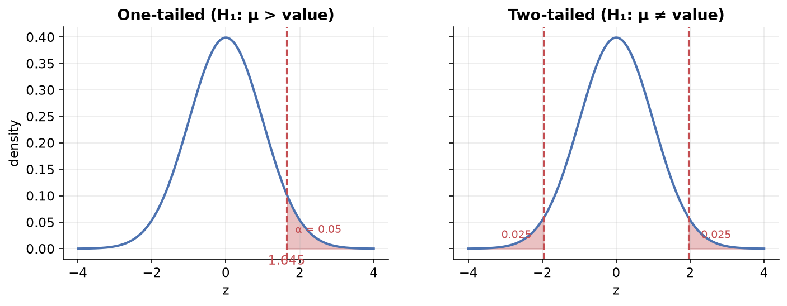
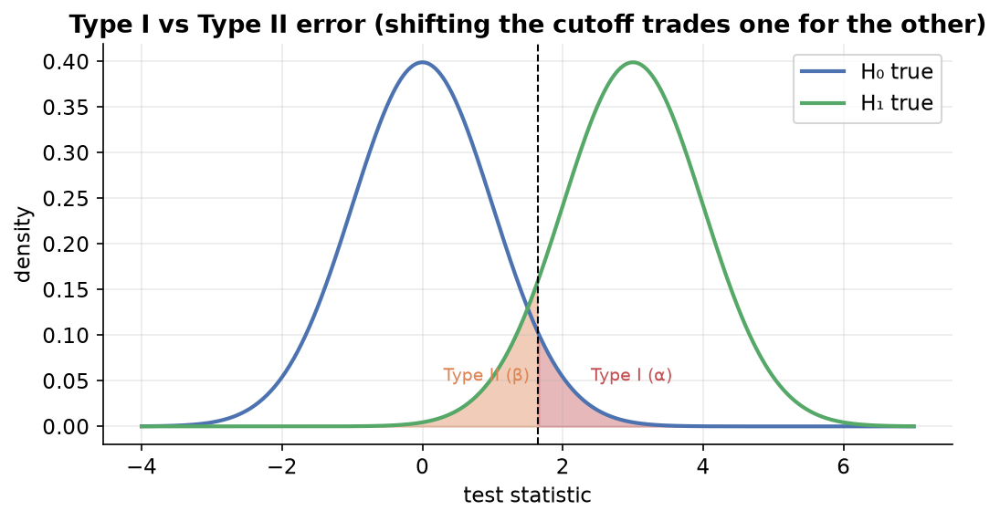

---
tags:
  - statistics
  - inferential-statistics
  - hypothesis-testing
  - data-science
aliases:
  - Hypothesis Testing
difficulty: advanced
prerequisites:
  - Confidence Intervals
created: 2026-07-09
---


> [!info] Where this fits
> Continues from [[Confidence Intervals|Confidence Intervals]]. Hypothesis testing is one of the most important topics in inferential statistics and a favorite in data-science and data-analyst interviews. This note covers the **why**, the core vocabulary, and the **rejection-region approach**. The follow-up, [[P-values and T-tests|P-values and T-tests]], covers the more refined p-value approach and specific tests.

---

## Why hypothesis testing exists

We often have an **idea** (a hypothesis) and want to check whether the **data supports it**.

> [!example] YouTube video style (hypothetical)
> Average view duration is 6 minutes. You think a new shooting style (standing in front of the screen) will increase it. You shoot one video and it runs 13 minutes. Can you conclude the new style works? **No.** A single result could be luck (a trending topic that day, etc.). You need many samples and a formal test.

> [!example] Lays packet weight
> A packet claims 50 g. A consumer watchdog suspects it is not exactly 50 g. They weigh a random sample of packets and test the claim.

Hypothesis testing lets us make **probabilistic statements about population parameters** from sample data. It is used to compare treatments, compare group means/proportions, analyze relationships, check goodness of fit, and run A/B tests.

---

## The two hypotheses

Every test starts with two competing statements.

| Hypothesis | Symbol | What it says |
| :--- | :--- | :--- |
| Null hypothesis | $H_0$ | **Nothing new** is happening; the status quo holds. Usually contains an equality. |
| Alternate hypothesis | $H_1$ or $H_A$ | The opposite of the null; the effect the researcher wants to demonstrate. |

They are **mutually exclusive**: exactly one will be supported at the end.

> [!tip] Rule of thumb for choosing the null
> $H_0$ always says "nothing changed". You changed the video style but the average duration is still 6 minutes. You opened the chips packet but the weight is still exactly 50 g.

> [!example] Writing them formally
> **YouTube:** $H_0: \mu = 6$ min, $H_1: \mu > 6$ min.
> **Lays:** $H_0: \mu = 50$ g, $H_1: \mu \ne 50$ g.

### What the whole test does

We collect **evidence against the null hypothesis** in the hope of rejecting it.

> [!important] Failing to reject ≠ proving true
> Not being able to reject $H_0$ does **not** prove $H_0$ is true. It only means we lacked enough evidence to reject it.

> [!example] Courtroom analogy
> - $H_0$: the accused is innocent ("no crime").
> - $H_1$: the accused is guilty.
> - The lawyer (like the researcher) presents evidence to convince the judge of guilt.
> - If the lawyer fails to bring enough evidence, it does **not** prove the accused is innocent, it just means guilt wasn't established.

---

## Significance level ($\alpha$)

The **significance level $\alpha$** is a threshold, chosen **before** testing. Common values are **0.05 (5%)** and **0.01 (1%)**.

It is the probability of **rejecting $H_0$ when $H_0$ is actually true** (this is a **Type I error**, covered below). If $\alpha = 0.05$, then in the long run about 5 out of 100 true nulls would be wrongly rejected.

> [!note]
> $\alpha$ must be fixed in advance, otherwise you have no threshold against which to decide whether to reject the null.

---

## The rejection-region approach (step by step)

This is the first, most basic technique. The general flow:

1. **Formulate** $H_0$ and $H_1$.
2. **Choose** the significance level $\alpha$ (e.g. 0.05).
3. **Check assumptions** about the data (e.g. normality, known $\sigma$) to pick the right test.
4. **Decide the test** (Z-test if $\sigma$ known and data normal; t-test if $\sigma$ unknown; chi-square for categorical, etc.).
5. **Select the test statistic** and compute it.
6. **Conduct the test:** compare the statistic against the **critical value(s)** to see if it lands in the rejection region.
7. **Conclusion:** reject $H_0$, or fail to reject it.

---

## Worked example: one-sample Z-test (rejection region)

> [!example] Training program
> A car factory produces on average $\mu = 50$ cars/day with $\sigma = 5$. After a training program, a sample of $n = 30$ employees shows a sample mean of $\bar{x} = 53$. Did productivity **increase**? Use $\alpha = 0.05$.

**Step 1.** $H_0: \mu = 50$, $H_1: \mu > 50$.

**Step 2.** $\alpha = 0.05$.

**Step 3.** $n = 30 \ge 30$ (CLT → normality holds), and $\sigma$ is known → use a **Z-test**.

**Step 5–6.** Compute the Z statistic:
$$Z = \frac{\bar{x} - \mu}{\sigma/\sqrt{n}} = \frac{53 - 50}{5/\sqrt{30}} \approx 3.28$$

Because $H_1$ is $\mu > 50$, this is a **one-tailed (right-tailed)** test. Put all of $\alpha = 0.05$ in the right tail. The critical value is $z = 1.645$.

**Step 7.** $3.28 > 1.645$, so the statistic lands in the **rejection region**. We **reject $H_0$**: the training program significantly increased productivity.

```text
            |          rejection region (α = 0.05)
            |                 ┌───────
   ─────────┴─────────────────┤
            0               1.645   3.28 ✗ (falls here → reject H0)
```

---

## One-tailed vs two-tailed tests

The alternate hypothesis decides which one you use.

| $H_1$ contains | Test type | Rejection region |
| :--- | :--- | :--- |
| $>$ or $<$ (a direction) | **one-tailed** (one-sided) | all $\alpha$ in one tail |
| $\ne$ (just "different") | **two-tailed** (two-sided) | $\alpha/2$ in **each** tail |



> [!example] Lays packet (two-tailed)
> $H_0: \mu = 50$, $H_1: \mu \ne 50$. With $\alpha = 0.05$, put 0.025 in each tail, giving critical values $\pm 1.96$. Compute $Z = \dfrac{49 - 50}{4/\sqrt{40}} \approx -1.58$. Since $-1.58$ lies **between** $-1.96$ and $1.96$ (the no-rejection region), we **fail to reject $H_0$**. There isn't enough evidence that the weight differs from 50 g.

---

## Type I and Type II errors

Because we decide from a sample, we can be wrong in two ways.

| | $H_0$ is true | $H_0$ is false |
| :--- | :--- | :--- |
| **Reject $H_0$** | Type I error (false positive), prob $\alpha$ | correct |
| **Fail to reject $H_0$** | correct | Type II error (false negative), prob $\beta$ |

- **Type I error (false positive):** rejecting a true null. Example: the innocent person gets convicted. Its probability is $\alpha$.
- **Type II error (false negative):** failing to reject a false null. Example: the guilty person walks free. Its probability is $\beta$.
- **Power of the test** $= 1 - \beta$.

### The trade-off

Lowering $\alpha$ shrinks the rejection region and grows the "fail to reject" region. That reduces Type I errors but **increases** Type II errors, and vice versa. You cannot minimize both at once; you strike a balance (which is why 0.05 is a common default).



---

## How $\alpha$ shapes the regions (intuition)

Picture a two-tailed test. The white middle region is "fail to reject"; the shaded tails are "reject".

- **Decrease $\alpha$** (e.g. 0.05 → 0.01): the white region **grows**, so it's harder to reject $H_0$ (fewer Type I errors).
- **Increase $\alpha$**: the white region **shrinks**, so even a true $H_0$ is more likely to be (wrongly) rejected.

The value from the Z/t table that separates the regions is the **critical value**; the shaded area is the **rejection region**.

---

## The weakness of the rejection-region approach

This approach gives a **binary** answer (reject or not) but ignores **how strong** the evidence is.

> [!example]
> If the critical value is 1.96 and your statistic is 1.97, you reject; if it's 1.95, you don't, even though the two are almost identical. And a statistic of 15 (very strong evidence) is treated the same as one of 2 (borderline). The rejection-region approach can't express this difference in strength.

The fix is the **p-value approach**, covered in [[P-values and T-tests|P-values and T-tests]].

---

## Where hypothesis testing is used in ML

| Use case | How |
| :--- | :--- |
| Model comparison | test whether one model's accuracy is significantly better across CV folds (paired t-test) |
| Feature selection | test whether a feature is significantly related to the target (t-test, chi-square, ANOVA) |
| Hyperparameter tuning | compare performance across parameter settings |
| Checking model assumptions | test linearity/normality of residuals (e.g. for linear regression) |

Libraries like scikit-learn use these tests internally; understanding them helps you use those tools wisely.

---

## Summary

1. Hypothesis testing checks whether **data supports an idea** about a population parameter.
2. $H_0$ (null) says "nothing new"; $H_1$ (alternate) is the effect we want to show; the goal is to **gather evidence against $H_0$**.
3. Failing to reject $H_0$ does **not** prove it true.
4. $\alpha$ (significance level, often 0.05) is the pre-chosen probability of a **Type I error**.
5. The **rejection-region approach**: compute a test statistic and check if it falls beyond the **critical value**.
6. **One-tailed** tests (direction in $H_1$) put $\alpha$ in one tail; **two-tailed** tests ($\ne$) split it into both tails.
7. **Type I** = false positive (prob $\alpha$); **Type II** = false negative (prob $\beta$); they trade off; **power** $= 1 - \beta$.
8. The rejection-region approach ignores the **strength** of evidence, which the **p-value approach** fixes.
