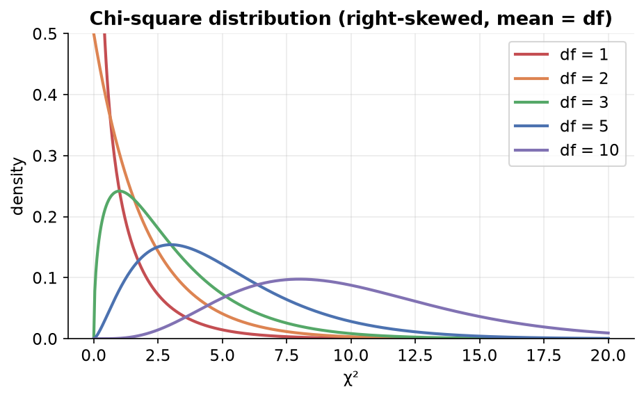

---
tags:
  - statistics
  - inferential-statistics
  - hypothesis-testing
  - chi-square
  - data-science
aliases:
  - Chi-Square Tests
  - Chi-Square Test
difficulty: advanced
prerequisites:
  - Hypothesis Testing
created: 2026-07-09
---

> [!info] Where this fits
> Continues from [[P-values and T-tests|P-values and T-tests]]. Z-tests and t-tests work on **numerical** data. The **chi-square test** works on **categorical** data. It is a non-parametric test (it makes no assumption about the data's distribution) and is very common in feature selection.

---

## The chi-square distribution

A distribution built from the standard normal.

- If you take a standard normal variable $Z$ (mean 0, sd 1) and **square** it, you get a chi-square distribution with **1 degree of freedom**.
- Sum $k$ independent squared standard normals and you get a chi-square distribution with **$k$ degrees of freedom**:
$$\chi^2 = \sum_{i=1}^{k} Z_i^2$$

Key properties:

1. It is a **continuous** probability distribution.
2. Values are **never negative** (they are sums of squares), starting at 0.
3. It is **right-skewed** for small degrees of freedom, and approaches the normal shape as degrees of freedom grow.
4. Its **mean equals its degrees of freedom** $k$.

The test statistic we compute in a chi-square test follows this distribution, which is why the test is named after it.

---

## Two chi-square tests

Both are based on the chi-square distribution but answer different questions.

| Test | Needs | Question |
| :--- | :--- | :--- |
| **Goodness of fit** | one categorical column | Does the observed distribution match an expected/theoretical distribution? |
| **Test for independence** | two categorical columns | Are the two categorical variables related, or independent? |

The common formula for both:

$$\chi^2 = \sum \frac{(O - E)^2}{E}$$

where $O$ is the **observed** frequency and $E$ is the **expected** frequency.

---

## Test 1: goodness of fit

Checks whether one categorical column's observed counts match some theoretical distribution (uniform, binomial, etc.).

### Steps

1. State $H_0$ (data follows the theoretical distribution) and $H_1$ (it does not).
2. Compute the **expected** count for each category under $H_0$.
3. Compute the test statistic $\chi^2 = \sum \dfrac{(O-E)^2}{E}$.
4. Degrees of freedom $= (\text{number of categories}) - 1$.
5. Get the p-value from the chi-square distribution and compare to $\alpha$.

> [!example] Is a die fair? (uniform)
> Roll a die 60 times. If fair, each face is **expected** 10 times. Suppose observed counts are 12, 8, 11, 9, 5, 15.
> - $H_0$: outcomes are uniform (die is fair). $H_1$: not uniform.
> - $\chi^2 = \dfrac{(12-10)^2}{10} + \dfrac{(8-10)^2}{10} + \dots = $ some value.
> - Degrees of freedom $= 6 - 1 = 5$. If the p-value < 0.05, reject $H_0$ (the die is not fair).

> [!example] Boys/girls per family (binomial)
> Out of 800 families with 4 children, count how many have 0, 1, 2, 3, 4 boys. Under $H_0$, the number of boys follows a **binomial** distribution with $p = 0.5$, so expected counts are $800 \times \binom{4}{x}(0.5)^4$, giving 50, 200, 300, 200, 50. Compare observed vs these expected counts with the chi-square statistic (degrees of freedom $= 5 - 1 = 4$).

> [!note]
> The theoretical distribution can be uniform, binomial, Poisson, etc. You compute the expected counts from whatever distribution the null hypothesis assumes.

---

## Test 2: test for independence

Checks whether **two categorical variables** are related or independent.

### Steps

1. Build a **contingency table** of observed counts (rows = categories of one variable, columns = categories of the other).
2. State $H_0$ (the two variables are independent) and $H_1$ (they are associated).
3. Compute an **expected** count for each cell, assuming independence.
4. Compute $\chi^2 = \sum \dfrac{(O-E)^2}{E}$ over all cells.
5. Degrees of freedom $= (\text{rows} - 1)\times(\text{columns} - 1)$.
6. Get the p-value and compare to $\alpha$.

### The key step: expected counts

Under independence, the probability of landing in a cell is the product of its row and column probabilities (just like independent events multiply). Multiplying by the total $N$ gives the expected count:

$$E_{ij} = \frac{(\text{row total}) \times (\text{column total})}{N}$$

> [!example] Education vs exercise preference
> A contingency table of education level (high school, bachelors, PhD) vs preferred exercise (yoga, running, swimming). For the "high school & yoga" cell:
> $$E = \frac{(\text{high-school total}) \times (\text{yoga total})}{\text{grand total}}$$
> Do this for every cell, compute $\chi^2 = \sum \frac{(O-E)^2}{E}$, use degrees of freedom $= (3-1)(3-1) = 4$, and read the p-value.

> [!example] Titanic (Pclass vs Survived)
> Cross-tabulate `Pclass` (1, 2, 3) against `Survived` (0, 1). Using `scipy.stats.chi2_contingency(table)`, the observed and expected counts differ a lot, giving a p-value ≈ 0. So we **reject independence**: survival **is** associated with passenger class. This is exactly why `Pclass` is a valuable feature for predicting survival.

> [!note] Assumptions for the independence test
> Observations should be independent, and every expected cell count should be **greater than 5** for the chi-square approximation to hold.

---

## Sample vs population caution

> [!warning]
> A chi-square test on a **sample** infers about the **population**. Even if a table "obviously" shows a pattern (e.g. more Pclass-3 passengers), the formal test is what lets you generalize from your limited sample to the whole population. Eyeballing the sample is not proof.

---

## Where chi-square is used in ML

| Use case | How |
| :--- | :--- |
| **Feature selection** | rank categorical features by their association with the target; drop irrelevant ones (a filter method) |
| Evaluating classifiers | compare observed vs expected class frequencies in a confusion matrix |
| Analyzing relationships | test associations between categorical features in EDA |
| Discretizing continuous variables | choose good bin boundaries |
| Decision trees | some algorithms use chi-square to pick the best split |

---

## Summary

1. The **chi-square distribution** is a sum of squared standard normals; it is non-negative, right-skewed, and its mean equals its degrees of freedom.
2. Both chi-square tests use $\chi^2 = \sum \dfrac{(O-E)^2}{E}$ on **categorical** data.
3. **Goodness of fit** (one column): does the observed distribution match a theoretical one? df $= (\text{categories} - 1)$.
4. **Test for independence** (two columns): are the variables related? Build a contingency table, compute expected counts $E_{ij} = \frac{\text{row total}\times\text{col total}}{N}$, and use df $= (r-1)(c-1)$.
5. Small p-value → reject $H_0$ (not a good fit / variables are associated).
6. Chi-square is widely used for **feature selection** in machine learning.
