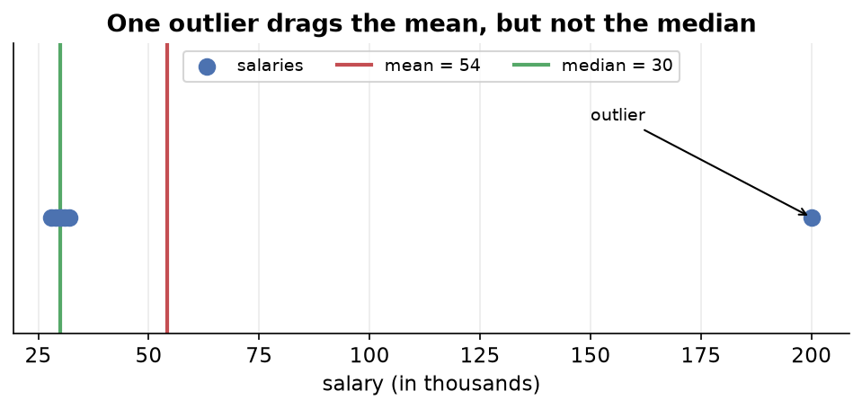
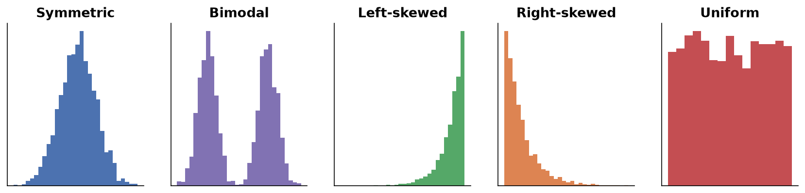
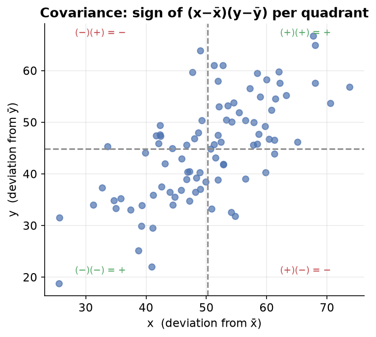

---
tags:
  - statistics
  - descriptive-statistics
  - data-science
aliases:
  - Descriptive Statistics Notes
created: 2026-06-30
---


## What is statistics?

Statistics is the science of collecting, organizing, summarizing, and drawing conclusions from data. We use it to describe what happened in the past and to make predictions about the future.

Statistics has two main branches.

| Branch | What it does | Simple idea |
| :--- | :--- | :--- |
| Descriptive | Summarizes and describes the data you already have | Studying past data |
| Inferential | Uses a small piece of data to make predictions about a larger group | Making predictions |

- **Descriptive statistics**: you are given some data and you generate a description, or summary, of it. This includes mean, median, standard deviation, the five-number summary, and graphs. You only describe what is in front of you and make no predictions.
- **Inferential statistics**: you use the data you have to infer something about a much bigger group you cannot fully measure. This is more advanced and covers [[09 - Hypothesis Testing|Hypothesis Testing]], [[08 - Confidence Intervals|Confidence Intervals]], [[12 - ANOVA|ANOVA]], and regression.

---

## Population vs sample

This is one of the most important foundational ideas.

- **Population**: the entire group you care about, meaning every single individual in it.
- **Sample**: a subset of the population that you actually measure.

We need samples because the population is often too large to measure fully.

> [!example]
> To find the average salary in India with 140 crore people, you cannot ask every single person. Instead you pick, say, 50,000 people from different states, ages, and genders, calculate their average, and infer the population average from it.

More examples follow.

- All cricket fans form a population; the fans physically in the stadium form a sample.
- All students enrolled in a college, whether online, offline, or distance, form a population; only those physically attending lectures form a sample.

### Rules for a good sample

For your inference to be trustworthy, the sample must be:

1. **Large enough**, because a tiny sample cannot represent a huge population well.
2. **Random**, with no bias, so every individual has a fair chance of being picked.
3. **Representative**, so every variation in the population such as state, age, and gender appears in the sample.

If the sample is built poorly, every prediction you make about the population will be wrong.

---

## Types of data

Knowing the type of each column tells you which concepts and graphs you can apply.

```text
                        DATA
                  /              \
          CATEGORICAL          NUMERICAL
          /        \            /        \
      Nominal    Ordinal   Discrete   Continuous
```

### Categorical data

Categorical data holds categories or labels.

- **Nominal**: categories with no order.
  - Example: gender (Male, Female), state (Haryana, Bihar, Maharashtra).
- **Ordinal**: categories that have an order or ranking.
  - Example: feedback (Bad, then Average, then Good).

### Numerical data

Numerical data holds numbers.

- **Discrete**: only whole numbers, because you count it.
  - Example: number of children, number of cars.
- **Continuous**: any value, including decimals, because you measure it.
  - Example: weight (35.3 kg), height (172.4 cm).

> [!tip]
> Always ask: is this column categorical or numerical? If categorical, is it nominal or ordinal? If numerical, is it discrete or continuous? This drives every analysis decision.

---

## Measure of central tendency

A measure of central tendency is a single value that represents the center of a data set, meaning the typical value.

### Mean (average)

Add all values and divide by how many there are.

$$3 + 4 + 1 + 2 + 5 = 15 \quad\Rightarrow\quad \frac{15}{5} = 3$$

So the mean is 3.

Population mean and sample mean use the same arithmetic but different symbols and meaning.

- Population mean: $\mu = \dfrac{\sum x_i}{N}$, where $N$ is the size of the population.
- Sample mean: $\bar{x} = \dfrac{\sum x_i}{n}$, where $n$ is the size of the sample.

Always know whether your data is a population or a sample, because the two can give different results.

The big flaw of the mean is that it is sensitive to outliers.

> [!example]
> A classroom earns around 30,000 per month. One student lands a package of lakhs. The mean salary shoots up to lakhs and no longer represents the typical student. One extreme value, called an outlier, shifts the mean badly.



If your data has outliers, the mean is a poor measure.

### Median

The median is the middle value when the data is arranged in order.

Steps:

1. Sort the data in ascending or descending order.
2. If the count is odd, the middle value is the median.
3. If the count is even, take the average of the two middle values.

The median beats the mean for outliers because, when you sort, an extreme value goes to the far end and never to the middle. So it cannot distort the median.

> [!example]
> If Bill Gates stands in a salary line, he stands at the very end. The middle person still represents the class correctly.

Use the median when outliers are present.

### Mode

The mode is the most frequent value in the data set.

It is most useful for categorical data, where it shows which category appears most often, and for discrete numerical data.

> [!example]
> Ask every student which state they are from, then count each state. The state appearing most is the mode.

### Weighted mean

Instead of treating all values equally, assign each one a weight, meaning an importance.

$$\text{Weighted mean} = \frac{\sum (\text{value} \times \text{weight})}{\sum \text{weights}}$$

> [!example]
> Three model predictions weighted 0.2, 0.3, and 0.5 are combined by importance.

### Trimmed mean

Remove a fixed percentage of the smallest and largest values, then take the mean of the rest. This reduces the effect of outliers.

> [!example]
> With a 20 percent trimmed mean, drop the bottom 20 percent and top 20 percent of values, then average what remains. The trimming percentage is how much you cut from each end.

### Quick summary

| Measure | Best for | Weakness |
| :--- | :--- | :--- |
| Mean | clean numerical data | ruined by outliers |
| Median | data with outliers | ignores exact values |
| Mode | categorical or discrete data | not useful for continuous data |

---

## Measure of dispersion (spread)

Central tendency alone is not enough. Two different data sets can have the same mean.

```text
Data A: -5,  0,  5     ->  mean = 0
Data B: -10, 0, 10     ->  mean = 0
```

Both have the same center, but B is more spread out. A measure of dispersion tells us how spread out the data is around its center.

### Range

```text
Range = Maximum value - Minimum value
```

The range is easy to compute, but it is heavily affected by outliers, since one extreme point inflates it. It is rarely reliable on its own.

### Variance

Variance is the average of the squared differences between each point and the mean. It tells you how far values are from the mean on average.

- Sample variance: $s^2 = \dfrac{\sum (x_i - \bar{x})^2}{n - 1}$
- Population variance: $\sigma^2 = \dfrac{\sum (x_i - \mu)^2}{N}$

Worked example with data 3, 2, 1, 5, 4 and mean 3:

$$
\begin{aligned}
&(3-3)^2 + (2-3)^2 + (1-3)^2 + (5-3)^2 + (4-3)^2 \\
&= 0 + 1 + 4 + 4 + 1 = 10 \\
&\frac{10}{5} = 2
\end{aligned}
$$

Key points about variance:

- It is proportional to the spread, so a bigger spread gives a bigger variance, but it is not the spread itself.
- It is prone to outliers, because squaring differences makes far points dominate.
- The denominator is `n - 1` for samples and `N` for population. The reason belongs to inferential statistics.
- Its unit is squared. If data is in LPA, variance is in LPA squared, which is hard to interpret. The next measure fixes this.

### Standard deviation

$$\text{Standard deviation} = \sqrt{\text{Variance}}$$

> [!example]
> If variance is 2, standard deviation is 1.41.

Standard deviation has the same unit as the original data, not squared, so it is directly interpretable. It tells you, on average, how far values lie from the mean.

### Mean absolute deviation (MAD)

Instead of squaring, take the absolute distance from the mean and average it. It uses the same unit as the data. Its limitation appears in inferential statistics, because you cannot easily infer the population MAD from a sample.

### Coefficient of variation (CV)

$$CV = \frac{\text{Standard deviation}}{\text{Mean}} \times 100\%$$

The coefficient of variation lets you compare the variability of two different columns.

> [!example]
> You cannot directly compare the spread of salary and experience, because they have different units and scales. CV normalizes spread relative to each column's own mean, giving a unit-free number you can compare.

- A larger CV means the data is more spread out relative to its mean.
- A smaller CV means the data is more tightly concentrated around its mean.

---

## Quantiles, quartiles, and percentiles

Quantiles are statistical measures that divide sorted numerical data into equal-sized groups, where each group holds an equal number of observations.

> [!warning]
> Data must be sorted from low to high before computing any quantile.

| Name | Divides data into | Cut points |
| :--- | :--- | :--- |
| Quartiles | 4 equal parts | 25th, 50th, 75th percentile |
| Quintiles | 5 equal parts | 20th, 40th, 60th, 80th |
| Deciles | 10 equal parts | 10th, 20th, up to 90th |
| Percentiles | 100 equal parts | 1st, 2nd, up to 99th |

Key facts:

1. Sorting is mandatory.
2. You are finding the location of an observation in the data.
3. The quantile value may not exist in the data, because it can fall between two points.
4. Everything can be derived from percentiles. If you know percentiles, you can build any quartile, decile, or quintile.

### Quartiles

- **Q1** is the 25th percentile and cuts off the lowest 25 percent.
- **Q2** is the 50th percentile and equals the median.
- **Q3** is the 75th percentile, with 75 percent of data below it.

### What a percentile means

A percentile tells you what fraction of people you are ahead of.

> [!example]
> Scoring in the 90th percentile means 90 percent of people are behind you and only 10 percent are ahead. This differs from scoring 90 percent, which means 90 marks out of 100.

### Formula 1: find the value at a given percentile

$$PL = \frac{P}{100} \times (n + 1)$$

where $P$ is the desired percentile (for example, 75) and $n$ is the total number of observations.

Example with 10 students' marks, finding the 75th percentile:

$$PL = \frac{75}{100} \times (10 + 1) = 0.75 \times 11 = 8.25$$

The 75th percentile sits at position 8.25, between the 8th and 9th values. The 8th value is 96 and the 9th value is 98.

$$\text{Value} = 96 + 0.25 \times (98 - 96) = 96 + 0.5 = 96.5$$

So the 75th percentile is 96.5.

### Formula 2: find the percentile of a given value

$$\text{Percentile} = \frac{X + 0.5\,Y}{N}$$

where $X$ is the number of values below the given value, $Y$ is the number of values equal to it, and $N$ is the total number of observations.

Example: find the percentile of the value 88 in a 10-point data set, with 3 values below 88 and one value equal to 88:

$$\frac{3 + 0.5 \times 1}{10} = \frac{3.5}{10} = 0.35 \quad\Rightarrow\quad 35\text{th percentile}$$

---

## Five-number summary

The five-number summary describes a numerical column using five values.

| Number | Value | Meaning |
| :--- | :--- | :--- |
| 1 | Minimum | smallest value (0th percentile) |
| 2 | Q1 | 25th percentile |
| 3 | Median (Q2) | 50th percentile |
| 4 | Q3 | 75th percentile |
| 5 | Maximum | largest value (100th percentile) |

It summarizes the center, spread, and distribution of the data. In pandas, the `describe()` function returns this plus count and mean.

### Inter-quartile range (IQR)

$$IQR = Q_3 - Q_1$$

- The IQR represents the middle 50 percent of the data, with 25 percent below Q1 and 25 percent above Q3.
- It is the box in a box plot.

---

## Box plot (box-and-whisker plot)

A box plot is a powerful graph built directly from the five-number summary. It shows the range, median, quartiles, spread, skewness, and outliers all at once.


### How to build a box plot

1. Sort the data.
2. Compute Q1, Q2 (median), and Q3, then draw the box, where the box equals the IQR.
3. The median line inside the box shows whether the middle 50 percent leans left or right.
4. Compute the whisker limits: the lower limit is $Q_1 - 1.5 \times IQR$ and the upper limit is $Q_3 + 1.5 \times IQR$.
5. Whiskers extend to the last actual data point inside these limits.
6. Any point beyond the whisker limits is plotted separately as an outlier.

Worked example with data 6, 213, 241, 260, 281, 290, 314, 321, 350, 1500, where $Q_1 \approx 234$, $Q_2 \approx 285.5$, and $Q_3 \approx 328$:

$$IQR = Q_3 - Q_1 \approx 94$$
$$\text{Lower limit} = 234 - 1.5 \times 94 \approx 93$$
$$\text{Upper limit} = 328 + 1.5 \times 94 \approx 469$$

- The smallest point inside the lower limit is 213, so 6 becomes an outlier.
- The largest point inside the upper limit is 350, so 1500 becomes an outlier.

So 6 and 1500 are outliers, and the whiskers stop at 213 and 350.

A box plot tells you several things:

- **Spread**: the width of the box and whiskers.
- **Skewness**: shown when the median line is off-center or one whisker is longer.
- **Outliers**: points plotted beyond the whiskers.
- **Comparison**: draw two box plots side by side, for example weight by gender, to compare distributions.

---

## Visualizing data: univariate analysis

Univariate analysis means studying one column at a time. The graph you choose depends on the column type.

### Categorical column

First build a frequency distribution table, which counts how many times each category appears.

| Graph | Built from | Shows |
| :--- | :--- | :--- |
| Bar chart | frequency counts | count of each category |
| Pie chart | relative frequency in percent | each category's share of the whole |

- **Relative frequency** is the category count divided by the total, expressed as a percentage. It is used for pie charts.
- **Cumulative frequency** is the running total of frequencies, eventually reaching 100 percent.

### Numerical column

Use a histogram. It divides the number range into buckets, also called bins, and counts how many values fall into each.

Choosing bin size matters:

- Too few or large bins give only a couple of thick bars and no detail.
- Too many or small bins give many thin bars and noise.
- Find a balanced middle ground.

### Common histogram shapes

- **Symmetric**: most values in the middle, tapering equally on both sides.
- **Bimodal or trimodal**: two or three peaks of high density.
- **Left-skewed**: a long tail on the left, with data bunched to the right.
- **Right-skewed**: a long tail on the right, with data bunched to the left.
- **Uniform**: every bin has roughly the same count, often appearing when bins are wide, with no real shape.



---

## Visualizing data: bivariate analysis

Bivariate analysis means studying two columns together. There are three cases.

### Case 1: categorical and categorical

Build a contingency table, also called a cross tab. It summarizes the relationship between two categorical variables by counting combinations.

> [!example]
> Titanic `Survived` (0 or 1) versus `Pclass` (1, 2, or 3) forms a 2 by 3 table holding the count for each combination. From it you can draw stacked or side-by-side bar charts.

### Case 2: numerical and numerical

Build a scatter plot. Plot one column on the x-axis and the other on the y-axis, so each row becomes a point.

> [!example]
> Flat area in square feet on the x-axis and price on the y-axis. The pattern of points reveals the relationship between the two variables.

### Case 3: categorical and numerical

Options:

- A bar chart with an aggregation, such as mean age per gender, on the y-axis instead of a count.
- Side-by-side box plots or histograms, one per category.
- Convert the numerical column into buckets and build a contingency table.

---

## Covariance

Covariance measures the direction, or nature, of the linear relationship between two numerical columns.

$$\text{Population: } \; Cov = \frac{\sum (x_i - \bar{x})(y_i - \bar{y})}{N}$$

$$\text{Sample: } \; Cov = \frac{\sum (x_i - \bar{x})(y_i - \bar{y})}{n - 1}$$

### Intuition with four quadrants around the means

For each point, compute $(x_i - \bar{x})$ and $(y_i - \bar{y})$ and multiply them:

- Points in quadrants 1 and 3 give a positive product.
- Points in quadrants 2 and 4 give a negative product.



| Covariance | Meaning |
| :--- | :--- |
| Positive | as x increases, y increases |
| Negative | as x increases, y decreases |
| Near 0 | no linear relationship |

> [!note]
> The covariance of a variable with itself is its variance.

### The big flaw of covariance

Covariance gives only direction, not strength. Its value is not scale-invariant, so if you multiply x and y by 2, the relationship is unchanged but the covariance value changes. It can be any number from negative infinity to positive infinity, so you cannot judge how strong a relationship is. This makes it unreliable for comparison.

---

## Correlation

Correlation fixes the flaw of covariance by measuring both the direction and the strength of a linear relationship, on a fixed scale.

### Pearson correlation coefficient

$$r = \frac{Cov(x, y)}{\sigma_x \, \sigma_y}$$

It is covariance normalized by the standard deviations.

The range is always between -1 and +1.

| Value | Meaning |
| :--- | :--- |
| +1 | perfect positive correlation, where x up gives y up by the same proportion |
| -1 | perfect negative correlation, where x up gives y down by the same proportion |
| 0 | no linear relationship |


- Closer to +1 means a stronger positive relationship; closer to -1 means a stronger negative relationship; closer to 0 means a weaker relationship.
- The more scattered the points are around the trend line, the closer correlation moves toward 0.

Correlation is scale-invariant. Multiply x and y by any constant and the correlation stays the same. This is why correlation is reliable and is preferred over covariance.

> [!note]
> Covariance exists mainly because we need it to calculate correlation. For analysis, always use correlation.

---

## Correlation does not imply causation

Just because two variables move together does not mean one causes the other.

Classic examples:

- **Ice cream sales and homicides** rise together. Ice cream does not cause murder; the hidden factor is hot weather, since more people go out in summer, so both rise.
- **Firefighters at a fire and fire size** are correlated, but more firefighters do not cause bigger fires.
- **Experience and salary** are correlated, but experience is not the only cause, because talent, company budget, and other factors matter too.

To establish causation you need extra evidence:

- Controlled experiments.
- Randomized control trials.
- Well-designed observational studies.

Be careful, because many analysts report a correlation as if it were a cause and reach wrong conclusions.

---

## Multivariate analysis (beyond two columns)

Multivariate analysis means studying three or more columns together.

| Graph | How it adds dimensions |
| :--- | :--- |
| 3D scatter plot | three numerical columns on x, y, and z |
| Hue parameter | adds an extra categorical column through color |
| Facet grid | side-by-side plots split by a category |
| Pair plot | scatter plots between every pair of columns, with histograms on the diagonal |
| Bubble chart | x, y, plus a third numerical value as bubble size |

> [!example]
> A scatter plot of age versus fare, colored by gender through the hue parameter, captures three columns at once. Add a facet split by another category to reach four.

> [!note]
> A joint plot, meaning a scatter plot with side histograms, is still bivariate, because it only uses two columns.

---

## Summary

1. Statistics describes data through descriptive methods and predicts from data through inferential methods.
2. A population is everyone; a sample is a representative subset that must be large, random, and representative.
3. Data types are categorical, meaning nominal or ordinal, and numerical, meaning discrete or continuous.
4. Central tendency uses the mean, which is sensitive to outliers, the median, which is robust, and the mode, which suits categories.
5. Dispersion uses range, variance, standard deviation, which shares the data's unit, mean absolute deviation, and coefficient of variation, which compares across columns.
6. Quantiles such as quartiles, deciles, and percentiles locate observations in sorted data.
7. The five-number summary covers minimum, Q1, median, Q3, and maximum, and the IQR is the middle 50 percent.
8. A box plot visualizes the five-number summary and flags outliers using the 1.5 times IQR rule.
9. Graphs span univariate (bar, pie, histogram), bivariate (cross tab, scatter), and multivariate (3D scatter, hue, facet, pair, bubble).
10. Covariance gives direction only and is unreliable; correlation gives direction and strength on a scale from -1 to +1 and is reliable.
11. Correlation does not imply causation, always.

---

> [!info] Continues to
> These notes lead into [[02 - Probability Distributions|Probability Distributions]], which sits on the boundary between statistics and probability and opens the door to inferential statistics.
