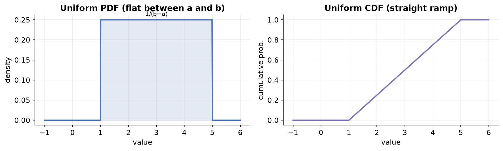
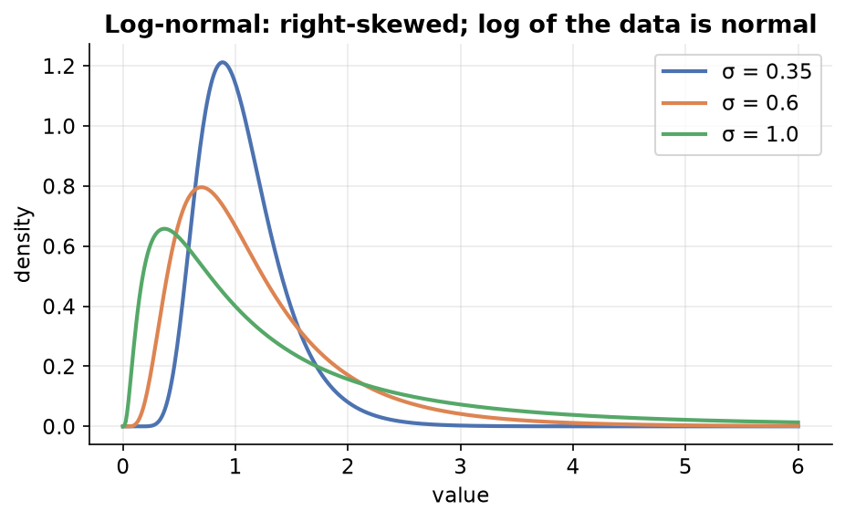
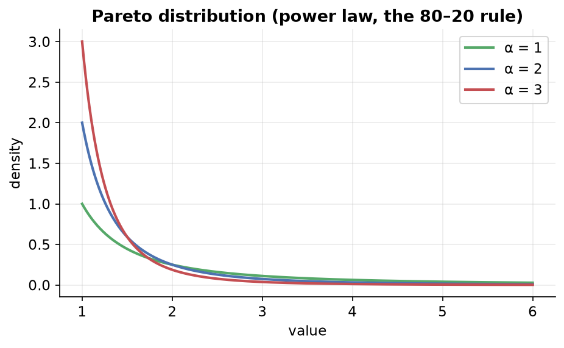
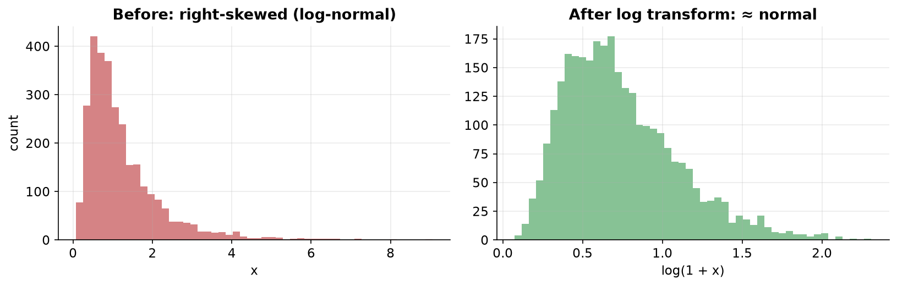

---
tags:
  - statistics
  - probability
  - probability-distributions
  - transformations
  - data-science
aliases:
  - Non-Gaussian Distributions and Transformations
  - Non-Gaussian Distributions
  - Mathematical Transformations
created: 2026-07-09
---


> [!info] Where this fits
> Continues from [[04 - Skewness, Kurtosis and Normality Checks|Skewness, Kurtosis and Normality Checks]]. Once you know a column isn't normal, you have two options: model it with a different distribution, or reshape it toward normal. This note covers the common **non-Gaussian continuous distributions** (uniform, log-normal, Pareto) and the **mathematical transformations** used to normalize data for distribution-sensitive algorithms.

---

## Non-Gaussian continuous distributions

Real-world data is often not normal. Three very common non-Gaussian continuous distributions:

### 1. Uniform distribution

Every outcome in a range is equally likely. A fair die is the discrete version (each face has probability 1/6, so all bars are the same height).

**Continuous uniform** is denoted $X \sim U(a, b)$, where `a` is the lower bound and `b` the upper bound of the range.

- **PDF:** constant between `a` and `b`, zero elsewhere. Because the total area must be 1 and the width is $b - a$:
$$f(x) = \begin{cases} \dfrac{1}{b - a} & a \le x \le b \\[6pt] 0 & \text{otherwise} \end{cases}$$
- **CDF:** 0 below `a`, rises steadily, and reaches 1 at `b`.
- **Skewness = 0** (it is symmetric, like the normal).



**Where it appears in machine learning** (usually behind the scenes):

| Use case | Role of uniform distribution |
| :--- | :--- |
| Random initialization | starting parameters in neural networks and k-means are drawn uniformly, so all values in a range are equally likely |
| Sampling | randomly selecting a representative subset (e.g. train/test split) |
| Random number generation | pseudo-random generators rely on it |
| Data augmentation | adding controlled randomness to create new data (e.g. zoomed/shifted images in CNNs) |
| Hyperparameter tuning | randomly searching parameter combinations |

### 2. Log-normal distribution

A **heavy-tailed, right-skewed** distribution whose **logarithm is normally distributed**.

> [!important]
> Not every right-skewed distribution is log-normal. Only those where **taking the log of the values produces a normal distribution** qualify. If `X` is log-normal, then `ln(X)` is normal.

- Denoted $\text{LogNormal}(\mu, \sigma)$, with the same two parameters as the normal (though they describe the log of the variable).
- The PDF is very similar to the normal's, essentially the normal's cousin.



**Where it appears** (extremely common in internet/social applications):

- Number of words in comments on YouTube, Reddit, Instagram, Facebook.
- Dwell time users spend on online articles.
- Length of online chess games.
- Distribution of wealth/income (many people earn little, few earn a lot).

The pattern: many observations cluster at low values, and a few stretch far out to the right.

**How to check for log-normal:** take the log of the data, then run a QQ plot (or normality check) on the transformed values. If the transformed data is normal, the original was log-normal.

### 3. Pareto distribution

A special case of a **power law**. A power law is a functional relationship where one variable is a power of another:

$$y = k \, x^{-\alpha}$$

Its graph drops steeply then flattens into a long tail.



**The 80–20 rule (Pareto principle):** roughly 20% of causes account for 80% of effects.

> [!example]
> Wilfredo Pareto studied wealth and found that ~20% of people control ~80% of the wealth. This is the origin of the Pareto distribution.

- **Single parameter $\alpha$** (shape). A higher $\alpha$ gives a higher, sharper peak and thinner tail; a lower $\alpha$ gives a lower peak and fatter tail. As $\alpha \to \infty$, the curve becomes a vertical line.
- **PDF:** $f(x) = \dfrac{\alpha \, x_m^{\alpha}}{x^{\alpha + 1}}$, where $x_m$ is the minimum value.
- It is skewed (not symmetric).

> [!note]
> The exact 80–20 split is not universal; it depends on $\alpha$. It is a rough guide, not a fixed law.

**Where it appears:** wealth/income distributions, city population vs area, file-size distribution of internet traffic (a few large files make up most of the total gigabytes).

**How to detect Pareto:** use a **log-log plot** (plot log(x) vs log(y)); a Pareto/power-law relationship shows up as a straight descending line. A QQ plot against a theoretical Pareto also works.

---

## Mathematical transformations

**Goal:** convert a non-normal distribution into a (more) normal one, because several ML algorithms (linear regression, logistic regression, KNN) perform better on normally distributed data.

A transformation applies a mathematical function to a column to reshape its distribution.

> [!note]
> It is not a strict rule that normal data always helps. Whether it improves results depends on the algorithm. Tree-based models like decision trees are unaffected by the distribution; linear models are affected.

In scikit-learn, transformations live in two classes:

```text
              scikit-learn transformers
              /            |            \
     FunctionTransformer  PowerTransformer  QuantileTransformer
       (log, reciprocal,   (Box-Cox,          (rarely used)
        square, sqrt,       Yeo-Johnson)
        custom)
```

### FunctionTransformer transforms

Apply any function you like via `FunctionTransformer(func=...)`.

| Transform | Formula | Best for |
| :--- | :--- | :--- |
| Log | $\log(x)$ | right-skewed data |
| Reciprocal | $1/x$ | reverses order (big↔small); situational |
| Square | $x^2$ | left-skewed data |
| Square root | $\sqrt{x}$ | mildly right-skewed; try and check |

- **Log transform** is the go-to for **right-skewed** data. It pulls in large values and centers the distribution. On a log scale, distant points come closer and look more linear, helping linear models.
  - `np.log` fails on zeros/negatives. Use `np.log1p`, which computes $\log(1 + x)$, so zeros are safe. If your data has no zeros, plain log is fine too.


- There is no one-size-fits-all; **try each transform and keep whichever gives the best result**. You can even define a fully custom function ($x^2 + 2x$, a sine, etc.).

> [!example] Titanic (Age + Fare → Survived)
> `Fare` is right-skewed, `Age` is roughly normal. Applying a **log transform to `Fare`** and refitting **logistic regression** improved accuracy, while **decision tree** accuracy stayed the same (trees ignore distribution). Forcing a log transform on the near-normal `Age` actually **hurt** results, so a `ColumnTransformer` was used to transform only `Fare` and pass `Age` through unchanged. Cross-validation confirmed the improvement was real.

### PowerTransformer transforms

`PowerTransformer` finds the best power to raise data to (via a parameter $\lambda$, "lambda") so the result is as normal as possible. Two methods:

| Method | Data requirement | Notes |
| :--- | :--- | :--- |
| Box-Cox | strictly **positive** (no zero, no negative) | classic; a small constant can be added to handle zeros |
| Yeo-Johnson | works with **positive, zero, and negative** data | default in scikit-learn; often the better performer |

- Internally, a lambda is estimated per column (using maximum likelihood), and each value is raised to that power to transform it.
- By default `PowerTransformer` also applies **zero-mean, unit-variance standardization** (`standardize=True`), so you usually do not need to scale separately.
- Understanding *what* it does (map to a normal shape) is enough at this level; the deep *how* belongs to advanced (maximum likelihood / Bayesian) statistics.

> [!example] Concrete strength dataset
> A regression problem with several non-normal input columns. Baseline linear regression gave an R² (cross-validated) around **0.46**. Applying **Box-Cox** (with a tiny constant added to zero-valued columns) raised it to about **0.66**. Applying **Yeo-Johnson** raised it further to about **0.68**. Plotting each column before vs after showed most columns becoming much closer to normal (though bimodal columns cannot be fully fixed by a single transform).

**Practical workflow:** check which columns are non-normal, apply `PowerTransformer` (try both Box-Cox and Yeo-Johnson), compare via cross-validation, and keep whatever performs best. It is essentially parameter tuning.

---

## Summary

1. Common **non-Gaussian** distributions: **uniform** (equal likelihood over a range, skew 0), **log-normal** (right-skewed, its log is normal), and **Pareto** (a power law, the 80–20 rule).
2. Detect them by transforming and re-checking normality (log for log-normal) or with tailored plots (log-log plot / QQ plot for Pareto).
3. **Transformations** reshape non-normal data toward normal to help distribution-sensitive algorithms (linear/logistic regression, KNN); tree models are unaffected.
4. **FunctionTransformer** applies log (right-skew), square (left-skew), reciprocal, sqrt, or custom functions; log is the workhorse (use `np.log1p` for zeros).
5. **PowerTransformer** estimates the best power automatically: **Box-Cox** (positive data only) and **Yeo-Johnson** (handles zero/negative, the usual default).
6. There is no universal best transform, try several and validate with cross-validation.

---

> [!info] Continues to
> That completes the distributions arc. The story now shifts to two key **discrete** distributions in [[06 - Bernoulli and Binomial Distributions|Bernoulli and Binomial Distributions]], which open the door to inferential statistics.
