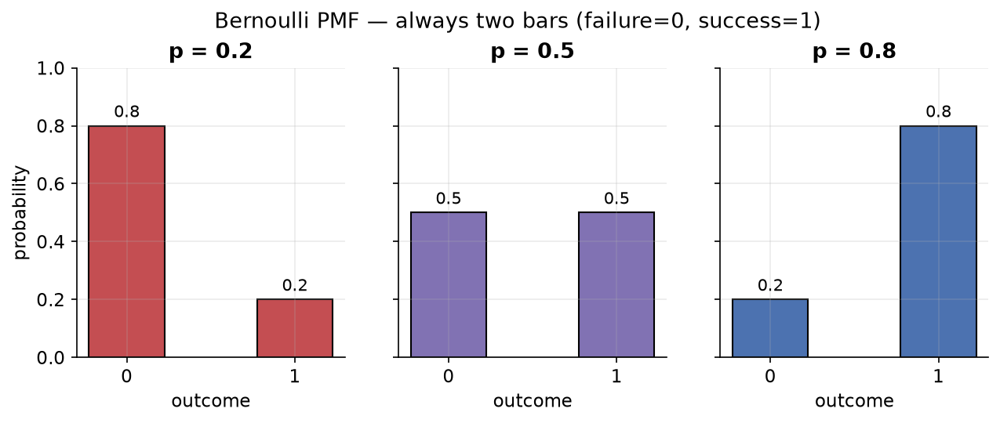
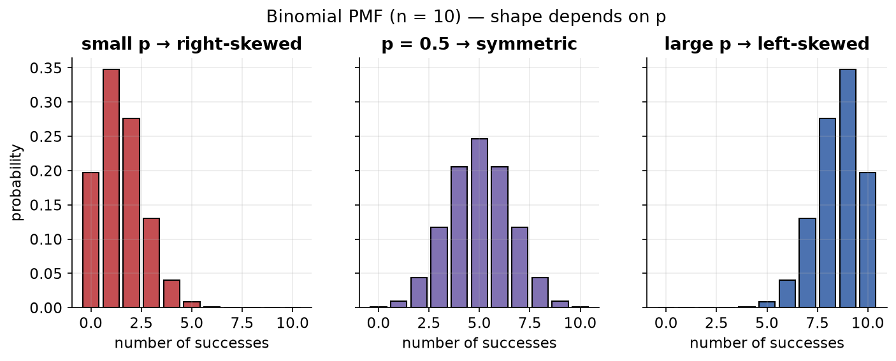
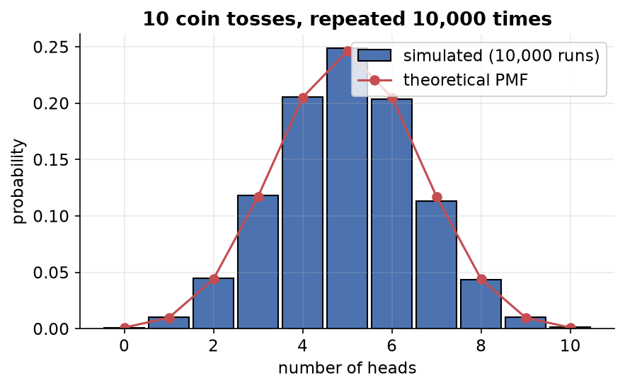

---
tags:
  - statistics
  - probability
  - probability-distributions
  - discrete-distributions
  - data-science
aliases:
  - Bernoulli and Binomial Distributions
created: 2026-07-09
---


> [!info] Where this fits
> These notes continue from the distributions arc that ended with [[05 - Non-Gaussian Distributions and Transformations|Non-Gaussian Distributions and Transformations]]. Those notes covered continuous distributions (normal, uniform, log-normal, Pareto). Here we cover two closely related **discrete** distributions that show up constantly in machine learning classification problems, and that also become the building blocks for the [[07 - Central Limit Theorem|Central Limit Theorem]].

---

## Bernoulli distribution

A **Bernoulli distribution** models a single random experiment with exactly **two possible outcomes**, usually called **success (1)** and **failure (0)**.

> [!note]
> Named after the Swiss mathematician Jacob Bernoulli, who introduced it in the late 1600s. It only applies to **binary** outcomes.

Any single trial with a yes/no result is a Bernoulli experiment.

| Experiment | Success (1) | Failure (0) |
| :--- | :--- | :--- |
| Coin toss | head | tail |
| Email spam classifier | spam | not spam |
| Rolling a die and "getting a 5" | a 5 appears (prob 1/6) | anything else (prob 5/6) |

> [!tip]
> "Success" does not mean a good outcome. It is just the event you chose to label as 1. When hunting spam, spam is the "success".

### PMF of the Bernoulli distribution

The single parameter is **p**, the probability of success. The probability of failure is automatically $1 - p$.

$$P(X = x) = p^{x}\,(1-p)^{1-x}, \qquad x \in \{0, 1\}$$

> [!example] Fair coin
> Let head = success with $p = 1/2$.
> - $P(X=1) = (1/2)^1 (1/2)^0 = 1/2$
> - $P(X=0) = (1/2)^0 (1/2)^1 = 1/2$

### The graph

The PMF graph is always just **two bars**, one at 0 and one at 1. Their heights are $1-p$ and $p$.



### Why it matters in ML

The Bernoulli distribution appears everywhere in **classification**. Any time the target/output is a class (yes/no, 1/0, spam/not-spam), the outcome can be treated as Bernoulli. Algorithms such as **logistic regression, SVM, decision trees, and especially Naive Bayes** lean on this assumption internally.

On its own it is simple; its real power is as the seed for the binomial distribution.

---

## Binomial distribution

A **binomial distribution** describes the **number of successes** in a **fixed number of independent Bernoulli trials**, where the probability of success is constant on every trial.

Simply put: run a Bernoulli trial **n times** and count how many successes you get.

> [!important]
> If $n = 1$ (a single trial), the binomial distribution **becomes** the Bernoulli distribution.

### Two parameters

| Parameter | Meaning |
| :--- | :--- |
| $n$ | number of trials |
| $p$ | probability of success on each trial |

> [!warning] Trials must be independent
> The trials cannot influence each other. If you survey 10 students about a course and one student's opinion sways another's, the trials are no longer independent, and the binomial model breaks.

### Building intuition: sample space first

Suppose 3 people watch a video and each likes it with probability $p = 1/2$. What is the probability that **nobody** likes it?

List the sample space (Yes/No for each of 3 people): there are $2^3 = 8$ equally likely cases.

| # successes | Cases | Count | Probability |
| :--- | :--- | :--- | :--- |
| 0 likes | NNN | 1 | 1/8 |
| 1 like | YNN, NYN, NNY | 3 | 3/8 |
| 2 likes | YYN, YNY, NYY | 3 | 3/8 |
| 3 likes | YYY | 1 | 1/8 |

As the number of trials grows, listing the sample space becomes impossible. That is where the formula helps.

### PMF of the binomial distribution

$$P(X = x) = \binom{n}{x}\, p^{x}\,(1-p)^{\,n-x}$$

- $x$ = the desired number of successes.
- $\binom{n}{x} = \dfrac{n!}{x!\,(n-x)!}$ counts how many ways those successes can be arranged.
- The $p^{x}(1-p)^{n-x}$ part is exactly the Bernoulli PMF repeated; the $\binom{n}{x}$ factor accounts for the different arrangements.

> [!example] 2 out of 3 likes
> $$P(X=2) = \binom{3}{2}\left(\tfrac12\right)^2\left(\tfrac12\right)^1 = 3 \cdot \tfrac18 = \tfrac{3}{8}$$
> This matches the sample-space count above.

### The graph and the role of p

The shape of the binomial PMF depends on **p**:

| Probability of success | Shape |
| :--- | :--- |
| $p$ high (close to 1) | left-skewed (graph shifts right) |
| $p \approx 0.5$ | symmetric, looks like a normal distribution |
| $p$ low (close to 0) | right-skewed (graph shifts left) |



> [!example] Simulating in code
> ```python
> import numpy as np
> # 10 coin tosses, p = 0.5, repeated 1000 times
> data = np.random.binomial(n=10, p=0.5, size=1000)
> ```
> Each number is "how many heads in 10 tosses". A histogram clusters around 5 (because $p = 0.5$) and looks bell-shaped. Raise `p` toward 1 and the whole graph shifts right; lower it toward 0 and it shifts left.



### Criteria for a binomial distribution

An experiment is binomial only if all of these hold:

1. A **fixed** number of trials, $n$.
2. Each trial has a **binary** outcome (success/failure).
3. Trials are **independent**.
4. The probability of success $p$ is **constant** across trials.

### Where it matters in ML

The binomial distribution appears in **logistic regression** and other models that reason about counts of binary events. In short: repeat a Bernoulli experiment $n$ times and its behavior follows the binomial distribution.

---

## Summary

1. **Bernoulli** models a single binary trial with parameter $p$; its PMF is $p^x(1-p)^{1-x}$, and its graph is two bars.
2. It is the natural model for a single classification outcome (yes/no).
3. **Binomial** counts successes over $n$ independent Bernoulli trials with parameters $n$ and $p$; its PMF is $\binom{n}{x}p^x(1-p)^{n-x}$.
4. With $n = 1$, binomial reduces to Bernoulli.
5. The binomial shape is right-skewed for small $p$, symmetric near $p = 0.5$, and left-skewed for large $p$.
6. A valid binomial needs fixed trials, binary outcomes, independence, and constant $p$.
