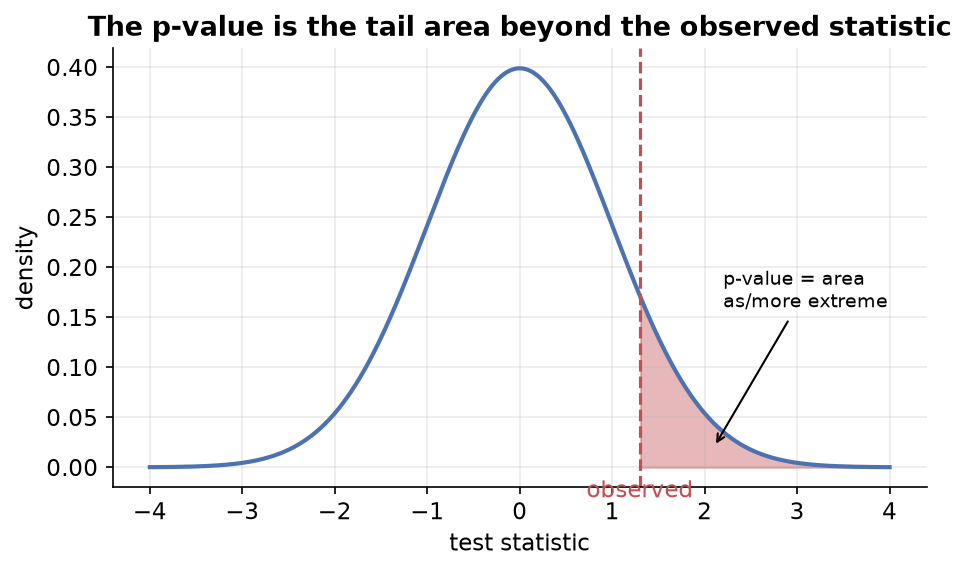

---
tags:
  - statistics
  - inferential-statistics
  - hypothesis-testing
  - p-value
  - t-test
  - data-science
aliases:
  - P-values and T-tests
created: 2026-07-09
---


> [!info] Where this fits
> Continues from [[09 - Hypothesis Testing|Hypothesis Testing]]. That note used the rejection-region approach, which only gives a yes/no answer. Here we learn the **p-value approach**, which also measures the **strength** of the evidence, and then apply it through the three main **t-tests**.

---

## What is a p-value?

> [!important] Definition
> The **p-value** is the probability of getting a sample **as or more extreme** than our own sample, **given that the null hypothesis is true**.

"More extreme" means "providing more evidence against $H_0$".

### Building intuition with a coin

> [!example] Is a coin fair?
> Toss a coin 100 times and count heads. This follows a [[06 - Bernoulli and Binomial Distributions|binomial distribution]], and its PMF is roughly bell-shaped, peaking at 50 heads.
> - $H_0$: the coin is fair, $P(\text{head}) = P(\text{tail})$.
> - $H_1$: the coin is rigged, $P(\text{head}) > P(\text{tail})$.
>
> You run the experiment and get **53 heads**. The p-value is the probability of getting **53 or more** heads, which is the area to the right of 53. That area ≈ **0.30**.

| Result | p-value (area to the right) | Meaning |
| :--- | :--- | :--- |
| 53 heads | ≈ 0.30 | weak evidence; happens often for a fair coin |
| 60 heads | ≈ 0.02 | stronger evidence |
| 80 heads | ≈ 0 | extremely unlikely for a fair coin |

So the p-value tells you how likely your (or a more extreme) result is **assuming the null is true**. A tiny p-value means your result would be very surprising under $H_0$, which is strong evidence against it.



### Decision rule

> [!tip] Rule of thumb
> If **p-value $\le \alpha$** (usually 0.05), **reject $H_0$**. Otherwise, **fail to reject $H_0$**.

When you don't have a fixed $\alpha$, a rough guide:

| p-value | Evidence against $H_0$ |
| :--- | :--- |
| $\le 0.01$ | strong → reject |
| between 0.01 and 0.05 | moderate → reject |
| between 0.05 and 0.10 | weak → investigate more |
| $> 0.10$ | insufficient → fail to reject |

### Why p-value beats the rejection-region approach

The rejection-region approach only says "reject or not". The p-value also encodes **how strong** the evidence is: a p-value of 0.001 is far stronger evidence against $H_0$ than 0.049, even though both lead to rejection. That extra information is why the p-value approach is preferred.

---

## P-value with a Z-test

Same setup as the Z-test in [[09 - Hypothesis Testing|Hypothesis Testing]], but now we read off a p-value instead of comparing to a critical value.

> [!example] Training program (one-tailed)
> $H_0: \mu = 50$, $H_1: \mu > 50$, $\bar{x} = 53$, $\sigma = 5$, $n = 30$.
> $$Z = \frac{53 - 50}{5/\sqrt{30}} \approx 4.10$$
> The p-value is the area to the **right** of 4.10 (because $H_1$ is $>$). Using a Z-table (or `1 - norm.cdf(4.10)`), this area ≈ **0.00004**. Since $0.00004 \le 0.05$, **reject $H_0$**.

> [!example] Lays packet (two-tailed)
> $H_0: \mu = 50$, $H_1: \mu \ne 50$. Compute $Z \approx -1.26$. For a two-tailed test, take the area to the left of $-1.26$ and **double** it: $2 \times 0.103 = 0.206$. Since $0.206 > 0.05$, **fail to reject $H_0$**.

> [!note] One-tailed vs two-tailed p-values
> For a **two-tailed** test, double the one-sided tail area. For a **one-tailed** test, use the single tail area directly.

---

## The t-test

A **t-test** is very similar to a Z-test, with one key difference.

| | Z-test | T-test |
| :--- | :--- | :--- |
| Population $\sigma$ | **known** | **unknown** (use sample $s$) |
| Distribution used | normal | Student's t-distribution |
| Good for | large samples | works well for small samples too |

Because we substitute the sample standard deviation $s$ for the unknown $\sigma$, we use the **t-distribution** (see [[08 - Confidence Intervals|Confidence Intervals]] for its properties: fatter tails, parameter = degrees of freedom).

There are **three** t-tests, each for a different situation.

---

## 1. One-sample t-test

Checks whether a **single sample's mean** differs from a known **population mean**.

**Assumptions:** normality (of the population/sample), independent observations, random sampling, and $\sigma$ unknown.

> [!example] Chocolate bar weight
> Population claim $\mu = 50$ g. Sample of $n = 25$ bars: $\bar{x} = 49.7$, $s = 1.2$. Is the mean different from 50? ($\alpha = 0.05$.)
> - $H_0: \mu = 50$, $H_1: \mu \ne 50$.
> - Check normality first with a **Shapiro-Wilk test** on the 25 values (if its p-value > 0.05, the data is approximately normal).
> - Compute $t = \dfrac{49.7 - 50}{1.2/\sqrt{25}} = -1.25$, degrees of freedom $= 24$.
> - Get the two-tailed p-value from the t-distribution. It's > 0.05, so **fail to reject $H_0$**.

> [!note] Shapiro-Wilk test
> A separate hypothesis test whose $H_0$ is "the data is normally distributed". If its p-value > 0.05, treat the data as normal. Useful for checking the normality assumption before a t-test.

> [!example] Titanic age
> Claim: mean age of all 1309 passengers is < 35. Draw a sample of 25 ages, check normality (Shapiro-Wilk), run a one-tailed one-sample t-test with `scipy.stats.ttest_1samp(sample, popmean=35)`, halve the p-value (one-tailed), and compare to $\alpha$.

---

## 2. Independent two-sample t-test

Compares the means of **two independent groups**.

**Assumptions:** independence of observations, normality within each group, and **equal variances** across the two groups.

> [!note] Levene's test
> A separate test whose $H_0$ is "the two groups have equal variances". Run it (or an F-test) to check the equal-variance assumption. If variances are unequal, use **Welch's t-test** instead.

> [!example] Desktop vs mobile dwell time
> A site owner claims average time on desktop and mobile is the same. Collect 30 desktop users ($\bar{x} = 18.5$, $s = 3.5$) and 30 mobile users ($\bar{x} = 14.3$, $s = 2.7$). ($\alpha = 0.05$.)
> - $H_0: \mu_{\text{desktop}} - \mu_{\text{mobile}} = 0$, $H_1: \ne 0$.
> - Check normality of each group (Shapiro-Wilk) and equal variance (Levene).
> - Use `scipy.stats.ttest_ind(group1, group2)`. The p-value comes out ≈ 0, so **reject $H_0$**: the two means differ.

> [!note] Degrees of freedom
> For the independent two-sample t-test, degrees of freedom $= n_1 + n_2 - 2$.

> [!example] Titanic (age vs gender)
> Claim: average age of males differs from females. Draw 25 male ages and 25 female ages, then run `ttest_ind`. A large p-value means we can't conclude a difference; if so, drawing bigger samples helps because the true population means (≈ 30.6 vs 28.7) are actually close.

---

## 3. Paired two-sample t-test

Compares two **related / dependent** measurements, typically **before vs after** on the **same subjects**.

**Assumptions:** paired observations, independence *between pairs*, and normality of the **differences**.

> [!example] Weight-loss program
> Measure 15 people's weight **before** and **after** a program.
> - $H_0: \mu_{\text{before}} = \mu_{\text{after}}$, $H_1: \mu_{\text{before}} > \mu_{\text{after}}$ (weight should drop).
> - Compute the **difference** for each person, then check that the differences are normal (Shapiro-Wilk).
> - Run `scipy.stats.ttest_rel(before, after)` and interpret the p-value.
> - The test works on the differences: $t = \dfrac{\bar{d} - 0}{s_d/\sqrt{n}}$.

> [!tip] Other paired scenarios
> Matched or correlated groups (siblings, paired individuals) also use the paired t-test.

---

## Choosing the right t-test

```text
                Are the two sets of measurements related?
                     /                        \
                   No                          Yes
                   │                            │
        Independent two-sample          Paired two-sample
             t-test                          t-test

    Only one sample vs a known population mean?  →  One-sample t-test
```

---

## Summary

1. The **p-value** is the probability of a result as or more extreme than observed, **assuming $H_0$ is true**; small p-values are strong evidence against $H_0$.
2. Decision rule: **p-value $\le \alpha$ → reject $H_0$**.
3. The p-value approach beats the rejection-region approach because it also captures the **strength** of evidence.
4. For a **two-tailed** test, double the one-sided tail area; for **one-tailed**, use it directly.
5. A **t-test** replaces the unknown $\sigma$ with the sample $s$ and uses the **t-distribution**.
6. **One-sample** t-test: sample mean vs a known population mean.
7. **Independent two-sample** t-test: two separate groups (check equal variance with Levene, else use Welch).
8. **Paired** t-test: before/after on the same subjects (test the differences).
9. Use **Shapiro-Wilk** to check normality assumptions before running a t-test.
