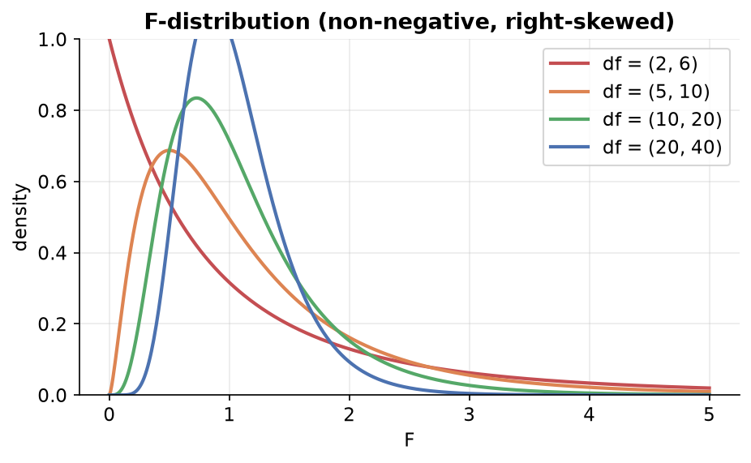
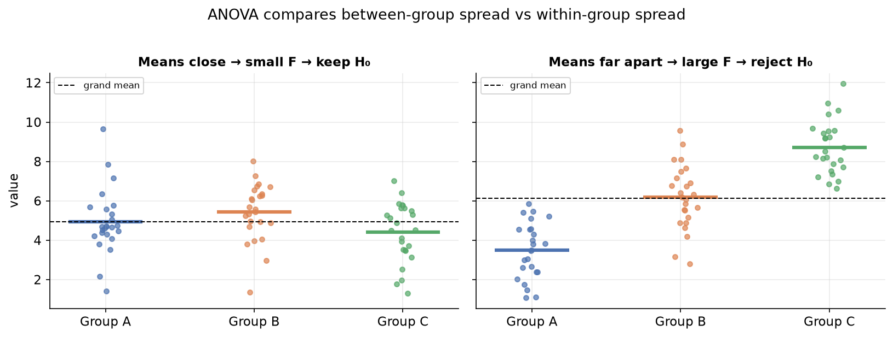

---
tags:
  - statistics
  - inferential-statistics
  - hypothesis-testing
  - anova
  - data-science
aliases:
  - ANOVA
  - Analysis of Variance
  - One-Way ANOVA
created: 2026-07-09
---


> [!info] Where this fits
> Continues from [[11 - Chi-Square Tests|Chi-Square Tests]]. A [[10 - P-values and T-tests|two-sample t-test]] compares the means of **two** groups. ANOVA generalizes this to **three or more** groups. This note first introduces the **F-distribution** it relies on, then covers **one-way ANOVA**.

---

## The F-distribution

Just as the [[11 - Chi-Square Tests|chi-square distribution]] is related to the normal, the **F-distribution** is related to the chi-square.

If you take two independent chi-square distributions and divide each by its degrees of freedom, then take their ratio, you get an F-distribution:

$$F = \frac{\chi^2_1 / d_1}{\chi^2_2 / d_2}$$

Key properties:

1. It is a **continuous** probability distribution.
2. Values are **non-negative** (it is a ratio of non-negative quantities), starting at 0.
3. It is **positively skewed** (right tail).
4. It has **two** parameters: the numerator degrees of freedom and the denominator degrees of freedom.



It is used whenever we compare **variances**, which is exactly what ANOVA does.

---

## Why ANOVA (and not many t-tests)?

A two-sample t-test only handles two groups. If a categorical column has **three or more** categories (e.g. three sections of a class), you want to compare all their means at once.

> [!warning] Don't just run many t-tests
> You could run a t-test on every pair (A-B, B-C, C-A), but each test carries a Type I error rate of $\alpha$. Doing several inflates the **overall** (family-wise) error. For 3 groups, the chance of at least one false positive rises from 5% to about 15%. ANOVA tests all groups together in **one** test, keeping the error controlled.

---

## One-way ANOVA

Compares the means of **three or more independent groups** to see if any differ significantly. "One-way" means the groups are split by a **single factor**.

### The hypotheses

- $H_0$: all group means are equal ($\mu_1 = \mu_2 = \mu_3 = \dots$).
- $H_1$: at least one group mean is significantly different from the others.

> [!note] The deeper null
> Really, $H_0$ assumes all groups are drawn from the **same population**, so of course their means would match. We try to gather evidence against that.

---

## The mechanics: partitioning variance

ANOVA's core idea: the **total variance** in the combined data comes from two sources.

$$\text{SST} = \text{SSB} + \text{SSW}$$

| Term | Name | What it measures |
| :--- | :--- | :--- |
| SST | Sum of Squares **Total** | overall variance: each point vs the **grand mean** |
| SSB | Sum of Squares **Between** groups | how far each **group mean** is from the grand mean (weighted by group size) |
| SSW | Sum of Squares **Within** groups | variance **inside** each group (each point vs its own group mean), summed |

The **grand mean** is the mean of all data points combined.

### Formulas

$$\text{SST} = \sum_{\text{all points}} (x - \bar{x}_{\text{grand}})^2$$

$$\text{SSW} = \sum_{\text{groups}} \sum_{\text{points in group}} (x - \bar{x}_{\text{group}})^2$$

$$\text{SSB} = \sum_{\text{groups}} n_{\text{group}}\,(\bar{x}_{\text{group}} - \bar{x}_{\text{grand}})^2$$

> [!tip] Sanity check
> $\text{SST} = \text{SSB} + \text{SSW}$ always holds. If your SSB and SSW don't add up to SST, there is a calculation error.

### Degrees of freedom

Let $N$ = total data points and $k$ = number of groups.

| Source | Degrees of freedom |
| :--- | :--- |
| Between (SSB) | $k - 1$ |
| Within (SSW) | $N - k$ |
| Total (SST) | $N - 1$ |

---

## The F-statistic

$$F = \frac{\text{SSB} / (k-1)}{\text{SSW} / (N-k)} = \frac{\text{variance between groups}}{\text{variance within groups}}$$

This ratio follows the **F-distribution** (because SSB and SSW each behave like chi-square quantities). Once you have $F$, compute its p-value from the F-distribution and compare to $\alpha$.

### Interpreting F

- **Large F** happens when **SSB is large** (group means are far from the grand mean) relative to SSW. That is strong evidence the groups differ, so the p-value is small and we **reject $H_0$**.
- **F near 0** happens when the group means are all close to the grand mean (SSB small). Then we **fail to reject $H_0$**; the groups look like one population.

```text
   large SSB  → group means spread far apart → large F → small p → reject H0
   small SSB  → group means bunched together → small F → large p → keep H0
```



> [!example] Titanic (age across Pclass)
> Split ages into three groups by `Pclass` (1, 2, 3) and ask whether their mean ages are equal.
> - `scipy.stats.f_oneway(age_class1, age_class2, age_class3)` returns the F-statistic and p-value.
> - The p-value came out ≈ 0, so **reject $H_0$**: mean age is not the same across passenger classes.

---

## Assumptions of one-way ANOVA

1. **Independence** of observations across groups.
2. **Normality**: data within each group is approximately normal (or $n \ge 30$ per group via the CLT).
3. **Equal variances** across groups (check with **Levene's test**). If violated, use **Welch's ANOVA** instead.

---

## Post-hoc tests

ANOVA only tells you that **at least one** group differs; it does **not** say **which** one. To find the culprit, run a **post-hoc test** after a significant ANOVA.

| Post-hoc approach | Idea |
| :--- | :--- |
| Pairwise t-tests with **Bonferroni correction** | run a t-test on each pair, but shrink $\alpha$ by dividing by the number of comparisons to control the inflated family-wise error |
| **Tukey's HSD** | compares all pairs at once and reports which pairs differ, with confidence intervals |

> [!note] Bonferroni correction
> If you make $m$ comparisons, use $\alpha / m$ as the threshold for each. This counteracts the family-wise error inflation described earlier, keeping the overall error near the intended 5%.

---

## Where ANOVA is used in ML

| Use case | How |
| :--- | :--- |
| Feature selection | test whether a numerical feature's mean differs across target classes |
| Model comparison | compare performance across several models/settings |
| Hyperparameter tuning | compare results across parameter combinations |

---

## Summary

1. The **F-distribution** is a ratio of two chi-square quantities (each divided by its degrees of freedom); it is non-negative, right-skewed, and has two df parameters.
2. **One-way ANOVA** compares the means of **3+ independent groups** in a single test, avoiding the inflated error of many t-tests.
3. It partitions variance: $\text{SST} = \text{SSB} + \text{SSW}$ (total = between + within).
4. The **F-statistic** $= \dfrac{\text{SSB}/(k-1)}{\text{SSW}/(N-k)}$; a large F (big between-group spread) gives a small p-value → reject $H_0$.
5. Assumptions: independence, normality per group, and equal variances (Levene's test).
6. A significant ANOVA needs a **post-hoc test** (Tukey's HSD, or Bonferroni-corrected pairwise t-tests) to find **which** groups differ.
